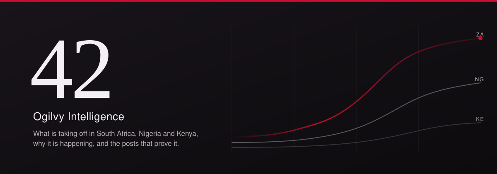
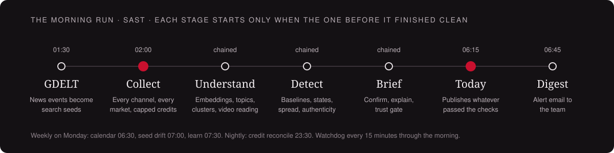
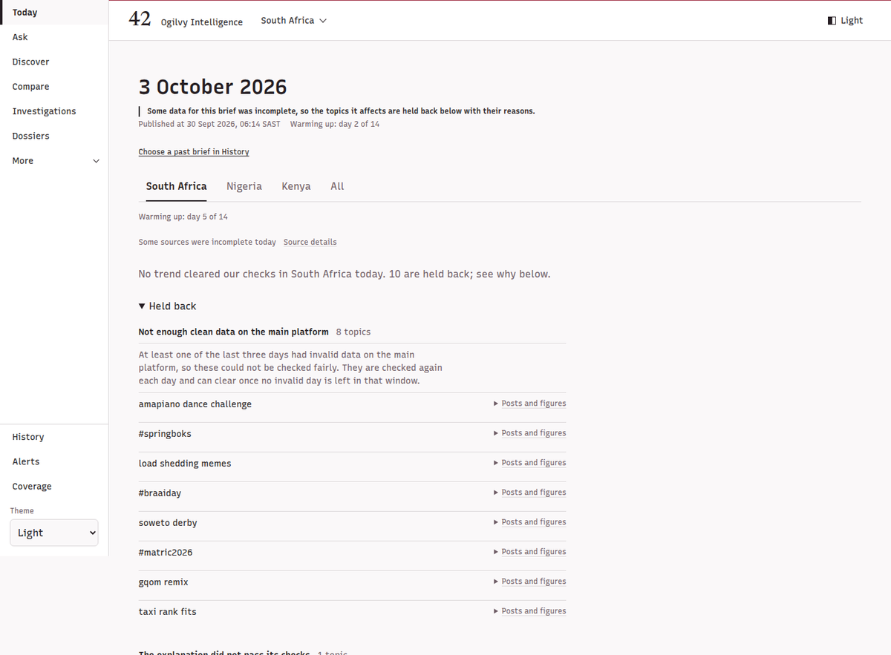
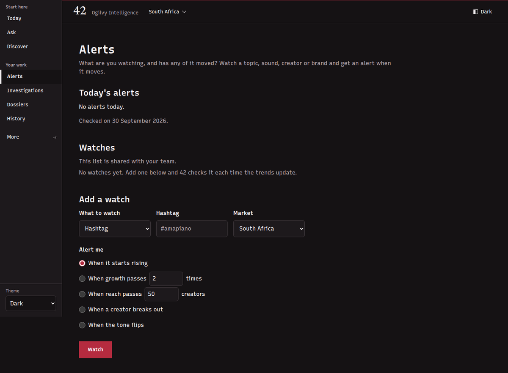
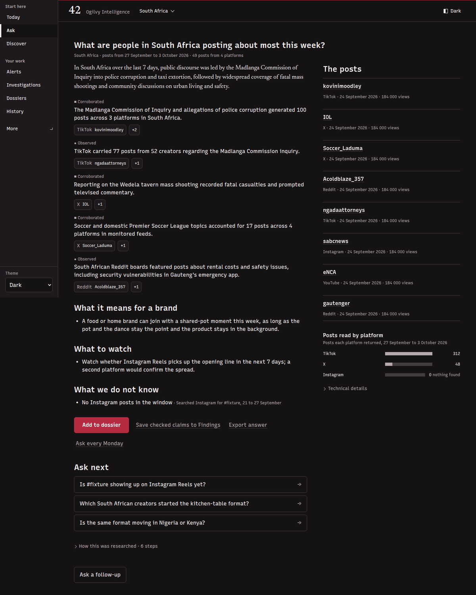
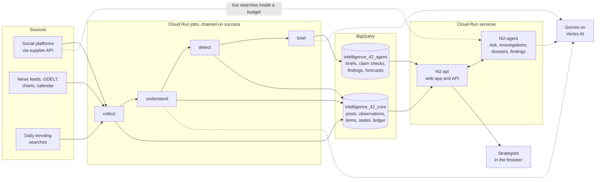

<p align="center">
  
</p>

<p align="center">
  <a href="#what-42-does">What it does</a> ·
  <a href="#the-morning-run">Morning run</a> ·
  <a href="#the-app">The app</a> ·
  <a href="#ask">Ask</a> ·
  <a href="#trust-and-evidence">Trust</a> ·
  <a href="#sources-and-markets">Sources</a> ·
  <a href="#architecture">Architecture</a> ·
  <a href="#where-42-stands">Status</a> ·
  <a href="#run-and-operate">Operate</a>
</p>

42 is Ogilvy South Africa's cultural trend engine. Every morning it reads what people are posting in South Africa, Nigeria and Kenya, works out what is growing faster than its own normal, checks that the growth is real and local, and explains it with posts a strategist can open. It also answers any question about culture in those markets with claims that each point at real posts and reproducible numbers.

The job it does fits in one sentence: show me what is taking off right now, why, and prove it.

## What 42 does

**It watches culture every day.** A chain of Cloud Run jobs collects from TikTok, Instagram, YouTube, X, Facebook, Reddit and Threads, plus music and app charts, local news feeds, GDELT news events and each market's daily trending searches. It runs on staging every night inside hard credit caps.

**It finds what is moving.** Every hashtag, sound, topic and creator is compared with its own 28-day normal for that market and platform. Each item gets a plain state word (New to 42, Emerging, Rising, Peaking, Mainstream, Fading, Recurring, Seasonal, Spike, On the boards) and a worth-attention rank.

**It refuses to guess.** Nothing reaches Today or an answer without passing a trust gate. Quotes are checked word for word by code, numbers are re-run, confidence labels are set by code, and a separate critic tries to explain each trend away. Anything held back is shown with its reason. Nothing is dropped silently.

**It answers questions.** Ask takes a plain question, researches the warehouse and live platform searches inside a per-question budget on Gemini, and returns cited claims labelled Observed, Corroborated, Single source or Inferred, with what it could not find said out loud.

**It never profiles people by age.** Audiences are described only by what posts show: language, place, interest, community, creator type and platform. Age words are a rule breach that the checks cut.

## The morning run

<p align="center">
  
</p>

| Stage | Module | What it does |
|---|---|---|
| Collect | `core/collect/job.py` | Pulls each market's own feeds (TikTok local trending, YouTube trending, hashtag boards, charts), scored search candidates, hub and creator panels, Reddit, public news feeds and search signals. Every response is kept raw, then merged into `posts` and appended to `post_observations`. |
| Understand | `core/understand/job.py` | Embeds posts, extracts structure from the day's posts, clusters them by meaning per market, labels the clusters and reads selected video clips within a daily clip cap. |
| Detect | `core/detect/job.py` | Builds daily counts, runs the statistical tests, flags coordinated posting, assigns states, traces spread, writes tomorrow's seeds and logs forecasts. |
| Brief | `core/brief/job.py` | Takes the top candidates per market, ranked local first, builds an evidence pack for each, runs a cross-platform confirm search, writes one cited explanation per card and puts every card through the trust gate. |
| Use | `core/api/app.py` | Serves Today, Discover, Ask and the rest of the app behind a sign-in gate. |

Each stage refuses to start unless the stage before it finished clean for the same day (`core/collect/chain.py`), so Today can never publish stale detection. At 06:15 SAST the brief publishes whatever has passed, with a banner when data was incomplete. Every job, schedule and cap is in [the operations guide](docs/guide/operations.md).

## The app

The app is a React single-page app served by the same FastAPI service as its API. The market picker in the header (South Africa, Nigeria, Kenya) follows you across pages, and every page has a light and a dark theme.

<p align="center">
  
  
</p>
<p align="center"><sub>Today and Alerts from the test build, filled with sample data.</sub></p>

| | Page | What you get |
|---|---|---|
| **Start here** | Today | The morning's key trends per market, each explained with posts you can open, plus what was held back and why, what left the list since yesterday, moments in the next 14 days, platform boards and the day's coverage. |
| | Ask | Any question in plain words, answered with cited claims while you watch the research happen. [More below](#ask). |
| | Discover | Every live trend, filtered by market, kind, state and platform, sorted by worth attention, with a Radar of growth against reach. |
| **Your work** | Alerts | Watch a hashtag, sound, creator or brand. Get told when it starts rising, passes a growth or reach line, when a creator breaks out or when the tone flips. Watches are shared with your team. |
| | Investigations | Deep research with a plan you can edit, a live log, a stop button and a dossier at the end. |
| | Dossiers | Collect claims, tick and order them, freeze a version, export HTML or PDF and share a link to that frozen version. |
| | History | Past questions, past briefs and saved findings, with search and each item's earlier waves. |
| **Dig deeper** | Compare | Two to five topics, brands, markets, platforms or creators side by side. |
| | Lexicon | The words and hashtags 42 is recording per market. |
| | Communities | Communities defined by shared interest, language and interaction, never age. |
| | Seed path | One word traced across platforms. |
| | Seeds | What 42 will search for next, and why. |
| **How 42 works** | Coverage | What was collected, where, at what cost in credits and model spend, the weekly detection scorecard and what 42 cannot see. |
| | Fieldwork | Every source on the roster and how it performed. |
| | Method | How 42 decides, in plain language. |
| | Schedules | Questions re-asked on a cadence, for example every Monday. |
| | Skins | Client lenses over the same engine, with a client Today, report and archive. |
| | Hidden people | People suppressed from every view on request. |
| | All pages | Every page in one list. |

Topic pages and creator pages open from any card. Click a jump in a topic's chart and 42 asks why it happened. The full tour, with the endpoints each page reads, is in [the product guide](docs/guide/product.md).

## Ask



1. You type a question and pick a market, or let the question decide.
2. The answer streams in. You see each research step, the sources gathered and each claim's check (Checking, Verified, Downgraded, Cut). You can stop it at any point.
3. Every claim carries a confidence label, set by code from the evidence:
   - ■ **Corroborated**: unrelated authors on 2 platforms, or 3 unrelated authors plus a metric. Authors are unrelated when no post of one reuses media, caption text, a linked page or a reply relation with a post of the other, and a person posting under several handles counts once.
   - ● **Observed**: two independent authors.
   - ▲ **Single source**: one author.
   - ○ **Inferred**: interpretation, always marked as such.
4. The answer ends with what it means for a brand, what to watch, what 42 does not know and up to three follow-ups that keep the context.
5. You can add it to a dossier, save the checked claims as findings, export it or have it asked again every Monday.

Each question has a depth and a budget. A quick lookup spends up to 10 credits, the default scan up to 60 and a deep read up to 300, where several researchers work by platform group and a critic follows. An investigation can spend up to 600, after you approve its plan. When the day's budget runs short, Ask answers from the warehouse and says so.

Ask runs on Gemini on Vertex AI through function calling, and the model can reach only 42's own fourteen tools: read-only SQL on allowlisted datasets, warehouse search, the capped supplier client, comments, transcripts, video reading, rising topics, saved findings, forecasts, history, analogues, the budget and date resolution. Scraped text always reaches the model fenced as untrusted data, never as instructions.

<sub>Ask answer from the test build, with sample data.</sub>

<br clear="right">

## Trust and evidence

42 is built so that a strategist can put its output in front of a client. That means it holds things back far more readily than it publishes them.

**Every card passes the publish gate** (`core/trust/gate.py`, `core/brief/job.py`). A card is held, with a visible reason, when any of these is true:

- one of the last three days had invalid data on the main platform;
- the item was only found by search, never in a measured feed;
- most of its posts are not located in the market, or the market cannot be confirmed;
- half or more of its posts are paid or sponsored, or its key is a paid tag such as #ad;
- it looks coordinated;
- it is political and has no independent corroboration;
- it is seasonal (it goes to Moments instead);
- it has fewer than three posts to show or fewer than two local posts;
- the explanation failed its checks.

**Every claim passes code checks** (`core/trust/claims.py`, `core/agent/checks.py`). Evidence ids must resolve. Quotes must match the post word for word. Every number must match a query pinned by run and result hash, and is re-run (counts exactly, ratios within 2%). Cited posts must sit inside the time window, and a post located in another market can never support a claim. Translations are marked. Age words and generated content are cut.

**Then two independent reviews.** A support checker reads each surviving claim against its posts, and anything less than fully supported is cut. A critic names the simplest non-cultural explanation (one viral post, one creator, a news event). The card passes only when that is ruled out, or when at least two local creators are reacting to the news in their own words, in which case it is labelled news-driven and every claim drops one step.

**Locality is strict.** A post located in the market counts in full. A post from the market's own feed without a known place counts one step lower and supports only wording such as "seen in Kenya's feeds". A post located elsewhere never counts.

**Some things are never evidence:** generated text or images, search interest (a signal for what to look into, never proof), news headlines (seeds only) and platform boards (labelled as the platform's own list).

Rule by rule, the detail is in [the trust guide](docs/guide/trust.md).

## Sources and markets

| Market | Time zone | Languages tracked |
|---|---|---|
| 🇿🇦 South Africa (ZA) | Africa/Johannesburg | English, isiZulu, isiXhosa, Afrikaans, Sesotho, Setswana, Sepedi, Xitsonga |
| 🇳🇬 Nigeria (NG) | Africa/Lagos | English, Nigerian Pidgin, Yoruba, Hausa, Igbo |
| 🇰🇪 Kenya (KE) | Africa/Nairobi | English, Kiswahili, Sheng |

| Source | How 42 reads it |
|---|---|
| TikTok | Local trending feed per market, the ZA hashtag board, country search, sound pages and hashtag counters |
| YouTube | Trending per market, Shorts trending, search |
| Instagram | Search, location posts where configured, global trending audio for context |
| X | Hub account panels and search |
| Facebook | Hub pages and search |
| Reddit | Each market's own subreddits, hot and rising |
| Threads | Search |
| Creator panels | Curated culture-desk and creator lists per market, read as the market's own feeds |
| Charts | Apple Music, Boomplay, Shazam, TurnTable, kworb, App Store |
| News | About 40 public news feeds across the three markets, used as seeds and for the news-to-social bridge, never as post evidence |
| GDELT | Daily news events turned into search seeds |
| Search signals | Each market's daily trending searches, used only to decide what to look into |
| Calendar | Public holidays and a curated moments list, refreshed weekly |

All social data comes through one supplier client (`core/collect/socialcrawl_client.py`) that checks a credit ledger and the daily and monthly caps before every call.

What 42 does not see, and says so on screen: WhatsApp and other private groups, official X location trends, Pinterest Trends for these markets, and search trends beyond each market's daily trending searches.

## Architecture



| Piece | Built with |
|---|---|
| Jobs and services | Python 3.13 on Cloud Run, Cloud Scheduler, Cloud Build images |
| Warehouse | BigQuery (US), two datasets: `intelligence_42_core` and `intelligence_42_agent` |
| Topics and trends | Embeddings, BERTopic clustering, negative binomial and beta-binomial tests with false-discovery control |
| Language models | Gemini on Vertex AI (gemini-3.8-flash, global endpoint) for extraction, video reading, the brief and Ask; gemini-embedding-001 for embeddings. Every call is priced and booked against a daily spend cap before it is made |
| API | FastAPI (`core/api/app.py` for the app, `core/api/agent_app.py` for Ask) with server-sent events for live progress |
| Web app | React 18, Vite, Bun, the Ogilvy Intelligence design system, Chart.js |
| Evaluation | A 30-question set across ten families and three markets, scored in replay mode from cached responses |

## Repository map

| Folder | What lives there |
|---|---|
| `core/` | **The 42 product:** `collect`, `public_feeds`, `understand`, `detect`, `brief`, `trust`, `agent` (Ask), `skills`, `llm` (Gemini), `api`, `eval`, `schema`, `setup`, `config` |
| `app/frontend/` | The React web app |
| `app/` (the rest) and `engine/` | The earlier product and engine, kept for reference and for parts lifted into `core/`; not on the morning path |
| `ops/` | Release runners and checks, and older certification tooling |
| `docs/guide/` | The guides linked from this page |
| `docs/full-42/` | The full specification, the build order and [the rules](docs/full-42/RULES.md) |
| `infra/`, `scripts/` | Older runtime definitions, paused |

## Where 42 stands

This is the honest picture on staging, not the plan.

| Area | State |
|---|---|
| Morning run | ✅ Live on staging: the chained morning jobs and their scheduled support jobs (GDELT, reconcile, drift, learn, calendar, scheduled questions, digest), with a watchdog and alert policies. |
| Ask | ✅ Live on staging with cited, checked answers and live searches inside a budget. |
| App | ✅ Every page above is live behind a passcode. A sign-in through Google's Identity-Aware Proxy exists as a read-only pilot. |
| Today | ⏳ **Holding back most candidates.** Each hold is shown with its reason. The main causes are invalid data days on some sources and too few local posts. |
| Rising | ⏳ **Waiting on history.** The statistical test needs 14 observed days of the same protocol per series. Until a series has them, its state comes from the warm-up rules (New to 42, Emerging, Spike, On the boards). |
| Weekly scorecard | ⏳ Code complete, no scored week yet. |
| Intraday pulse, Breaking and Telegram channels | ⏸ Built, switched off. |
| Wikipedia, LinkedIn, Bluesky | ○ Not collected yet. |
| Continuous deployment | ⏸ Workflows written but parked; releases are deployed by hand from a reviewed commit. |
| Production | ○ Not deployed. Staging only. |
| Brand South Africa | ⏳ The first client lens in Skins. |

## Run and operate

Everything runs in one staging project on Google Cloud (`us-central1`, BigQuery `US`). One add-only bootstrap script creates every identity and grant, and nothing removes access. Secrets live in Secret Manager and are never printed.

- [Operations guide](docs/guide/operations.md): jobs, schedules, caps, deploys, monitoring, access and data protection.
- [Product guide](docs/guide/product.md): every page and what it reads.
- [Trust guide](docs/guide/trust.md): the gate, the claim checks and the labels.

Run the tests for any area from the repo root, for example:

```bash
py -3.13 -m pytest core/trust/tests core/brief/tests -q
cd app/frontend && bun install --frozen-lockfile && bun test
```

## Ground rules

The full list is in [RULES.md](docs/full-42/RULES.md).


- Staging only. Production is a separate step on the owner's written word.
- No data is deleted, dropped or expired. Removal requests are suppressed at once.
- Access is only ever added, never owner or editor.
- Every claim carries evidence ids. Every number carries the query that produced it.
- No age lens, anywhere.

<p align="center"><sub>42 · Ogilvy South Africa · private and confidential</sub></p>
