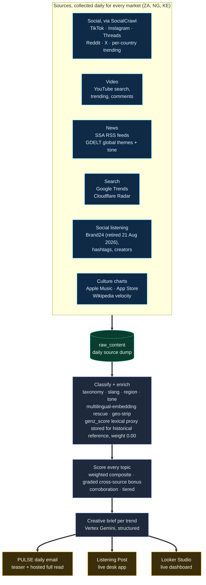
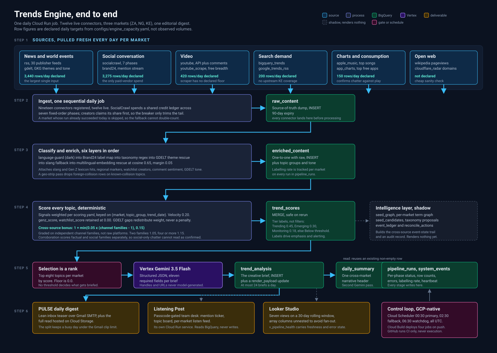
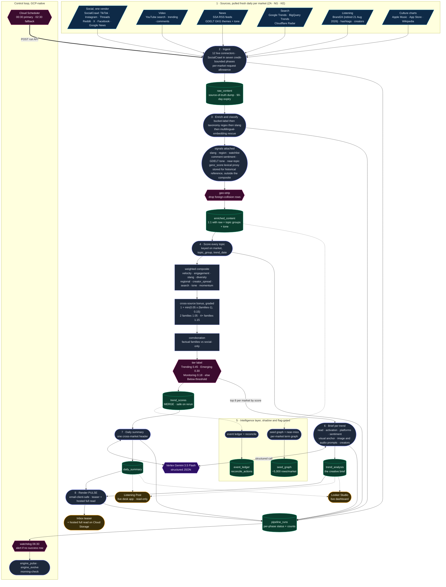

# Trends Engine

Cultural trend detection for Sub-Saharan Africa. Every morning the engine pulls fresh social, news, search, and music-chart signal from more than a dozen sources, classifies each row against a per-market taxonomy, scores every topic on a deterministic weighted composite, writes a creative brief per trend with Vertex Gemini, and emails one editorial digest. It covers three markets: South Africa (ZA), Nigeria (NG), Kenya (KE).

[](https://github.com/jhbanalytics-pixel/trends-engine-v2/actions/workflows/ci.yml)


## What it delivers

Every morning the engine sends one editorial digest, the PULSE, covering the day's strongest cultural trends across the three markets. Each trend carries a creative brief built for activation:

- a plain-language read of what is happening and why it matters now
- the cultural context and a concrete activation idea a brand can run
- the platforms it is moving on, the mood in the comment section, and the hashtags driving the conversation
- a visual anchor with ready-to-use image and audio prompts, plus the top creators and example posts behind the trend

Delivery is a lean inbox teaser plus a full read hosted on Cloud Storage, so the email stays light while the rich edition renders in the browser. The same records feed the Listening Post, a companion web app that turns the day's data into a live desk (see below), and a Looker Studio dashboard.

## How it works

The engine runs once per day on Google Cloud. Each run pulls fresh content from every enabled connector inside one sequential daily job, classifies each row, scores topics on the composite, then sends each surviving topic to Vertex Gemini for a structured brief. Output lands in BigQuery and is mirrored into the PULSE email, the Listening Post, and the Looker dashboard.

A typical day produces eight to nine topic groups per market, twenty-four to twenty-six briefs, and one cross-market summary. The full run takes roughly 45 to 90 minutes with briefs, well inside the Cloud Run task timeout of 5400s. Daily volume has grown from roughly 2,500 post-topic reads at launch to over 13,000 as source coverage deepened.



## Data flow, end to end



The same flow as a Mermaid source below, for anyone who wants to fork or edit it. The full journey of one day's data, from the moment a connector fires to the moment a brief lands in an inbox. Rounded boxes are processes, cylinders are BigQuery stores, hexagons are gates or scheduled control, the purple node is the Vertex model, amber nodes are the deliverables. Dotted edges are shadow or read-only paths.



## Connectors

The connector framework is a common base with a per-source subclass. Most are gated by an `enabled` flag in `configs/sources.yaml`; a few instead run whenever their credential and per-market config resolve, which is called out below. Twelve sources are live and nineteen are registered, so seven are built and held dark for staged rollout. A flag is only flipped after a live vendor probe confirms the endpoint shape and a downstream consumer is confirmed, so a flip never lights up dead ingestion.

| Name | Source | Access | Purpose | Declared daily target |
|---|---|---|---|---|
| `rss` | Direct fetch | Public feeds | Curated SSA news and culture feeds, category and byline extraction | 340 (ZA 130 · NG 130 · KE 80) |
| `google_trends_rss` | Google Trends RSS | Public | Daily trending searches per market | not declared |
| `bigquery_trends` | Google public dataset | Public | Search velocity via `international_top_rising_terms` | 200 (ZA 100 · NG 100 · KE 0, no upstream KE coverage) |
| `youtube` | YouTube Data API v3 | API | Keyword search, `mostPopular` chart, `commentThreads` enrichment | 420 (140 per market) |
| `youtube_scrape` | YouTube via yt-dlp | Public, no API quota | Uncapped keyword-search breadth alongside the metered API connector | not declared |
| `gdelt` | GDELT public BigQuery | Public | GKG tone, persons, organisations, themes | 3,100 (ZA 1,100 · NG 1,300 · KE 550) |
| `socialcrawl` | SocialCrawl | Licensed API, prepaid credits | Primary social layer: per-country TikTok and YouTube trending, watchlist creators, market term pools, subreddits, X handles, Facebook pages and groups, Google News, verified creator country | 3,000 (ZA 1,050 · NG 1,000 · KE 950) |
| `brand24` | Brand24 (retired 21 Aug 2026) | Licensed platform | Topics, hashtags, top creators, mentions, AI insights | 275 (ZA 95 · NG 95 · KE 85) |
| `apple_music` | Apple Music charts | Public | Per-market Top songs and albums | 150 (50 per market) |
| `app_charts` | Apple App Store charts | Public | Per-market top-free app rankings as culture signal | not declared |
| `cloudflare_radar` | Cloudflare Radar | API | Trending domains and search signal per market | not declared |
| `wikipedia` | Wikipedia pageviews | Public | Per-market article view velocity | not declared |

Retired 23 Jul 2026: `ensemble` (EnsembleData, vendor account cancelled) and `reddit`, which billed the same EnsembleData ledger and so could not outlive it. Between them they were 7,652 rows/day. Both connectors stay wired into the registry with their flags false, and every surface they carried now runs through `socialcrawl`. See `docs/socialcrawl-probe-2026-07-23.md`.

Held dark: `spotify` (Spotify Charts public API discontinued, replaced by `apple_music`), `semrush`, `audiomack` and `pulsar` by an explicit `enabled: false`, and `bluesky` by having no config block at all. `customer_units` is an internal vendor-introspection helper, not a row source.

Two connectors have no `enabled` flag and so cannot be stopped from `sources.yaml`. `brand24` runs whenever `BRAND24_API_KEY` resolves and its per-market `projects` list is non-empty, so retiring that vendor means pulling the key or emptying those lists. `ensemble` is stopped only by the absence of the cancelled vendor's `ENSEMBLEDATA_API_TOKEN` secret; the `ensemble_budget.enabled: false` in config is read by the capacity watchdog and never by the connector, so restoring that secret would silently resume paid ingestion.

Five of the twelve live connectors have no declared floor in `configs/engine_capacity.yaml`: `youtube_scrape`, `google_trends_rss`, `app_charts`, `cloudflare_radar` and `wikipedia`. The capacity watchdog therefore cannot see them drop to zero, which is the known gap in end-to-end monitoring.

## Pipeline stages

The entry point is `scripts/run_rss_now.py`. Stages run in this order, all within one process.

1. Ingestion. Each connector runs against its per-market request allowance. SocialCrawl runs seven phases in a fixed code order (discover, creators, search, reddit, accounts, news, facebook) against a class-level credit ledger shared by all three markets, plus a per-phase share of it. Creators runs second and claims its share before any keyword breadth, because creator posts are the only source of the watchlist signal, so the credit breaker only ever trims the tail. The `phases` list in `configs/sources.yaml` can subtract a phase but cannot reorder one.
2. Enrichment. A layered classifier runs a foreign-language guard (dark by default), then a Brand24 aggregated-label map that can also hard-drop a row, then regex over the per-market taxonomy, then a GDELT theme rescue, then a slang fallback, then a multilingual-embedding rescue over whatever is left (live at cosine 0.65, margin 0.05). Slang hits, regional markers, watchlist-creator matches, comment sentiment, and GDELT V2Tone attach to the enriched row, as does a historical lexical proxy (genz_score) that is computed and stored for historical reference and takes no part in the composite. A geo-strip pass removes foreign-collision content for known-collision topics.
3. Scoring. The weighted composite computes per `(market, topic_group, trend_date)`. A cross-source bonus then applies, graded on how many independent channel families carry the topic rather than on raw platform strings: `1 + min(0.05 x (families - 1), 0.15)`, so two families give 1.05 and four or more reach the 1.15 ceiling, with the final score capped at 1.0. The flat 1.15x it replaced fired on nearly every topic-day and so discriminated nothing. A corroboration pass then weighs factual sources (news, search, video, music) against social-only chatter so a single-platform spike cannot masquerade as a confirmed trend.
4. Brief generation. The top eight topics per market by score go to Vertex Gemini through a structured-JSON prompt. Selection is a rank, not a threshold: the score floor is 0.0, so the tier labels drive editorial emphasis and alerting rather than deciding what gets briefed. Each call produces a brief with description, activation idea, key metrics, platforms, sentiment summary, visual anchor, image and audio prompts, top creators, and social references, tagged with a lifecycle and continuity badge.
5. Daily summary. One cross-market call produces the digest header.
6. PULSE email. A modular renderer assembles the editorial digest from BigQuery and sends it via Gmail SMTP. The render layer is email-client-safe: nested tables, inline styles, and a dark-native palette that survives the Outlook engine.

Two stages sit alongside the core, gated off by default. A seven-day forecast outlook (`FORECAST_ENABLED`) stays dark because the BigQuery ML predictor does not beat a naive persistence baseline on a walk-forward backtest, and an accuracy watchdog blocks any future predictor that cannot clear that bar. The PULSE Intelligence Core (`RECONCILE_ENABLED`) runs a cross-source event-state ledger and reconcile pass in shadow, building an audit trail while rendering nothing, and promotes through documented phases once the evidence window is clean.

## Intelligence layer

Beyond the deterministic score, several enrichment and analysis passes deepen the read. Each is flag-gated and most are live.

| Capability | What it does |
|---|---|
| Embedding classifier | Multilingual-embedding rescue for rows the lexical taxonomy misses, per market |
| Seed graph | A per-market term graph over enriched content that surfaces near-miss topics adjacent to the taxonomy |
| Near-miss capture | Tags enriched rows with the nearest off-taxonomy topic, feeding taxonomy growth |
| Comment sentiment | Reads the mood in the comment section, not just the post |
| Pan-African | A cross-market story pass that connects a trend moving across ZA, NG, and KE |
| PULSE Intelligence Core | Cross-source event ledger plus reconcile, shadow-live, building the corroboration state trail |

## Data layer

Project `ogilvy-trends-v2`, dataset built from `BIGQUERY_DATASET + "_" + TRENDS_ENV`.

| Table | Write mode | Idempotency key | Notes |
|---|---|---|---|
| `raw_content` | INSERT | `(market, source_endpoint, source_id, collected_at::date)` | Source-of-truth dump, 90-day expiry |
| `enriched_content` | INSERT | matches `raw_content` | One-to-one, plus topic groups, slang, tone, near-topic |
| `trend_scores` | MERGE | `(market, query_group, trend_date)` | Safe on rerun |
| `trend_analysis` | INSERT, then a per-row UPDATE for `render_payload` | skip-existing guard, not a key | The creative brief |
| `daily_summary` | INSERT | non-empty-row guard for the date | Cross-market summary |
| `seed_graph` | Load, `WRITE_TRUNCATE` into the day partition | `seed_graph$YYYYMMDD` | Per-market term graph, ~5,000 rows/market |
| `seed_candidates` | Load, `WRITE_APPEND` | deterministic `candidate_id` | Proposed taxonomy additions |
| `seed_insights` | INSERT | none | Cross-topic seedable behaviours, read by the Listening Post |
| `pan_african_stories` | MERGE | `(trend_date, story_id)` | Topic families rising in two or more markets |
| `event_ledger` | DELETE the day, then INSERT | `(trend_date)` | Intelligence Core event-state trail |
| `reconcile_actions` | DELETE, then INSERT | `(trend_date, market)` | Reconcile audit rows, shadow |
| `pipeline_runs` | INSERT | none | Per-phase status and row counts, plus an `email_audit` marker row |
| `system_events` | INSERT | none | Cron heartbeat and digest-failure events |
| `predictions_archive` | Streaming insert | same-day dedupe probe | Forecast output, dark under `FORECAST_ENABLED=false` |

Looker views run on a 30-day rolling window. `v_trend_briefs` is the per-topic brief layout; `v_trend_briefs_creators` and `v_trend_briefs_social_refs` UNNEST the array columns into sibling views so binding both in one Looker table does not fan out into a Cartesian product; `v_pipeline_health` carries per-run counts, freshness flags, and an error summary.

## Scoring model

`configs/scoring.yaml` is the source of truth for every weight below. Eight signals carry an unconditional weight and sum to 1.00: velocity, diversity, engagement, creator_spread, regional_score, search_velocity_score, slang_score and tone_score. momentum carries a configured weight of 0.07 carved from the velocity weight and enters the composite only when the momentum flag is active; the flag is off today, so momentum is inert. genz_score, watchlist_score and gcam_score are configured at 0.00 and take no part in the composite; genz_score and watchlist_score are still computed per row and stored for historical reference. Immutable historical topic keys elsewhere in the taxonomy, such as genz_lifestyle and genz_sheng, are retained identifiers, not scoring inputs.

| Signal | Weight | Description |
|---|---|---|
| `velocity` | 0.20 | Today's topic volume against the 14-day per-topic baseline |
| `momentum` | 0.07 | Sustained rise on both the 7-day and 30-day windows, carved from the velocity weight; applies only when the momentum flag is active |
| `genz_score` | 0.00 | Historical lexical proxy, retained without influence |
| `watchlist_score` | 0.00 | Historical curated watchlist, retained without influence |
| `engagement` | 0.10 | Views, likes, comments, shares, winsorized |
| `slang_score` | 0.10 | Local slang authenticity per market |
| `diversity` | 0.16 | Distinct sources contributing to the topic |
| `regional_score` | 0.12 | Market-specific geographic markers in text |
| `creator_spread` | 0.12 | Distinct creators contributing |
| `search_velocity_score` | 0.15 | Rising search intent from BigQuery Trends |
| `tone_score` | 0.05 | GDELT V2Tone signal, applied only when a topic has parseable tone rows |
| `gcam_score` | 0.00 | GDELT GCAM emotional-arousal signal, ships at zero weight |

Composite order: `velocity`, `diversity`, `engagement`, `creator_spread`, `regional_score`, `search_velocity_score`, `slang_score`, `momentum`, `tone_score`.

Tier thresholds on the final composite: Trending at 0.45, Emerging at 0.30, Monitoring at 0.18. Anything below 0.18 drops from the digest. Per-content-type engagement weights apply before aggregation so a commercial music release cannot saturate the composite. The full derivation lives in `docs/scoring-methodology.md`.

## Configuration

| File | Purpose |
|---|---|
| `configs/sources.yaml` | Endpoints, RSS feeds, per-market query allowances, connector enable flags |
| `configs/scoring.yaml` | Signal weights, tier thresholds, baseline window, corroboration weights |
| `configs/cron_flags.env` | Feature flags baked into the Cloud Run jobs at deploy |
| `configs/keywords/{za,ng,ke}.yaml` | Per-market topic keywords, slang, regional markers |
| `configs/topic_groups/{za,ng,ke}.yaml` | Topic taxonomy with classifier regex |
| `configs/creators/{za,ng,ke}.yaml` | Tiered watchlist handles per platform |
| `configs/engine_capacity.yaml` | Declared per-connector daily targets, auto-suggest rules |
| `configs/vendor_endpoint_catalog.yaml` | Vendor endpoint inventory for the evolution watchdog |

Feature flags in `configs/cron_flags.env` are the single source of truth for what the daily run does. Cloud Build merges them onto every job on each deploy, so a flip lands by editing that file and merging to master, never by hand-editing a live job.

## Running locally

Requires Python 3.13. The system `python` on Windows is typically 3.14 and does not carry the Vertex and BigQuery deps.

```bash
git clone https://github.com/jhbanalytics-pixel/trends-engine-v2.git
cd trends-engine-v2
python -m venv .venv
source .venv/Scripts/activate            # Windows bash
pip install -e ".[dev]"
cp .env.example .env                     # populate GCP_PROJECT and tokens
python scripts/verify_gcp_setup.py       # auth + schema check (cloud-only on Windows)
python scripts/run_rss_now.py            # full pipeline run (cloud-only on Windows, see note)
```

On Windows plus Python 3.13 the BigQuery and Vertex SDK RPC path segfaults, so `verify_gcp_setup.py` and a full `run_rss_now.py` run do not complete locally. Run them in the cloud via the Cloud Run job (`gcloud run jobs execute trends-engine-pipeline --project=ogilvy-trends-v2 --region=us-central1`); locally, use the `bq` CLI for data reads. On Linux or macOS the local run works.

Environment variables are read from `.env` in dev and from GCP Secret Manager in staging and prod. See `.env.example` for the full list. Never commit `.env`, and keep the checkout in a local directory that does not sync to a cloud tenant. Inside a synced folder every file is mirrored regardless of `.gitignore`, so a secret that looks local is not.

## Cron deployment

The run is GCP-native end to end. GitHub holds no execution path; it is version control only. The pipeline runs daily from a Cloud Run job, `trends-engine-pipeline`, fired by Cloud Scheduler at 00:30 UTC (primary) and 02:30 UTC (fallback); both POST to the Cloud Run jobs `:run` API. A per-market idempotency guard skips any market already marked success today, so the fallback never double-ingests, and an email guard checks the day's sent marker so a fallback fire never sends a second digest. A watchdog Cloud Function on Cloud Scheduler runs at 06:30 UTC and alerts if no success row exists by its deadline. Cloud Build rebuilds the image and updates every job on each relevant master change (`cloudbuild.yaml`).

Manual ops (recovery, backfill, regen, resend) run as Cloud Run jobs on the same image, fired with `gcloud run jobs execute <job> --project=ogilvy-trends-v2 --region=us-central1` (pass `--update-env-vars TREND_DATE_INPUT=<date>` for a past date).

| Cloud Run job | Use |
|---|---|
| `trends-engine-pipeline` | The full daily run (cron and manual recovery) |
| `trends-engine-phase2` | Backfill or regenerate briefs for a date |
| `trends-engine-regen` | Heal an empty `daily_summary` row |
| `trends-engine-resend` | Re-render and re-send the digest from BigQuery |

The only GitHub Actions workflow is `ci.yml` (lint, test, scan on push and PR).

## Companion: Listening Post

The Listening Post is a separate web app that reads this engine's BigQuery, no writes. It turns the daily data into a passcode-gated team desk: a live mention ticker, a ranked topic board, Prompt Pulse briefs, a per-market Listen feed, and an async research surface. It runs as its own Cloud Run service in the same project and lives in its own repository. The engine is the source of truth; the Listening Post is the read surface.

## Observability

Two watchdog scripts read declared capacity against observed reality and surface the highest-priority next move.

```bash
python scripts/engine_pulse.py            # reactive daily check, JSON or text
python scripts/engine_evolve.py           # adaptive weekly check, proposes recalibration
```

`engine_pulse.py` compares actual per-connector row counts against `configs/engine_capacity.yaml` and tags each connector CLEAN, WARN, CRITICAL, or FAIL. `engine_evolve.py` reads a rolling 14-day median against declared capacity, proposes bounded recalibrations inside a 20 percent safety bound, and cross-references the vendor endpoint catalog against connector code to surface unshipped surfaces. The daily morning check chains a BigQuery snapshot, the digest audit, the Vertex usage watchdog, an accuracy watchdog, a SQL dry-run pre-flight, the reconcile shadow digest, and a Listening Post health probe into one report.

## Testing

```bash
make test                                # full unit suite, no external services
make lint                                # ruff check
make format                              # ruff format and fix
make precommit                           # ruff, bandit, ruff format, file hygiene
make coverage                            # pytest --cov=src
make verify-gcp                          # ADC, BigQuery schema, secret access
```

Roughly 2,090 unit tests run under pytest with HTTP mocked via the `responses` library and BigQuery mocked at the client layer. CI runs the suite on Python 3.11 and 3.13 against Ubuntu. The quality gate stacks ruff, bandit, pip-audit, detect-secrets, and qlty, which bundles zizmor, osv-scanner, trufflehog, actionlint, and ripgrep. Pre-commit hooks are mandatory and run on every commit.

## Project layout

```
src/
  ingestion/
    connectors/         # rss, google_trends_rss, bigquery_trends, youtube,
                        # gdelt, socialcrawl, brand24, apple_music,
                        # app_charts, cloudflare_radar, wikipedia
                        # (+ spotify, semrush, audiomack, bluesky, pulsar dark;
                        #  ensemble + reddit retired 23 Jul 2026, flags false)
    base.py             # shared connector contract and budget ledger
  enrichment/
    topic_classifier.py # layered taxonomy classifier
    embedding_classifier.py  # multilingual-embedding rescue (M4)
    sentiment_lexicon.py
  scoring/
    velocity.py         # baseline-relative momentum
    corroboration.py    # factual vs social family weighting
    driving_hashtags.py
    forecast.py         # BigQuery ML predictor (dark, off by default)
  analysis/
    gemini_client.py    # Vertex SDK wrapper, structured-JSON output, token logging
    generate_briefs.py  # per-topic Vertex calls, geo-collision filter
    generate_daily_summary.py
    seed_graph.py       # per-market term graph + near-miss
    reconcile.py        # Intelligence Core reconcile pass
    event_ledger.py     # cross-source event-state ledger
    pan_african.py      # cross-market story pass
    comment_sentiment.py
    prompts/            # trend brief and daily summary prompts
  alerts/
    email_digest.py     # digest assembly, subject builder, send path
    email_render/       # modular PULSE renderer, client-safe nested tables
    detector.py         # tier-upgrade alerts
    self_heal.py        # empty-row recovery
  utils/                # bigquery, secrets, config, log redactor, market detector

configs/                # source, scoring, taxonomy, watchlist, capacity, flags
infra/
  bigquery_schemas/     # DDL for the tables
  bigquery_views/       # the Looker views
  bigquery_queries/     # parameterised SQL helpers

scripts/
  run_rss_now.py            # full pipeline entry point
  engine_pulse.py           # reactive capacity watchdog
  engine_evolve.py          # adaptive capacity watchdog
  reconcile_shadow_digest.py
  accuracy_watchdog.py
  dry_run_sql.py            # BigQuery producer-query pre-flight
  verify_gcp_setup.py
  ops/                      # Cloud Run job entrypoints
  watchdog_function/        # Cloud Function for the no-run watchdog
  migrations/               # idempotent BigQuery schema migrations

tests/                  # unit, integration, e2e
docs/                   # scoring methodology, runbooks, v3 blueprint
.github/workflows/      # ci only (lint, test, scan); no execution workflows
```

## License

Copyright Ogilvy South Africa, part of WPP. Internal use only. See `LICENSE`.
