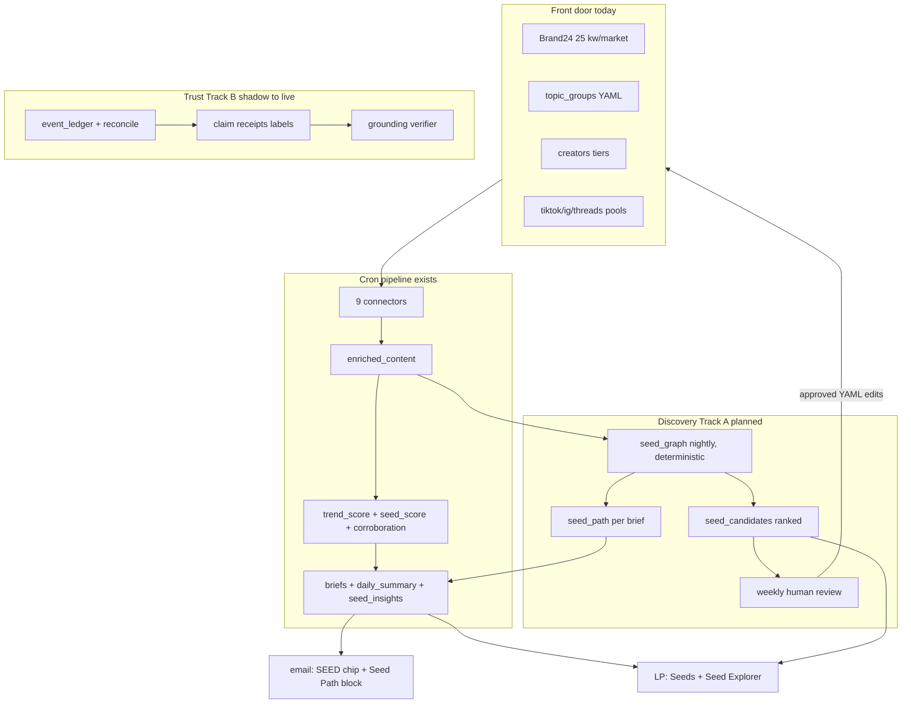
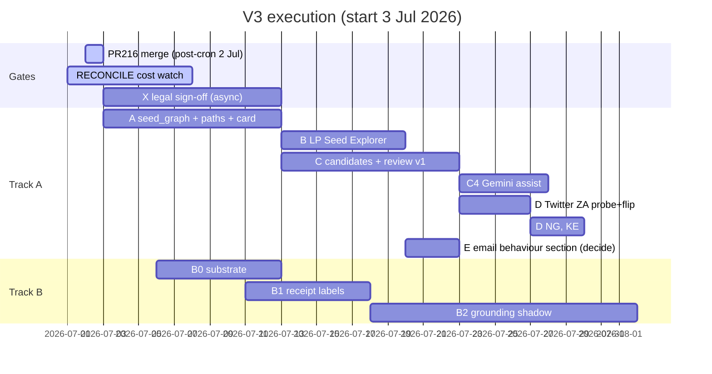

# Trends Engine V3 Blueprint (v3.2, execution edition)

Superseded by [`trends-engine-v3-blueprint-v3.4.md`](trends-engine-v3-blueprint-v3.4.md) (master build document). Kept for history.

Status: master build document, redone 2 Jul 2026 against `master` after a hard audit of the 1 Jul draft, then corrected same day after a second line-level audit against both repos (helper signatures, budget keys, probe CLI, pattern claims). Supersedes [`trends-engine-v3-blueprint.md`](trends-engine-v3-blueprint.md) and [`trends-engine-v3-blueprint-v3.1.md`](trends-engine-v3-blueprint-v3.1.md). Audit trail: [`trends-engine-v3-blueprint-audit.md`](trends-engine-v3-blueprint-audit.md). Every ticket below carries a flag, tests, acceptance criteria, and a rollback. Every code claim is tagged exists or planned.

What the 1 Jul draft got wrong and this edition fixes: no DDL, no flag names, no per-ticket acceptance criteria or rollback, term normalisation undefined, metrics with no measurement mechanism, the review workflow hand-waved, no dependency map against the live constraints (PR #216 budget merge, RECONCILE 7-day cost watch, Ensemble headroom, one-charging-surface-per-day), and no statement of where each new stage sits in the cron.

## 1. What V3 is

Two spines, parallel tracks, one engine.

Spine A, Discovery Loop, is the Google-facing product step. The paying client is Google; the commercial job is naming the cultural behaviour to seed Nanobanana (image) and Lyria (audio) into before it is obvious. V2 answers "what is loud" (`trend_score`). V3 answers "what is forming, how it moved across channels, why, and what to watch next." The 25 Brand24 keyword slots per market plus the taxonomy are the front door, not the ceiling: discovery opens adjacent terms, handles, and sounds from the data, reconstructs behaviour paths, and feeds reviewed candidates back into what the engine watches. The loop compounds; that is the next level.

Spine B, Trust Layer, is the defensibility step carried from v3.1 with the audit corrections. Corroboration is live, the event ledger and reconcile run in shadow (3 batched Gemini calls/day), and the promotion path is labels first, corrections later, grounding verifier last. Trust without discovery is polish on a static watchlist. Discovery without trust is recommendations Google cannot defend.

## 2. Ground truth (verified 1-2 Jul 2026)

### 2.1 What exists

| Component | Where | State |
|---|---|---|
| seed_score (audience x format x tone gate) | `scripts/run_rss_now.py` `_seed_breakdown`, weights `configs/scoring.yaml:111-126` | Live, persisted on `trend_scores` with decomposition |
| SEED chip + seed_recommend line | `src/alerts/email_render/card.py:309`, `verdict.py:65` | Live in email |
| Seed behaviours (3-5/day) | `src/analysis/generate_seed_intelligence.py` -> `seed_insights` table | Live, `SEED_INTELLIGENCE_ENABLED` default true, LP-only, never in email |
| LP Seeds page, get_seeds tool, seeds-first research | `Listening Post` `seeds.jsx`, `chat.py:378`, `research.py` | Live |
| LP partial adjacency | `desk.py` `build_bridges` (cross-scene creators), `build_lexicon` (slang index) | Live |
| Corroboration two-numbers | `src/scoring/corroboration.py` | Live every cron, free |
| Event ledger + reconcile shadow | `event_ledger.py`, `reconcile.py`, `RECONCILE_ENABLED=true` PR #218 | Shadow ON, 3 Gemini calls/day, renders nothing |
| Twitter path | `ensemble.py:214-224` `/twitter/user/tweets`, `terms_key: twitter_handles` | Wired, dark, lists empty all markets |
| Wave 3 seed lists | `sources.yaml` `yt_keywords`, `yt_channel_browse_ids`, `ig_user_ids`, `tt_music_ids` | Empty, flags off; empty list = silent no-op |
| Comments ingestion | `tt_comments_enabled` all markets; ZA `ig_post_comments` pilot | Live; comment rows are slang-scored and topic-classified |
| Embedding rescue vectors | `embedding_classifier.py`, cosine 0.65 / margin 0.05 | Live; residual vectors computed then discarded |
| Manual discovery | `topic-coverage-report runbook` frequency count | Manual only; the "weekly taxonomy cron" in `topic_classifier.py:122` docstring does not exist |
| MERGE upsert helper | `src/utils/bigquery.py:92` `merge_dataframe(df, table_name, merge_keys)` (`insert_dataframe` is append-only, no merge_keys arg) | Exists, identifier-hardened; UPDATE SET is a fixed `c = S.c` per non-key column, no custom expressions, and the MERGE ON clause has no partition pruning |
| New-table pattern | migration script + `setup_bigquery.py` `SCHEMA_ORDER` + `dry_run_sql.py` REGISTRY | Partially established: `seed_insights` shipped the migration + `infra/bigquery_schemas/seed_insights.sql` but was never added to `SCHEMA_ORDER` or the REGISTRY (retro-fix in A0) |

### 2.2 What does not exist (the build)

seed_graph, seed_candidates, behaviour paths, seed_path on briefs or cards, keyword-first Seed Explorer, any writer from signal back into config, Twitter ingestion, a discovery success metric.

### 2.3 Live constraints the sequencing must respect

| Constraint | Detail | Expires |
|---|---|---|
| RECONCILE cost watch | 7 days from 1 Jul; no new Gemini passes until it closes clean | ~8 Jul 2026 |
| PR #216 | Ensemble budget raise, merge after 2 Jul cron. VERIFIED against the PR diff (2 Jul): it edits ONLY the base pair, `budget_units_per_run` 2400 to 3000 and `per_market_units` 800 to 1000, and does not touch `budget_units_per_run_boost`. With `CREATOR_INGEST_BOOST=true` live, the connector reads the boost key (code default 1500, no `sources.yaml` override, `ensemble.py:696-703`), so on the live boost path the raise is inert; it only widens the base path if the boost flag ever comes off. Do not treat 3000/1000 as the live ledger for Twitter/Wave-3 headroom maths; the live boost ledger stays 1500 plus vendor truth via `fetch_units_history` | 2 Jul |
| One charging surface per day | Ensemble account 5000 units/day shared with Reddit, real spend already 1700-3700/day via `fetch_units_history` | Standing |
| Probe before flip | Vendor shape + downstream consumer grep, `scripts/verify_live.py` | Standing |
| Protected files | `sources.yaml`, `.env`, `*.bak`, `*.eml` change-with-care | Standing |
| X data legal check | EnsembleData Twitter for a Google-facing product needs WPP/Ogilvy compliance sign-off BEFORE any spend | Blocking gate for D |
| pd.isna() rule | every BQ-derived scalar | Standing |

## 3. Architecture



Principles: reuse-first, additive columns and tables, every new stage dark behind a flag with the OFF path byte-identical and unit-tested, generative proposes and deterministic disposes, no auto-charging surface without probe and review, writer (TEV2) before reader (LP).

## 4. Track A: Discovery Loop, ticket level

### Phase A: seed_graph + behaviour paths (zero new vendor or Gemini spend)

#### A0. Retro-fix the new-table pattern (hygiene, no flag)

`seed_insights` shipped its migration and `infra/bigquery_schemas/seed_insights.sql` but was never added to `scripts/setup_bigquery.py` `SCHEMA_ORDER` (ends at `reconcile_actions.sql`) or the `scripts/dry_run_sql.py` REGISTRY. Add `seed_insights.sql` to `SCHEMA_ORDER` and its daily read to the REGISTRY now, so a fresh-dataset rebuild creates the table and the SQL pre-flight covers it. A1 and C1 then follow the completed pattern. Tests: extend the existing setup/dry-run tests if present; otherwise a one-line assert that every file in `infra/bigquery_schemas/` appears in `SCHEMA_ORDER`. Rollback: revert, purely additive.

#### A1. seed_graph table

New `infra/bigquery_schemas/seed_graph.sql` + `scripts/migrations/create_seed_graph_table.py` (clone the `create_seed_insights_table.py` dry-run/apply pattern) + `SCHEMA_ORDER` entry.

```sql
CREATE TABLE IF NOT EXISTS `{project}.{dataset}.seed_graph` (
  market STRING NOT NULL,             -- za | ng | ke
  term STRING NOT NULL,               -- normalised (see A2)
  term_type STRING NOT NULL,          -- slang | hashtag | token
  channel_family STRING NOT NULL,     -- the _channel_family() map in run_rss_now.py (which corroboration consumes); IMPORT it or extract to a shared util, do not add a third copy (event_ledger.py:135 already duplicates it)
  trend_date DATE NOT NULL,           -- partition
  row_count INT64,                    -- rows carrying the term that day in that family
  -- NO stored first_seen_date. It is derived at read time (see A2/A5); a
  -- denormalised copy cannot be kept correct across backfill order and re-runs
  -- with the fixed-UPDATE merge helper.
  topic_groups ARRAY<STRING>,         -- topics co-occurring that day
  co_occur_terms ARRAY<STRING>,       -- top 10 same-row co-occurring terms that day
  sample_row_ids ARRAY<STRING>,       -- up to 5 enriched_content ids as receipts
  generated_at TIMESTAMP DEFAULT CURRENT_TIMESTAMP()
)
PARTITION BY trend_date
CLUSTER BY market, term;
```

Cardinality, stated not implied: worst case is the 5k terms/market/day acceptance cap x up to ~6 channel families x 3 markets x 365 days, roughly 30M rows/yr; realistic volume is far under that and the table stays small. `merge_dataframe`'s MERGE ON clause carries no partition pruning, so each daily merge scans the whole target and that scan grows with history. Accept it while the table is small; if it ever matters, replace the daily persist with a custom MERGE that adds `AND T.trend_date = @trend_date` to the ON clause.

#### A2. Builder module `src/analysis/seed_graph.py`

Pure function `build_seed_graph_rows(df, market, trend_date)` plus a persist wrapper using `merge_dataframe(df, "seed_graph", merge_keys=["market", "term", "channel_family", "trend_date"])` (`src/utils/bigquery.py:92`; note `insert_dataframe` is append-only and takes no merge_keys).

Term extraction, defined not vibed: split `slang_terms` on comma (term_type `slang`); regex `#(\w{3,30})` over `title + " " + text` because the `hashtags` column is empty across connectors (term_type `hashtag`); for rows with empty `topic_groups` only, tokens `[a-z0-9]{4,}` starting with a letter, minus the coverage skill's STOP set (lifted verbatim from `topic-coverage-report runbook:29` into the builder, term_type `token`, top 30 per market per day by frequency, to bound cardinality). The digit-tolerant regex keeps slang like "2k26"-adjacent forms with trailing digits; pure-digit strings never match. Normalise: lowercase, strip leading `#`, collapse whitespace.

Safety filtering, with the real API shapes: `text_matches_geo_blocklist(text, topic_group)` needs a topic_group, which a bare term does not have. So filter at row level BEFORE extraction with `row_matches_geo_blocklist(row, tg)` for each of the row's `topic_groups` (skip the row's terms if any topic fires); for token-type terms from unclassified rows (no topic context) use `has_non_ssa_script` and `has_foreign_latin_density` from `src/utils/geo_blocklist.py` instead. Also drop terms hitting `_RISK_TEXT_MARKERS` (`src/analysis/generate_briefs.py:1140`) and anything in a new `configs/seed_graph_stoplist.yaml` (connector boilerplate, market names). PII guard: drop any term containing `@` or matching a known creator/watchlist handle after normalisation; extracted comment tokens can carry personal handles and those must not reach storage that later feeds prompts or email.

`first_seen_date` is NOT stored (see A1 DDL). The fixed `UPDATE SET c = S.c` in `merge_dataframe` cannot express `MIN(T.first_seen_date, S.first_seen_date)`, and MERGE only touches the staged day's rows, so a stored copy silently goes stale whenever backfill runs after daily runs. Derive it at read time instead: `MIN(trend_date) OVER (PARTITION BY market, term, channel_family)` in the A5 query, or a small view `v_seed_first_seen` created alongside the table. This is rerun-proof and backfill-order-proof by construction.

#### A3. Cron wiring

New stage in `run_rss_now.py` after trend scoring, before briefs, gated `SEED_GRAPH_ENABLED` (new `configs/cron_flags.env` entry, default false). Non-fatal try/except like FORECAST and RECONCILE. Add the daily read to `dry_run_sql.py` REGISTRY. Mechanics the executor needs: if a parent workspace ignore hides `**/*.env`, edit `cron_flags.env` via git/shell in a normal PR (RECONCILE_ENABLED landed there the same way); and add the new flag name to `tests/unit/test_workflow_env_parity.py`, which enumerates cron flags and will otherwise fail or silently miss it. No Dockerfile or cloudbuild change is needed: the deploy already reads `cron_flags.env` and pushes it to every Cloud Run job.

#### A4. Backfill

`scripts/backfill_seed_graph.py --start YYYY-MM-DD --end YYYY-MM-DD [--dry-run]`, reads retained `enriched_content` partitions (no partition expiry on that table; only `raw_content` expires at 90 days), idempotent via the same MERGE. Run once for the full retained history in off-peak hours. Backfill order is a non-issue because first_seen is derived at read time (A2), but keep the oldest-to-newest convention anyway so partial backfills read sensibly. Cost control: the full-text columns are the scan driver, so SELECT only `market, trend_date, title, text, slang_terms, topic_groups, id`, and run `--dry-run` first to print the bytes-scanned estimate before committing the job.

#### A5. Behaviour path builder `src/analysis/seed_path.py`

`build_seed_path(market, topic_group, trend_date)`: pull the topic's top terms from seed_graph, order channel families by derived first-seen (`MIN(trend_date) OVER (PARTITION BY market, term, channel_family)` or the `v_seed_first_seen` view from A2), emit:

```python
{
  "term": str,
  "channels": [{"family": str, "first_seen": "YYYY-MM-DD", "row_count": int}],
  "span_days": int,
  "confidence": "measured" | "thin",   # measured = >=2 families AND span >=2 days AND >=10 rows total
  "coverage_note": str,                 # names families NOT ingested (e.g. twitter), so absence is explicit
}
```

No cross-correlation in v1; channel ordering by first-seen is the shippable core, lead/lag regression is a later refinement. Confidence "thin" renders with "in our data" phrasing, never as a market claim.

#### A6. Brief contract + prompt + email card

`TopicBrief` gets `seed_path: dict = field(default_factory=dict)`. Populate after `_build_display` in `generate_briefs.py`; add to the `persist_render_payloads` merge dict (same seam as `seed_score` ~line 1356) so resends carry it. Inject a compact structured block into `trend_brief.py` prompt ("channel trail, cite it, do not invent ordering"). Prompt-injection guard: the terms in that block originate in raw social text, so sanitise before injection with a length cap (~40 chars), a charset allowlist (the normalised `[a-z0-9#_]` space), and a URL/`@` strip; a term that survives extraction is data, not an instruction, and the block should frame it as quoted data. Handle masking: the email path has no LP-style `mask_handle`, so any handle-like term that slips through renders masked or not at all. New `_seed_path(brief, pal, dark)` block in `card.py` rendered between `hashtags` and `kit` in the `inner` chain (line ~566), self-hiding when the field is absent, render gated by `SEED_PATH_RENDER_ENABLED` (default false) so writer data can bake before readers see it. Sub-task: add the path-coverage query (section 8) to the morning-check skill (`morning-check runbook` or bq-snapshot) when the render flag flips, so the metric has a home from day one.

Phase A tests, named: `tests/unit/test_seed_graph.py` (extraction: slang split, hashtag regex, token path only on unclassified, stoplist / geo / handle drops; MERGE idempotency, same day twice = same rows), `tests/unit/test_seed_path.py` (derived first-seen stability across backfill order, path confidence thresholds, coverage_note), plus OFF-path byte-identical asserts for both flags and a card block presence/absence golden render in the existing email render test file. Acceptance: two consecutive cron days of seed_graph rows in all three markets with sane cardinality (< 5k terms/market/day), one real topic showing a multi-channel path, email unchanged with render flag off. Rollback: flags off; table is additive and ignorable.

### Phase B: Listening Post Seed Explorer (reader, LP repo)

B1: `bq.py` adds `fetch_seed_graph_adjacency(keyword, market)` (co_occur_terms + topic overlap + bridge creators + lexicon hits) and `fetch_seed_path(keyword, market)`. B2: `main.py` route `GET /api/seed-path?keyword=&market=` behind the existing passcode gate; new `seed_path` entry in `chat.py` TOOL_SCHEMAS + `_TOOLS` following the `get_seeds` pattern, handles masked via `mask_handle`/`is_real_handle`. B3: frontend `seedpath.jsx` view registered in `App.jsx` STANDALONE set and router, keyword input, trail visual, adjacent term chips linking to Console research. Caching: `bq.py` uses module-level TTL caches (`_channel_totals_cache` pattern); `fetch_seed_graph_adjacency` gets the same shape with a stated TTL (~10 min), and the sub-3s warm target depends on that cache, so say so in the docstring. Tests follow `test_api.py` seeds patterns (add seed-path route auth + shape cases there). Deploy: LP ships on push to its own main via the existing keyless CI gate, no engine deploy involved. Acceptance: enter "amapiano", get adjacency + trail + candidate handles in under 3 s warm. Rollback: route removal is additive-only.

### Phase C: seed_candidates + review loop (deterministic first, Gemini later)

#### C1. Table

`seed_candidates.sql` + migration + SCHEMA_ORDER: `candidate_id STRING, proposed_date DATE (partition), market, candidate_type (keyword|slang|handle|music_id|channel_id|yt_keyword), candidate_value, source (seed_graph|embedding_cluster|coverage|manual), score FLOAT64, seed_fit STRUCT<genz FLOAT64, slang FLOAT64, visual_audio FLOAT64, co_occur FLOAT64>, safety_flags ARRAY<STRING>, evidence_topics ARRAY<STRING>, sample_row_ids ARRAY<STRING>, status (pending|approved|rejected|applied), status_by STRING, status_at TIMESTAMP, rationale STRING`.

#### C2. Deterministic ranker `src/analysis/seed_candidates.py`

Weekly stage (Mondays, `SEED_CANDIDATES_ENABLED` default false). There is no weekly-stage precedent in the daily cron, so the mechanics are explicit: gate inside the daily stage on `trend_date.weekday() == 0`, and make it idempotent by skipping when pending candidates already exist for that `proposed_date`, so the 00:30 primary and 02:30 fallback schedulers cannot double-propose. Candidates = seed_graph terms that are 7-day-new (`first_seen_date` within window), not in any taxonomy/slang/anchor YAML (load and check the actual configs), frequency >= 5. Score = 0.35 x co-occurrence with topics whose `seed_score >= 0.5` + 0.25 x visual/audio family share + 0.25 x frequency velocity + 0.15 x genz/slang row context, each clamped 0..1. Safety pre-filter stamps `safety_flags` from geo blocklist, `_RISK_SIGNALS`, foreign script; any flag forces `status=rejected` at insert. Cap 15 pending candidates per market per week so the review stays reviewable.

#### C3. Review workflow (the gate is Albert, admit it and bound it)

Weekly, 15 minutes, batched: `scripts/review_seed_candidates.py --list` prints pending with evidence; `--approve ID --target topic_group:music_amapiano` / `--reject ID --reason "..."` update status. Approved keyword/slang candidates the script emits as a ready-to-paste YAML diff; it never writes `sources.yaml` or the taxonomy itself. Applying the diff is a normal reviewed commit; then `--applied ID`. LP pending-queue view is a later nice-to-have, not a dependency.

#### C4. Gemini assist (only after RECONCILE watch closes clean, ~8 Jul+)

`scripts/propose_taxonomy_candidates.py`: the coverage skill made real, one batched Vertex call per market per WEEK over the unclassified residual + top new seed_graph terms, writing `source=coverage` proposals into the same table and same review gate. ~$1-2/mo. Embedding-residual clustering stays a research spike behind `--experiment`, shadow-logged only, never auto-proposing.

Phase C tests: `tests/unit/test_seed_candidates.py` (weekday gate, double-fire idempotency, novelty check against the actual YAML configs, safety auto-reject, per-market cap). Acceptance: first weekly batch lands <= 45 candidates total, at least 3 survive review, at least 1 applied term classifies real rows within 7 days of apply. Rollback: flag off, table ignorable.

### Phase D: Twitter/X activation (hard-gated)

Order is binding: D1 legal sign-off on X-via-EnsembleData for a Google-facing product (Albert -> Ogilvy/WPP compliance; no spend before this clears). D2 populate 5 handles per market from tier_1 creators + approved handle candidates, dedupe, `is_real_handle` sanity. D3 probe: `fetch_units_history` baseline, then `py -3.13 scripts/verify_live.py ensemble-probe twitter_user <handle> za` with the real token (there is no `twitter` target in `verify_live.py main()`; the `twitter_user` endpoint is registered for `ensemble-probe` and the probe resolves the handle via `/twitter/user/info` at 2 units inside the call); record shape (GraphQL envelope means adding `legacy.favorite_count/retweet_count/reply_count` to metric candidates per flip-readiness row 084) and real units/call. D4 flip ZA only (`twitter_handles_enabled: true`), one cron, morning-check + `fetch_units_history` delta, confirm tweets land with metrics and non-null `published_at`. D5 NG then KE on separate days if headroom holds after the 3000/1000 budget (PR #216). Rollback: flag false, no data loss. Twitter rows then feed seed_graph automatically (new channel family) and complete the discourse leg of behaviour paths.

### Phase E: optional email promotion

`seed_insights` rank-1 behaviour as a top-level digest section (`_section_row` pattern in `email_render/__init__.py`), gated `SEED_BEHAVIOUR_EMAIL_ENABLED` default false. Decision point after Seed Path has run visibly for a week and Jo/T react.

## 5. Track B: Trust Layer (v3.1 corrected, unchanged in substance)

| Phase | Content | Gate |
|---|---|---|
| B0 | `get_dataset()` routing in ops scripts (~15 hardcoded `trends_v2_dev` literals in `accuracy_watchdog.py` + 4 in `engine_pulse.py`; check `engine_evolve.py` too), ensemble pre-call budget harden + daily `fetch_units_history` cross-check, idempotent re-ingest guard with `FORCE_REINGEST` | None, start any time |
| B1 | `claim_receipt` labels only: corroboration chip (factual N / social M) on cards | ~10 clean shadow days from 1 Jul, watchdog green |
| B2 | Grounding verifier SHADOW (Key-tier topics only, batched, human-labelled 100-200 claim set) + ledger `validity_window` + widened factual fetch | B1 live, cost line approved |
| B3 | Reconcile stale-correct/suppress live + future-tense validator | B2 sign-off, zero true-to-false inversions |
| B4 | THE READ swap, VECTOR_SEARCH hybrid, pattern detectors (emergence first, each beats persistence backtest), `relevance.py` | B3 |

Facts that stay pinned from the audit: ledger emits `resolved|scheduled|unknown` only; ledger cost is 3 batched calls/day not per-entity; reconcile is zero-Gemini; `schema_version` on `render_payload` does not exist yet and ships with B1; the $30/mo Vertex RED is a morning-check procedure, not a deployed script.

## 6. Sequence and dependencies



Rules encoded: nothing Gemini-new before the RECONCILE watch closes (C4 waits), Twitter waits on legal AND candidate handles AND PR #216 headroom proof, one charging surface per day (D staggered), writer before reader (A before B), trust labels only after clean shadow days.

## 7. Cost model

| Item | Cadence | Monthly est. | Status |
|---|---|---|---|
| Per-topic briefs (~20-30 calls/day) | Daily | Dominant existing line | Live |
| daily_summary + seed_intelligence | Daily | ~$0.5-1 | Live |
| event_ledger shadow | 3 calls/day | ~$3-5 | Live, under watch |
| seed_graph build + backfill | Daily SQL | BQ scan pennies; one-time backfill scan, dry-run first | Planned A |
| seed_candidates ranker | Weekly SQL | Negligible | Planned C |
| Taxonomy Gemini assist | 3 calls/week | ~$1-2 | Planned C4, gated |
| Twitter ingestion | ~15 handles daily | Ensemble units (probe gives real number), $0 Vertex | Planned D, gated |
| Grounding verifier | Shadow then scale | $8-15+ at scale, own budget line | Planned B2 |

Guardrails: $50 Cloud Billing outer bound, $30/mo Vertex RED via morning-check, `fetch_units_history` before/after every Ensemble change.

## 8. Success metrics with measurement mechanisms

| Metric | Mechanism | Target |
|---|---|---|
| Path coverage | Morning-check query: share of top-10 seed_score topics with `seed_path.confidence != ""` in render_payload | >=60% by A+14 days |
| Discovery yield | `seed_candidates` GROUP BY status per week | >=3 approved/week by C+30 days |
| Loop closure | `status=applied` count + the applied term's row_count in seed_graph 7 days later | >=2 applied/month, each classifying real rows |
| Unclassified rate | Weekly: unclassified rows / total, per market, vs 4-week baseline | -20% relative by C+60 days, zero new geo collisions |
| Twitter health | tweets/day per market, % null published_at, units/day delta | Metrics present, <5% null, inside headroom |
| Trust promotion | `reconcile_actions` stale catches audit, zero false corrections at B3 sign-off | Zero inversions |
| Google resonance | Jo/T qualitative on Seed Path + behaviours; optional LP thumbs later | Directional |

## 9. Risks

| Risk | Mitigation |
|---|---|
| Token-type terms explode cardinality or surface junk | Top-30/market/day cap, stoplist config, unclassified-rows-only, weekly review rejects fast |
| Review bottleneck (Albert is the gate) | Weekly 15-min batch, 15/market cap, aggressive auto-reject on safety flags |
| Path ordering reflects our ingest cadence, not culture | `coverage_note` names missing families; "thin" confidence renders as "in our data"; never a market claim |
| Twitter legal or cap blowout | Legal gate blocks spend; ZA-only first; vendor-truth before/after; PR #216 headroom proven first |
| Gemini cost stack opaque during watch | C4 and B2 explicitly wait for the watch to close |
| First-seen corrupted by backfill/rerun | Not stored at all; derived at read time from MIN(trend_date), rerun-proof by construction; idempotency unit test on the MERGE |
| Two-repo skew | `schema_version` ships with B1; LP reads defensively; writer-first |
| Discovery quality is garbage | Deterministic ranker first, small caps, hit-rate metric decides whether C4 Gemini is earned |
| Prompt injection via discovered terms | A6 sanitises before the trend_brief block: length cap, charset allowlist, URL/`@` strip, quoted-data framing |
| PII in comment-derived terms | A2 drops `@`-bearing and handle-matching terms at extraction; email render masks or drops handle-like survivors; LP already masks via `mask_handle` |
| seed_graph MERGE scan grows with history | No partition pruning in `merge_dataframe`'s ON clause; acceptable while small, custom pruned MERGE if it matters (A1 note) |
| LP cache staleness on new endpoints | Seed Explorer fetchers use the existing TTL-cache pattern with a stated ~10 min TTL, matching `_channel_totals_cache` |
| Cron time budget at 00:30 | seed_graph is one deterministic SQL pass per market, minutes not tens of minutes; non-fatal try/except means an overrun never blocks briefs |

## 10. What V3 is NOT

Not a rewrite of ingestion or composite scoring. Not forecast-on until something beats persistence. Not autonomous config writes, ever; the script emits diffs, a human commits. Not batch-flipping Wave 3 lists or Twitter markets. Not external vector stores or non-Vertex models (WPP). Not behaviour paths presented as ground truth without the "in our data" qualifier. Not client-facing trust corrections before shadow sign-off.

## 11. Immediate next actions (in order)

1. Confirm 2 Jul cron completed, then merge PR #216 (standing instruction, one flip that day).
2. Kick off X legal question with compliance (async, long pole for D).
3. Build A1-A4 (seed_graph + backfill) on a feature branch; flags default false.
4. Start B0 substrate in parallel (pure hygiene, no gates).
5. After two clean seed_graph days: A5-A6 (paths onto briefs and card, render flag still off).
6. RECONCILE watch closes ~8 Jul: review Vertex spend, then unlock C4 planning.

## 12. Document lineage

| Version | Date | Focus |
|---|---|---|
| v3.0 | 30 Jun | Trust-first, stale on reconcile state |
| v3.1 | 1 Jul | Audit-corrected trust, no discovery spine |
| v3.2 draft | 1 Jul | Discovery + Trust, strategy grade |
| v3.2 execution | 2 Jul | Ticket-level: DDL, flags, tests, acceptance, rollback, gantt, metrics mechanisms |
| v3.2 execution, corrected post-audit | 2 Jul | Line-level audit fixes: `merge_dataframe` reality, derived first-seen, boost-budget key precision, real probe CLI, A0 retro-fix, weekly-stage mechanics, geo/PII/injection filters, named tests |

Update triggers: PR #216 merged, RECONCILE watch closed, first seed_graph migration landed, X legal answer.
