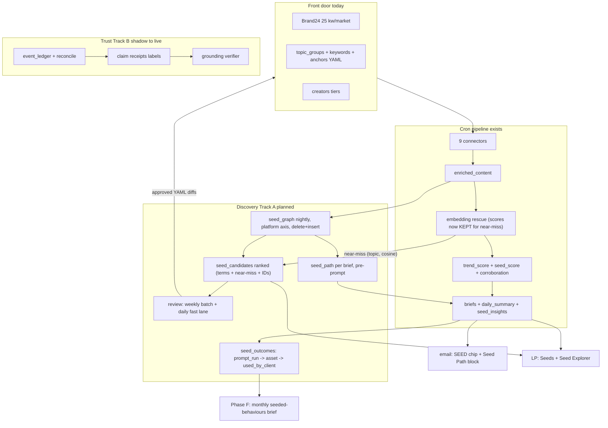
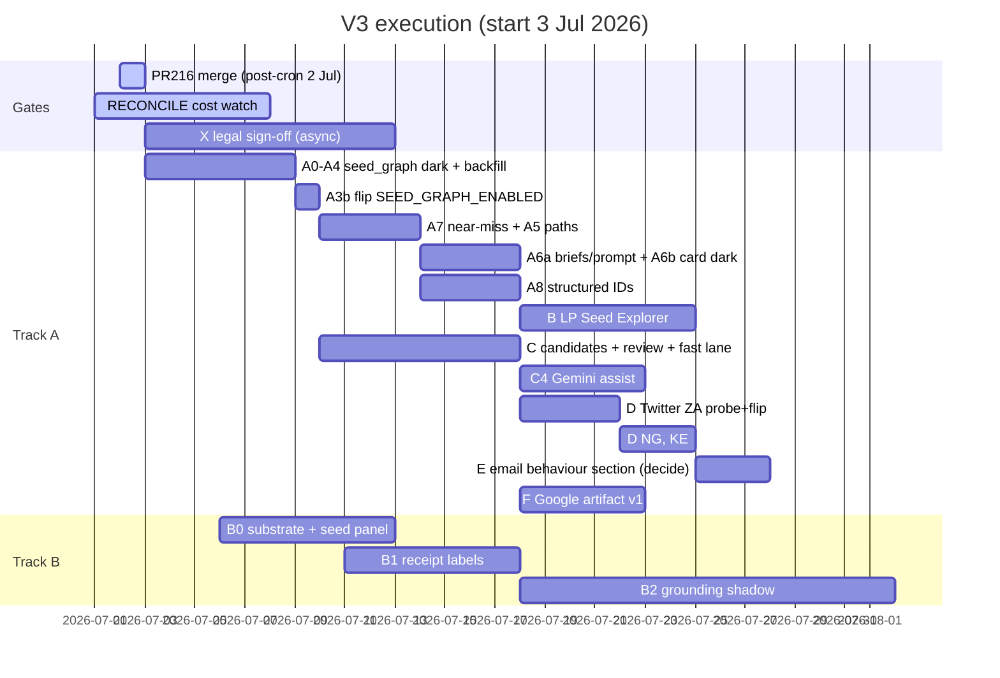

# Trends Engine V3 Blueprint (v3.3, audited execution edition)

Superseded by [`trends-engine-v3-blueprint-v3.4.md`](trends-engine-v3-blueprint-v3.4.md) (master build document, merged v3.2 inventory + v3.3 architecture + audit P0/P1 fixes). Kept for history.

Status: master build document, produced 2 Jul 2026 by a 27-agent adversarial audit of v3.2 against both live repos (109 code claims line-verified, 5 confirmed wrong or imprecise at major severity, 11 high-impact design gaps confirmed by independent refutation passes, 1 candidate gap refuted and dropped). Supersedes `trends-engine-v3-blueprint-v3.2.md`. Every ticket carries a flag, tests, acceptance, rollback. Every code claim below survived a line-level check or is tagged planned.

What v3.2 got wrong and this edition fixes, in order of blast radius:

1. A6 was internally contradictory: it populated `seed_path` after `_build_display` (generate_briefs.py:1834) yet injected it into a prompt assembled at build_brief_prompt (:1678) and consumed by the Gemini calls at :1714/:1769, all earlier. A literal executor ships a permanently empty prompt block and never notices. A6 is now split with the fetch moved before prompt build.
2. "Resends carry it" was false. The resend path rebuilds entries in `src/alerts/brief_loader.py` `_row_to_entry` (:94-121) from an explicit per-key whitelist; a key not added there dies on every resend. `scripts/backfill_render_payload.py` preserves only three keys on rebuild and would drop it too. Both are now named sub-tasks.
3. Phase D's closing claim was wrong: Twitter rows land as source "EnsembleData", and `_channel_family` (run_rss_now.py:249-283) looks up source first, so tweets collapse into the existing "ensemble" family. No new family appears without a code change. v3.3 replaces the channel_family axis entirely (see 4).
4. channel_family names the vendor pipe, not the cultural channel. It collapses Brand24's tiktok/facebook/instagram/web into one "brand24" family, and the "extract a shared util" instruction rested on a false premise: event_ledger.py:135 is a divergent taxonomy (gdelt/rss/trends/raw-source/other), not a duplicate, and corroboration.py:29-32 is pinned to the run_rss_now names so unification would silently move live scoring. seed_graph now keys on a normalised platform axis of its own.
5. C2's scoring was uncomputable: 0.15 of the weight sat on genz/slang context that no A1 column carried, and C1's seed_fit STRUCT had no producer. The DDL now carries the aggregates.
6. Mechanics corrections: no in-repo workspace ignore hides cron_flags.env (it is tracked and editable with normal file tools; only `.env`, `.env.*`, `*.bak`, `*.eml`, `sources.yaml` are hook-blocked); `enriched_content` has no `trend_date` column (partition is `DATE(collected_at)`, the backfill must derive it); SCHEMA_ORDER is missing TWO files, `seed_insights.sql` AND `system_events.sql`, so A0's proposed assert would fail on day one as written; engine_pulse has 2 functional dataset literals (:165, :201), not 4; the re-ingest guard B0 wanted to build already ships live (`_markets_already_ingested_today`, run_rss_now.py:1495-1533), leaving only the FORCE_REINGEST override to write.

What v3.2 missed entirely, now designed in: the engine computes embedding scores for every residual row on every cron and throws them away while discovery gets rebuilt on regex (A7 fixes this for zero new spend); no metric measured the one thing the product sells, earliness (section 8); nothing closed the loop to the paying client (seed_outcomes); no ticket ever flipped any of the new flags on; the writer ran blind for 10+ days before its first monitoring; the PII guard was dead code against the real leak vector; the token leg was English-stoplisted in three code-switching markets.

## 1. What V3 is

Two spines, parallel tracks, one engine.

Spine A, Discovery Loop, is the Google-facing product step. The paying client is Google; the commercial job is naming the cultural behaviour to seed Nanobanana (image) and Lyria (audio) into before it is obvious. V2 answers "what is loud" (`trend_score`). V3 answers "what is forming, how it moved across platforms, why, and what to watch next." The 25 Brand24 keyword slots per market plus the taxonomy are the front door, not the ceiling: discovery opens adjacent terms, handles, and sounds from the data, reconstructs behaviour paths, and feeds reviewed candidates back into what the engine watches.

v3.3 adds two commercial commitments v3.2 lacked. First, earliness is measured, not asserted: every discovered term gets a lead-time receipt (days from our first sighting to its Google Trends rising appearance or trend_score peak), computable from data already ingested daily. Second, the loop closes to the client, not just the taxonomy: behaviours carry an outcome state (proposed, prompt run, asset generated, used by client) so "did Google use it" is a queryable fact, not a vibe.

Spine B, Trust Layer, carried from v3.1/v3.2 with rescoped B0 and a corrected B1. Corroboration is live, the event ledger and reconcile run in shadow (3 batched Gemini calls/day, the calls live in event_ledger.py; reconcile.py is fully deterministic), promotion path is labels first, corrections later, grounding verifier last.

## 2. Ground truth (line-verified 2 Jul 2026)

### 2.1 What exists

All 14 rows of the v3.2 table were verified correct against code, with these precision upgrades:

| Component | Verified detail |
|---|---|
| seed_score | `_seed_breakdown` run_rss_now.py:794, wrapper :865; scoring.yaml:111-126; persisted with decomposition at :1158-1163 |
| SEED chip | card.py:309-318; verdict.py:65 seed_recommend, self-hides when empty |
| seed_insights | generate_seed_intelligence.py:151, 3-5 behaviours/day enforced in prompt schema; zero hits in src/alerts/, genuinely LP-only |
| Corroboration | src/scoring/corroboration.py pure, no BQ, no Vertex; called from run_rss_now.py:66. Family COUNTS n_factual/n_social computed then DISCARDED at :139-140; only 0..1 scores persist (matters for B1) |
| Embedding rescue | embedding_classifier.py:84 threshold 0.65, :90 margin 0.05; per-run cache, vectors and score lists never persisted (matters for A7) |
| Twitter path | ensemble.py:214-224, `/twitter/user/tweets`, terms_key twitter_handles, all markets false + empty. Rows would stamp source="EnsembleData", platform="twitter" |
| MERGE helper | bigquery.py:92 signature confirmed; fixed `c = S.c` UPDATE, no partition pruning. v3.3 no longer uses it for seed_graph (A2) |
| Channel family maps | run_rss_now.py:249-283, 9 named families + news fallback (10 values); event_ledger.py:135 is a DIVERGENT vocabulary, not a duplicate; corroboration.py:29-32 pins the run_rss_now names |
| Re-ingest guard | ALREADY LIVE: `_markets_already_ingested_today` run_rss_now.py:1495-1533, wired at :1849-1857, exists precisely to stop the 02:30 fallback double-spend |
| Vendor truth | fetch_units_history EXISTS at src/ingestion/connectors/customer_units.py:92; engine_pulse.py:580-660 already reads today's units + 14-day history every morning check |
| Schema orphans | SCHEMA_ORDER (setup_bigquery.py:30-47) is missing seed_insights.sql AND system_events.sql out of 13 files in infra/bigquery_schemas/ |
| enriched_content | No trend_date column; partition DATE(collected_at); carries published_at, genz_score (:25), slang_score (:29); no partition expiry (raw_content 90d) |
| Discovery configs | Novelty surface is per-market directories: configs/topic_groups/{za,ng,ke}.yaml, configs/keywords/{za,ng,ke}.yaml (slang: key PLUS a second topic_groups keyword block), configs/topic_anchors/{za,ng,ke}.yaml, configs/creators/{za,ng,ke}.yaml |
| Hashtag prior art | src/scoring/driving_hashtags.py already regex-extracts from text for the same reason (hashtags column empty), with a digit-tag fix and a 40-entry DEFAULT_STOPLIST the A2 leg must inherit, not reinvent |

### 2.2 What does not exist (the build)

seed_graph, seed_candidates, seed_outcomes, behaviour paths, seed_path on briefs or cards, keyword-first Seed Explorer, any writer from signal back into config, Twitter ingestion, lead-time or outcome metrics, near-miss persistence.

### 2.3 Live constraints (unchanged from v3.2, all verified or standing)

| Constraint | Detail | Expires |
|---|---|---|
| RECONCILE cost watch | 7 days from 1 Jul; no NEW Gemini passes until it closes clean. A7 is exempt: zero new Gemini or Vertex spend | ~8 Jul 2026 |
| PR #216 | Edits only the base pair (2400 to 3000 / 800 to 1000). With CREATOR_INGEST_BOOST=true live, the connector reads budget_units_per_run_boost (code default 1500, ensemble.py:696-703), so the raise is inert on the live path. All Twitter/Wave-3 headroom maths use the 1500 boost ledger plus fetch_units_history vendor truth, never 3000/1000 | merge post-cron 2 Jul |
| One charging surface per day | 5000 units/day account cap shared with Reddit | Standing |
| Probe before flip | Vendor shape + downstream consumer grep, scripts/verify_live.py | Standing |
| Protected files | .env, .env.*, *.bak, *.eml, sources.yaml (protect-paths hook). cron_flags.env is NOT protected and edits normally | Standing |
| X data legal check | EnsembleData Twitter for a Google-facing product needs WPP/Ogilvy compliance sign-off BEFORE any spend | Blocking gate for D |
| pd.isna() rule | Every BQ-derived scalar | Standing |

## 3. Architecture



Principles unchanged: reuse-first, additive tables, every stage dark behind a flag with the OFF path byte-identical and unit-tested, generative proposes and deterministic disposes, no auto-charging surface without probe and review, writer before reader. One addition: every dark flag ships with its own flip ticket; unflippable acceptance criteria are a bug in the plan, not the code.

## 4. Track A: Discovery Loop, ticket level

### Phase A: seed_graph + behaviour paths (zero new vendor or Gemini spend)

#### A0. Retro-fix the new-table pattern (hygiene, no flag)

Add BOTH `seed_insights.sql` AND `system_events.sql` to `setup_bigquery.py` SCHEMA_ORDER (verify system_events' live table first; its migration is scripts/migrations/create_system_events_table.py and its writer src/observability/events.py is live). Add the seed_insights daily read to the dry_run_sql.py REGISTRY. Then land the guard test: assert every file in infra/bigquery_schemas/ appears in SCHEMA_ORDER. As v3.2 wrote it the assert failed on day one because system_events.sql was the second orphan. No existing setup/dry-run test file exists; new asserts go in a new tests/unit/test_schema_order_parity.py. Rollback: revert, purely additive.

#### A1. seed_graph table

New `infra/bigquery_schemas/seed_graph.sql` + `scripts/migrations/create_seed_graph_table.py` (clone create_seed_insights_table.py dry-run/apply pattern) + SCHEMA_ORDER entry + REGISTRY read.

```sql
CREATE TABLE IF NOT EXISTS `{project}.{dataset}.seed_graph` (
  market STRING NOT NULL,             -- za | ng | ke
  term STRING NOT NULL,               -- normalised (see A2)
  term_type STRING NOT NULL,          -- slang | hashtag | token | music | handle | channel
  platform STRING NOT NULL,           -- normalised platform axis (see A2), NOT the connector family
  trend_date DATE NOT NULL,           -- partition; ingest day
  event_date DATE,                    -- DATE(COALESCE(published_at, collected_at)); behaviour timing
  row_count INT64,                    -- rows carrying the term that day on that platform (per-row presence, never per-occurrence)
  avg_genz_score FLOAT64,             -- mean enriched_content.genz_score over carrying rows (C2 input)
  slang_row_share FLOAT64,            -- share of carrying rows with slang_score > 0 (C2 input)
  topic_groups ARRAY<STRING>,         -- topics co-occurring that day (classified rows)
  near_topics ARRAY<STRING>,          -- A7: nearest-anchor topics from embedding near-miss rows, provisional
  co_occur_terms ARRAY<STRING>,       -- top 10 same-row co-occurring terms that day
  sample_row_ids ARRAY<STRING>,       -- up to 5 enriched_content ids as receipts
  generated_at TIMESTAMP
)
PARTITION BY trend_date
CLUSTER BY market, term;
```

Design decisions, stated: `platform` replaces channel_family as the path axis. The run_rss_now `_channel_family` map names vendor pipes (it collapses Brand24's tiktok/facebook/instagram/web strings into one "brand24" bucket, and Twitter would vanish into "ensemble"), which is the wrong lens for "how did this behaviour move." The builder derives platform from the row's `platform` column first (tiktok, instagram, threads, facebook, reddit, youtube, twitter, news, search, music) with a small source-fallback map of its own, owned by seed_graph. Do NOT touch `_channel_family` or event_ledger's variant; corroboration.py:29-32 is pinned to those names and unifying them silently changes live scoring. That unification is a separate hygiene ticket if ever wanted.

`row_count` and all co-occurrence counting are per-row presence (set semantics). Ensemble rows carry title = text[:100], so an occurrence count over title + text doubles every term in short comments.

No stored first_seen. Derived at read time: `MIN(event_date) OVER (PARTITION BY market, term, platform)` via a `v_seed_first_seen` view created alongside the table. event_date, not trend_date, so a creator's back-catalogue upload or a late-ingested row does not fake a fresh sighting. Backfill-order-proof and rerun-proof by construction.

Cardinality: acceptance cap 5k terms/market/day x up to 10 platforms x 3 markets x 365 days is a ~55M row/yr worst case; realistic volume far under. Scan growth is a non-issue because A2 writes with delete+insert, not MERGE.

#### A2. Builder module `src/analysis/seed_graph.py`

Pure function `build_seed_graph_rows(df, market, trend_date)` plus a persist wrapper that DELETES the day's (market, trend_date) slice then appends via `insert_dataframe` (bigquery.py:51), mirroring the event_ledger daily-rebuild pattern. This replaces v3.2's merge_dataframe plan and dissolves three of its workarounds at once: the fixed `c = S.c` UPDATE limitation, the unpruned MERGE scan that grew with history, and the MERGE idempotency test (now a delete+insert rerun test: same day twice, identical table state). The daily source read pulls only `id, market, platform, source, title, text, slang_terms, topic_groups, genz_score, slang_score, published_at, collected_at` from the day's enriched_content partition; the stage is a bounded BQ read plus an in-memory pandas pass, and the dry_run_sql REGISTRY entry covers the read.

Term extraction, defined:

Slang: split `slang_terms` on comma (term_type slang).

Hashtags: reuse, do not reinvent. Extract the regex + digit-tag guard + DEFAULT_STOPLIST from `src/scoring/driving_hashtags.py` into a shared util consumed by both (driving_hashtags already exists because the hashtags column is empty across connectors, and it already fixed the HTML-entity digit-tag bug: `&#8217;` producing #8217). Pattern requires a leading letter (`#([a-z]\w{2,29})` post-lowercase); all-digit and non-`[a-z0-9_]` captures drop at extraction. Seed `configs/seed_graph_stoplist.yaml` cold-start from DEFAULT_STOPLIST plus per-market function-word lists (see tokens), with a stated rule: C3 review rejections tagged junk append to it.

Tokens (the discovery long tail): Unicode word regex with NFKC + diacritic-fold normalisation, folded length >= 4, store the folded form. The v3.2 ASCII `[a-z0-9]{4,}` pattern fragments Yoruba underdot orthography and Sheng apostrophe forms into unmatchable shards, rebuilding the exact literal-token ceiling the M4 embeddings exist to fix. Token sources: (a) unclassified rows, as before; (b) NEW, bounded: top-N novel tokens per topic from CLASSIFIED rows (tokens absent from all taxonomy/slang configs), because adjacent-term discovery lives inside classified conversation, not only outside it, and unclassified-only tokens carry empty topic_groups which starves C2's co-occurrence component. Ranking within the top-30/market/day cap is by distinctiveness (day frequency over trailing 28-day seed_graph baseline), not raw frequency, so ambient function words self-suppress and C2 gets its velocity input for free.

Token-row exclusions: strip the Reddit `[r/<sub>]` prefix (the `_PREFIX_RE` pattern at driving_hashtags.py:39) so subreddit names do not become top tokens; exclude Brand24 synthetic rows (link/author aggregates) and GDELT rows from token extraction entirely, their text is not human language.

Safety filtering: row-level BEFORE extraction. Classified rows: `row_matches_geo_blocklist(row, tg)` per topic, skip the row's terms if any fires. Unclassified token rows: `has_non_ssa_script` + `has_foreign_latin_density` (geo_blocklist.py) PLUS `is_hard_foreign_text` (src/utils/language_guard.py, already imported by the classifier) applied inside the builder regardless of the global langdetect flag, because the script-block and two-language Latin-density checks pass Tagalog, Indonesian, Portuguese, French, Spanish clean, the exact hole the r/all incident proved. Drop terms hitting `_RISK_TEXT_MARKERS` (generate_briefs.py:1140) and the stoplist.

PII guard, rewritten because v3.2's was dead code: no extraction path can emit a term containing `@` (both regexes exclude it), while the REAL leak is @mention bodies becoming bare tokens ('@thandi_m' tokenising as 'thandi'). So: scan the raw row text for @-mention spans first, add each mention body (post-normalisation) to a per-row drop set, then extract. Watchlist-handle matching stays as a second check, with the nuance that watchlisted creator handles are allowed through as term_type handle (they are public figures and D2 wants them). Required test: text "love this @thandi_m 🔥" yields no thandi token.

Dedupe: one row per (market, term, term_type, platform, trend_date). A term that is both slang and hashtag the same day (amapiano is in the ZA slang config AND a live hashtag) keeps both rows; term_type is part of the identity, and C2 dedupes at candidate_value level.

#### A3. Cron wiring + day-one monitoring (one PR)

New stage in run_rss_now.py after trend scoring, before briefs, gated `SEED_GRAPH_ENABLED` (cron_flags.env, default false), non-fatal try/except like FORECAST (:2170) and RECONCILE (:2314). cron_flags.env is tracked and editable with normal file tools; flip lands via normal PR. Optionally add the flag to `_DURABLE_FLAGS` in tests/unit/test_workflow_env_parity.py for drift protection (nothing fails if skipped, which is exactly why it should not be skipped). No Dockerfile or cloudbuild change; the deploy already pushes cron_flags.env to all four jobs.

Monitoring ships in the SAME PR, not at render-flip: a seed_graph line in the bq-snapshot skill (rows per market for trend_date; 0 rows while flag true = FAIL) plus a spot check that no stored term contains `@` or non-SSA script. Rationale: the stage is non-fatal by design, so a writer bug fails silently (the CF-0007 class dry_run_sql.py documents), and v3.2's first monitoring arrived 10+ days after first write.

#### A3b. Flip ticket (v3.2 had no flip for ANY discovery flag)

Own PR after the dark merge is CI-green: `SEED_GRAPH_ENABLED=true`. Confirm the Cloud Build deploy applied it to all four jobs (gcloud run jobs describe, env grep). First rows expected next 00:30 cron. Same pattern later for SEED_CANDIDATES_ENABLED (after C2 merges) and SEED_PATH_RENDER_ENABLED (after two clean seed_graph days + one real multi-platform path eyeballed). Phase A acceptance is unreachable with the writer flag false; a plan whose acceptance criteria cannot fire is a planning bug.

#### A4. Backfill

`scripts/backfill_seed_graph.py --start --end [--dry-run] [--resume-from DATE]`, local one-off under ADC like the three existing backfill scripts (backfill_seed_score.py, backfill_render_payload.py pattern), oldest-to-newest, chunked per trend_date so a kill restarts cheaply. Correction from v3.2: enriched_content has NO trend_date column; select `DATE(collected_at) AS trend_date` and filter `WHERE DATE(collected_at) BETWEEN @start AND @end` so the read also prunes partitions. Select the same narrow column list as A2 (full-text columns are the scan driver; include published_at for event_date). `--dry-run` prints bytes-scanned before committing. Avoid the 00:00-04:00 UTC window so the backfill never contends with the live cron's daily delete+insert.

#### A5. Behaviour path builder `src/analysis/seed_path.py`

`build_seed_path(market, topic_group, trend_date)`: topic's top terms from seed_graph, platforms ordered by derived first-seen from `v_seed_first_seen` (event_date-based). Emit:

```python
{
  "term": str,
  "channels": [{"platform": str, "first_seen": "YYYY-MM-DD", "row_count": int}],
  "span_days": int,
  "confidence": "measured" | "thin",   # measured = >=2 platforms AND span >=2 days AND >=10 rows total
  "coverage_note": str,                 # names platforms NOT ingested (e.g. twitter), absence is explicit
}
```

Connector go-live guard: a platform whose derived first-seen equals our watch-start for that (market, platform) (MIN(trend_date) per market+platform across seed_graph) contributes no ordering claim; it renders as "watched since", not "first seen". Otherwise every path ordering partially mirrors our ingest rollout, the risk v3.2 named but did not mitigate. No cross-correlation in v1; ordering by first-seen is the shippable core. "thin" renders with "in our data" phrasing, never as a market claim.

#### A6a. seed_path into briefs, prompt, persistence (writer side)

Sequencing fix, the big one: `build_seed_path` is called per topic BEFORE prompt assembly, and the sanitised compact block is passed into build_brief_prompt (generate_briefs.py:1678, template src/analysis/prompts/trend_brief.py) so the Gemini calls at :1714/:1769 actually see it. The same dict attaches to the TopicBrief (created at `_to_topic_brief` :1732; new field `seed_path: dict = field(default_factory=dict)`) for render and persistence. v3.2's "populate after _build_display" ordering produced a permanently empty prompt block.

Persistence, all three seams or resends silently drop it: (1) add to the `persist_render_payloads` dict (the seed_score seam, :1344-1358); (2) add to the `_row_to_entry` whitelist in src/alerts/brief_loader.py (mirror the seed_score line at :119-120) with a test in tests/unit/test_brief_loader.py, this is the path every resend uses; (3) add to the preserve list in scripts/backfill_render_payload.py (~:104) so a recovery-day payload rebuild keeps it.

Prompt-injection guard unchanged from v3.2: length cap ~40 chars, charset allowlist on the normalised space, URL and `@` strip, quoted-data framing ("channel trail, cite it, do not invent ordering"). New acceptance criterion: a generated brief on a path-bearing topic actually references the trail (spot-check three briefs), catching the silent-empty-block failure class.

#### A6b. Email card render (reader side)

`_seed_path(brief, pal, dark)` block in card.py rendered between hashtags and kit in the `inner` chain (~:566), self-hiding when absent, gated `SEED_PATH_RENDER_ENABLED` default false. Email has no LP-style mask_handle, so handle-like terms render masked or not at all. Path-coverage query joins morning-check when this flag flips (the bq-snapshot seed_graph line from A3 already exists by then).

#### A7. Embedding near-miss capture (new; zero new spend; the strongest discovery source v3.2 deferred)

The engine already pays to embed every residual row and score it against every topic anchor on every flag-on cron, then discards everything below threshold (embedding_classifier.py, per-run cache, nothing persisted). That near-miss band IS the discovery signal: content semantically adjacent to a topic but outside the current lexicon. C4's "embedding clustering research spike" was a strawman deferral, and the RECONCILE Gemini gate does not apply because this adds zero Gemini and zero new Vertex spend (the vectors are already computed).

Ticket: extend classify_batch (or add a scored variant, embedding_classifier.py ~:405-430) to return top-2 (topic, cosine) per row. At the rescue call site (src/ingestion/enrichment.py ~:598-620), rows in the near-miss band (top cosine 0.50-0.65, or margin-rejected) get their nearest topic stamped into the builder input so their extracted terms land in seed_graph `near_topics` (provisional, never `topic_groups`). C2 reads near_topics at half the co-occurrence weight. Gated by SEED_GRAPH_ENABLED (same stage), tests assert near-miss rows populate near_topics and fully-unclassified rows do not. This gives token-type candidates the topic affinity v3.2 structurally denied them.

#### A8. Structured ID capture (music, handles, channels; makes the C1 promise honest)

C1 declares candidate_type music_id, channel_id, handle, yt_keyword, but v3.2 had no producer for any of them: C2 sourced only seed_graph slang/hashtag/token terms, so the Lyria-relevant sound leg was dead on arrival and tt_music_ids stayed permanently unfillable from data (TikTok music metadata is currently discarded at normalisation; raw_content keeps no raw payload and expires at 90 days). Ticket: in ensemble.py normalisation, capture aweme music id + title, author handles, and YouTube channel ids into a compact side-channel the seed_graph builder persists as term_type music, handle, channel (label in co_occur_terms slot or a label column if cleaner at implementation). PII rules per A2 (public creators pass, private mention bodies never). This is the data-driven fill path for the empty Wave 3 lists and D2's handle shortlist.

Phase A tests, named: tests/unit/test_seed_graph.py (extraction legs incl. classified-token source, stoplist/geo/language/PII drops, @thandi_m test, presence-counting on ensemble-shaped rows, delete+insert rerun idempotency, platform mapping incl. brand24 platform split and twitter), tests/unit/test_seed_path.py (first-seen stability, watch-start guard, confidence thresholds, coverage_note), test_brief_loader.py seed_path carry, OFF-path byte-identical asserts for both flags, card golden render. Acceptance: two consecutive cron days of rows in all three markets, sane cardinality (< 5k terms/market/day), at least one real topic showing a multi-platform path with the watch-start guard exercised, email unchanged with render flag off, bq-snapshot line green. Rollback: flags off; tables additive and ignorable.

### Phase B: Listening Post Seed Explorer (reader, LP repo)

B1: bq.py adds `fetch_seed_graph_adjacency(keyword, market)` (co_occur_terms + topic overlap + bridge creators + lexicon hits) and `fetch_seed_path(keyword, market)`. Latency reality from the audit: bq.py queries are synchronous jobs (1-3 s cold each) and adjacency spans four signal families, so EITHER collapse it into one combined query OR run sub-queries on a ThreadPoolExecutor (research.py already does exactly this). Warm means a repeat of the same (keyword, market) inside the TTL (~10 min, `_channel_totals_cache` pattern; note the keyword-keyed cache has unbounded key space, cap or LRU it). B2: main.py route GET /api/seed-path behind the passcode gate; chat.py TOOL_SCHEMAS + _TOOLS entry following get_seeds (:378); handles masked via mask_handle/is_real_handle. B3: seedpath.jsx in App.jsx STANDALONE set + router, keyword input, trail visual, adjacent chips linking to Console research. Tests in test_api.py per the seeds patterns. Deploy: LP main push, keyless CI gate, no engine deploy. Acceptance: "amapiano" returns adjacency + trail + candidate handles, under 3 s warm, under ~5 s cold with parallel fetch. Rollback: additive route removal.

### Phase C: seed_candidates + review loop (deterministic first, Gemini later)

#### C1. Tables

`seed_candidates.sql` + migration + SCHEMA_ORDER + REGISTRY: candidate_id STRING, proposed_date DATE (partition), market, candidate_type (keyword|slang|handle|music_id|channel_id|yt_keyword), candidate_value, source (seed_graph|embedding_near_miss|coverage|manual), score FLOAT64, seed_fit STRUCT<genz FLOAT64, slang FLOAT64, visual_audio FLOAT64, co_occur FLOAT64>, safety_flags ARRAY<STRING>, evidence_topics ARRAY<STRING>, sample_row_ids ARRAY<STRING>, status (pending|approved|rejected|applied|reverted), status_by, status_at, rationale. `reverted` is in the enum from day one so the review script's state machine knows it exists (see C3 un-apply).

`seed_outcomes` (small, additive): behaviour_or_candidate_id, market, outcome (proposed|prompt_run|asset_generated|used_by_client), noted_by, noted_at, note. One column-flip per weekly review; this is the client-loop table sections 1 and 8 now depend on.

#### C2. Deterministic ranker `src/analysis/seed_candidates.py`

Weekly stage inside the daily cron, `SEED_CANDIDATES_ENABLED` default false, gated on `trend_date.weekday() == 0`, idempotent by skipping when pending candidates exist for that proposed_date (so 00:30 + 02:30 schedulers cannot double-propose). Candidates = seed_graph terms with derived first-seen (v_seed_first_seen, not a column) inside the 7-day window, absent from ALL of configs/topic_groups/{za,ng,ke}.yaml, configs/keywords/{za,ng,ke}.yaml (BOTH its slang key and its parallel topic_groups block), configs/topic_anchors/*.yaml, and for handle types configs/creators/*.yaml, frequency >= 5. Slang-type terms auto-fail novelty by construction (slang_terms is a closed config vocabulary), which is correct; the pool is hashtags, tokens, near-miss terms, and A8 IDs.

Score = 0.35 x co-occurrence with topics whose seed_score >= 0.5 (topic_groups full weight, near_topics half weight, so token candidates are no longer structurally zeroed) + 0.25 x visual/audio platform share + 0.25 x distinctiveness velocity (the A2 ranking stat, free) + 0.15 x genz/slang context from the A1 aggregates (avg_genz_score, slang_row_share; v3.2's version was uncomputable, no column carried it). Safety pre-filter stamps safety_flags (geo blocklist, _RISK_SIGNALS, foreign script, langdetect-foreign); any flag forces status=rejected at insert. Cap 15 pending per market per week.

Fast lane (new): candidates crossing the top decile of the composite propose DAILY, surfaced as a one-line LP chip or ops-digest line for same-day approve/reject. The weekly batch handles the tail. Rationale: Monday-only proposal plus weekly review put first-seen to actively-watched near three weeks, which contradicts "before it is obvious" (an Arbantone spike or a finance-bill flashpoint is over in days). Review latency (median days first_seen to applied) becomes a section 8 metric so the cadence itself is measured.

#### C3. Review workflow (the gate is Albert, admitted and bounded)

Weekly 15 minutes batched plus the daily fast-lane glance: `scripts/review_seed_candidates.py --list / --approve ID --target topic_group:X / --reject ID --reason`. Approved keyword/slang candidates emit a ready-to-paste YAML diff; the script never writes configs itself. Two mechanics v3.2 missed: (1) diffs targeting sources.yaml collide with the protect-paths hook (Edit/Write blocked); the script labels each diff with its target path, and sources.yaml diffs apply via explicit user-approved shell-side write, taxonomy-file diffs apply through normal Edit. (2) Un-apply exists: revert the YAML commit (own PR, redeploys via the configs path filter), set status=reverted with reason, and if the term caused a geo leak or brief pollution, regen the affected day via the trends-engine-regen job. Applying remains a normal reviewed commit; then `--applied ID`.

#### C4. Gemini assist (only after RECONCILE watch closes clean, ~8 Jul+)

`scripts/propose_taxonomy_candidates.py`: one batched Vertex call per market per WEEK over the unclassified residual + top new seed_graph terms, source=coverage, same table, same gate, ~$1-2/mo. The old "embedding clustering spike" language is gone: A7 already ships the embedding leg deterministically for free. C4 is earned by the precision metric (section 8), not by yield.

Phase C tests: tests/unit/test_seed_candidates.py (weekday gate, double-fire idempotency, novelty against the REAL config directories incl. the keywords/ topic_groups block, near_topics half-weight, safety auto-reject, per-market cap, fast-lane threshold). Acceptance: first weekly batch <= 45 candidates, >= 3 survive review, >= 1 applied term classifies real rows within 7 days, review latency measured. Rollback: flag off; un-apply procedure for anything already applied.

### Phase D: Twitter/X activation (hard-gated)

Order binding: D1 legal sign-off on X-via-EnsembleData for a Google-facing product (no spend before it clears). D2 shortlist 5 handles per market: tier_1 creator lists give the PEOPLE, not the X handles (configs/creators/*.yaml watchlists carry only tiktok/instagram/threads sections, and handles like "uncle.waffles" are not valid X usernames), so each needs its X username manually verified; the 2-unit `/twitter/user/info` resolve inside the D3 probe doubles as the existence check. `is_real_handle` is an LP helper (Listening Post src/api/bq.py:483) with no engine import path; apply its logic manually or copy the trivial check. D3 probe: fetch_units_history baseline, then `py -3.13 scripts/verify_live.py ensemble-probe twitter_user <handle> za` (no `twitter` target exists in main(); twitter_user is the registered ensemble-probe endpoint); record shape (GraphQL envelope: add legacy.favorite_count/retweet_count/reply_count to metric candidates per flip-readiness row 084) and real units/call. D4 flip ZA only, one cron, morning-check + units delta, tweets land with metrics and non-null published_at. D5 NG then KE on separate days, gated on the LIVE boost ledger (1500/run, ensemble.py:696-703) plus fetch_units_history account truth, never the inert 3000/1000 base pair. Rollback: flag false.

Correction that changes the D deliverable: Twitter rows do NOT automatically appear as a new path family. They stamp source="EnsembleData", platform="twitter", and the legacy `_channel_family` would swallow them into "ensemble". Under v3.3 this is already solved where it matters: the A2 platform axis reads the platform column, so seed_graph and behaviour paths get their discourse leg with zero extra code. Corroboration's family view still sees "ensemble"; widening corroboration's vocabulary is explicitly out of scope (it moves live scoring).

### Phase E: optional email promotion

seed_insights rank-1 behaviour as a top-level digest section (`_section_row` pattern), gated SEED_BEHAVIOUR_EMAIL_ENABLED default false. Decide after Seed Path has run visibly a week and Jo/Thapelo react.

### Phase F: the Google-facing artifact (new; the loop must reach the client)

Everything Track A builds terminates today at an internal email (Jo, Thapelo, Albert) and a passcode-gated internal tool; no defined deliverable reaches Google. Phase F: a monthly seeded-behaviours brief (hosted read, reuse the GCS MAILER_ARCHIVE_BUCKET pattern) pairing each behaviour with its lead-time receipt (section 8) and its Nanobanana/Lyria prompt, plus its seed_outcomes state. Owned by Jo for the Google relationship. Even as a stub ticket it forces the question "who at Google consumes this" to be answered before Track A finishes. Ties into BSA white-label: the discovery substrate (seed_graph, candidates, review) is client-agnostic infrastructure; the seeding lens (C2 weights, seed_score audience_weights) follows the configs/mailer_brands/ per-client pattern when the second tenant arrives. One paragraph now, no rebuild later.

## 5. Track B: Trust Layer (rescoped from the audit)

| Phase | Content | Gate |
|---|---|---|
| B0 | get_dataset() routing: ~15 literals in accuracy_watchdog.py, 2 FUNCTIONAL in engine_pulse.py (:165, :201; the third is a docstring), check engine_evolve.py. Ensemble vendor-truth pre-call check: WIRE the EXISTING engine_pulse fetch_units_history read (engine_pulse.py:580-660, customer_units.py:92) into the cron's pre-call path, do not build a new fetch. Re-ingest guard: ALREADY LIVE (_markets_already_ingested_today, run_rss_now.py:1495-1533); B0 scope is ONLY the FORCE_REINGEST override flag on top of it. Plus a seed panel in accuracy_watchdog (seed_score distribution drift, chip-hot rate, seed_insights rank-1 recurrence) and a one-off seed_score backtest against topics that later produced approved behaviours, BEFORE C2 hard-codes seed_score >= 0.5 as its quality bar | None, start any time |
| B1 | claim_receipt labels: corroboration chip on cards. Data correction: the family counts (n_factual/n_social) are computed then DISCARDED inside compute_corroboration (corroboration.py:139-140); only 0..1 scores persist on trend_scores (run_rss_now.py:1178-1181). B1 either persists n_factual/n_social as two new trend_scores columns or renders the existing scores; and the chip needs the trend_scores-to-brief bridge (the A6a seam) since cards render from briefs/render_payload | ~10 clean shadow days from 1 Jul, watchdog green |
| B2 | Grounding verifier SHADOW (Key-tier topics, batched, 100-200 human-labelled claims) + ledger validity_window + widened factual fetch | B1 live, cost line approved |
| B3 | Reconcile stale-correct/suppress live + future-tense validator | B2 sign-off, zero true-to-false inversions |
| B4 | THE READ swap, VECTOR_SEARCH hybrid, pattern detectors (emergence first, each beats persistence backtest), relevance.py | B3 |

Pinned facts, all re-verified: ledger emits resolved|scheduled|unknown only; ledger Gemini cost is 3 batched calls/day (the calls live in event_ledger.py; reconcile.py is zero-Gemini and fully deterministic); schema_version on render_payload does not exist yet, ships with B1; the $30/mo Vertex RED is a morning-check procedure, not a deployed script.

## 6. Sequence and dependencies



Rules encoded: nothing Gemini-new before the RECONCILE watch closes (C4 waits; A7 is exempt, zero new spend); Twitter waits on legal AND verified handles AND boost-ledger headroom proof; one charging surface per day (D staggered); writer before reader (A before B); trust labels only after clean shadow days; every flag has a flip ticket.

## 7. Cost model

| Item | Cadence | Monthly est. | Status |
|---|---|---|---|
| Per-topic briefs (~20-30 calls/day) | Daily | Dominant existing line | Live |
| daily_summary + seed_intelligence | Daily | ~$0.5-1 | Live |
| event_ledger shadow | 3 calls/day | ~$3-5 | Live, under watch |
| seed_graph build + backfill | Daily narrow read + delete/insert | BQ pennies; one-time backfill, dry-run first | Planned A |
| A7 near-miss capture | Daily | $0 incremental (vectors already paid) | Planned A |
| seed_candidates ranker + outcomes | Weekly SQL + one review column | Negligible | Planned C |
| Taxonomy Gemini assist | 3 calls/week | ~$1-2 | Planned C4, gated |
| Twitter ingestion | ~15 handles daily | Ensemble units (probe gives real number), $0 Vertex | Planned D, gated |
| Grounding verifier | Shadow then scale | $8-15+ at scale, own line | Planned B2 |

Guardrails: $50 Cloud Billing outer bound, $30/mo Vertex RED via morning-check, fetch_units_history before/after every Ensemble change.

## 8. Success metrics with measurement mechanisms

| Metric | Mechanism | Target |
|---|---|---|
| Lead time (THE product metric) | Days from v_seed_first_seen to (a) the term's Google Trends rising appearance (already ingested daily, percent_gain path) and (b) its topic's trend_score peak. Baseline computed from backfilled history immediately after A4, before any client conversation | Median lead > 0 days at baseline; growing |
| Client loop closure | seed_outcomes states per month: prompt_run, asset_generated, used_by_client | >= 1 asset_generated/month by F+60; this is the headline commercial number, above discovery yield |
| Path coverage | Morning-check query: share of top-10 seed_score topics with seed_path.confidence != "" in render_payload | >= 60% by A+14 days |
| Discovery precision | Share of applied candidates whose topic reaches seed_score >= 0.5 or spawns a seed_insights behaviour within 14 days of apply. Precision, not yield, decides whether C4 is earned | >= 30% by C+45 days |
| Discovery yield | seed_candidates GROUP BY status weekly (throughput gauge only; it measures the reviewer, not the market) | >= 3 approved/week by C+30 days |
| Review latency | Median days first_seen to applied (fast lane vs weekly batch split) | Fast lane < 3 days |
| Loop closure to taxonomy | status=applied count + applied term's row_count 7 days later | >= 2 applied/month, each classifying real rows |
| Unclassified rate | Weekly per market vs 4-week baseline | -20% relative by C+60 days, zero new geo collisions |
| Twitter health | tweets/day per market, % null published_at, units delta | Present, <5% null, inside boost-ledger headroom |
| Trust promotion | reconcile_actions stale-catch audit, zero true-to-false inversions at B3 | Zero inversions |

## 9. Risks

| Risk | Mitigation |
|---|---|
| Token junk floods the cap | Distinctiveness ranking (28-day baseline) self-suppresses ambient words; stoplist cold-started from driving_hashtags DEFAULT_STOPLIST + per-market function words; junk rejects append to stoplist; connector-boilerplate rows excluded at source |
| Non-English signal missed (the product IS code-switched culture) | Unicode + fold token regex; is_hard_foreign_text inside the builder regardless of global flag; A7 near-miss leg is language-agnostic by construction (multilingual embeddings) |
| PII leak via mention bodies | @-mention span strip pre-extraction (the @-in-term check was dead code); watchlist handles pass only as explicit handle candidates; email masks or drops handle-like survivors |
| Path ordering mirrors our ingest rollout | event_date basis + per-(market, platform) watch-start guard renders "watched since" instead of a false first-seen; coverage_note names missing platforms; thin renders as "in our data" |
| Writer bug fails silently for days | bq-snapshot line + 0-rows FAIL + PII/script spot check ship in the A3 PR, day one, not at render-flip |
| Review bottleneck (Albert is the gate) | Weekly 15-min batch + daily fast-lane glance, 15/market cap, safety auto-reject; review latency is itself a metric |
| Bad applied term pollutes classification | reverted status + un-apply procedure (YAML revert PR + optional day regen) in C3 from day one |
| Prompt injection via discovered terms | A6a sanitises: length cap, charset allowlist, URL/@ strip, quoted-data framing |
| Gemini cost stack opaque during watch | C4 and B2 wait for the watch; A7 is provably zero-Gemini |
| Two-repo skew | schema_version ships with B1; LP reads defensively; writer-first ordering |
| Cron time budget at 00:30 | Stage is one narrow-column partition read + in-memory pass + delete/insert; non-fatal try/except; sized in the A3 PR description with the dry-run bytes number |
| seed_score is an unvalidated fitness function | B0 seed panel + one-off backtest before C2 hard-codes 0.5 |

## 10. What V3 is NOT

Not a rewrite of ingestion or composite scoring. Not a change to `_channel_family`, event_ledger's family map, or corroboration's vocabulary (pinned to live scoring; seed_graph owns its own platform axis instead). Not forecast-on until something beats persistence. Not autonomous config writes, ever; the script emits diffs, a human commits, and un-apply exists. Not batch-flipping Wave 3 lists or Twitter markets. Not external vector stores or non-Vertex models (WPP). Not behaviour paths presented as ground truth without the "in our data" qualifier. Not client-facing trust corrections before shadow sign-off.

## 11. Immediate next actions (in order)

1. Confirm 2 Jul cron completed, then merge PR #216 (standing instruction, one flip that day; remember it is inert on the live boost path).
2. Kick off X legal question with compliance (async, long pole for D).
3. Build A0-A4 on a feature branch, flags default false, monitoring included in the A3 PR.
4. Start B0 substrate in parallel (pure hygiene, includes the seed panel; note the re-ingest guard already exists, only FORCE_REINGEST is new).
5. A3b flip PR once dark merge is CI-green; first rows next 00:30 cron.
6. After two clean seed_graph days: A7 + A5, then A6a/A6b (render flag still off). Run the lead-time baseline off the A4 backfill.
7. RECONCILE watch closes ~8 Jul: review Vertex spend, then unlock C4 planning.

## 12. Document lineage

| Version | Date | Focus |
|---|---|---|
| v3.0 | 30 Jun | Trust-first, stale on reconcile state |
| v3.1 | 1 Jul | Audit-corrected trust, no discovery spine |
| v3.2 execution | 2 Jul | Ticket-level: DDL, flags, tests, acceptance, rollback |
| v3.2 corrected | 2 Jul | Line-level audit fixes (merge helper reality, derived first-seen, probe CLI) |
| v3.3 audited | 2 Jul | 27-agent adversarial audit: 109 claims verified, 5 majors fixed (A6 sequencing, resend whitelist, Twitter family, C2 computability, mechanics), 11 confirmed gaps designed in (platform axis, delete+insert primitive, A7 near-miss, A8 ID capture, flip tickets, day-one monitoring, PII guard rewrite, multilingual tokens, fast lane, lead-time + outcome metrics, Phase F Google artifact, un-apply) |

Update triggers: PR #216 merged, RECONCILE watch closed, first seed_graph migration landed, X legal answer, first lead-time baseline computed.
