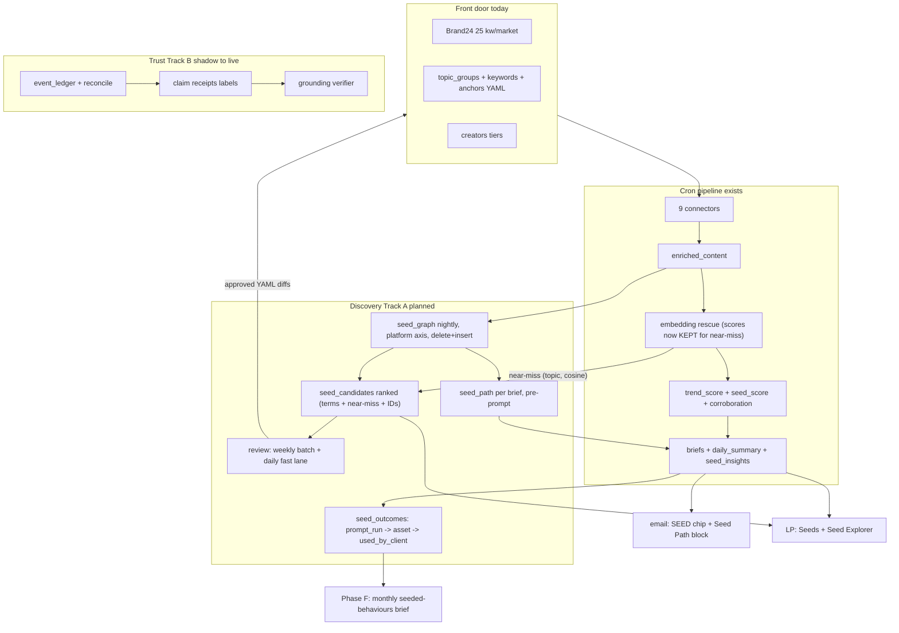
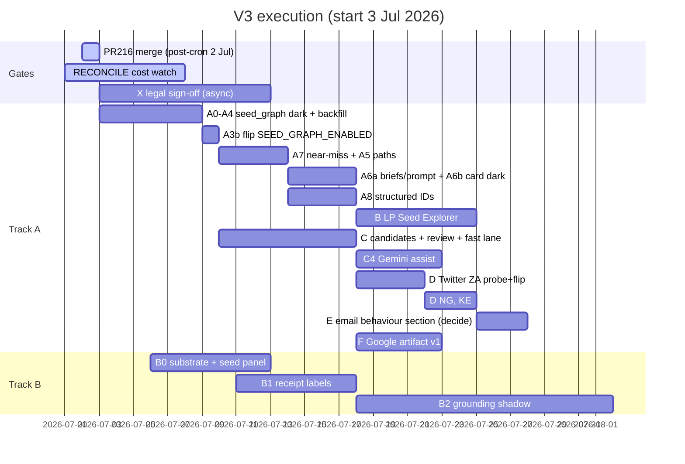

# Trends Engine V3 Blueprint (v3.4, master execution edition)

> Superseded by [`trends-engine-v3-blueprint-v3.6.md`](trends-engine-v3-blueprint-v3.6.md). Do not use for execution.

Status: master build document, produced 2 Jul 2026 by merging `trends-engine-v3-blueprint-v3.3.md` (architectural spine) with `trends-engine-v3-blueprint-v3.2.md` (inventory, cron_flags guidance, metrics) and applying adversarial-audit P0/P1 fixes. Supersedes v3.2 and v3.3. Every ticket carries a flag, tests, acceptance, rollback. Every code claim below survived a line-level check or is tagged planned.

What v3.2/v3.3 got wrong and this edition fixes, in order of blast radius:

1. A6 was internally contradictory: it populated `seed_path` after `_build_display` (generate_briefs.py:1834) yet injected it into a prompt assembled at build_brief_prompt (:1678) and consumed by the Gemini calls at :1714/:1769, all earlier. A literal executor ships a permanently empty prompt block and never notices. A6 is now split with the fetch moved before prompt build.
2. "Resends carry it" was false. The resend path rebuilds entries in `src/alerts/brief_loader.py` `_row_to_entry` (:94-121) from an explicit per-key whitelist; a key not added there dies on every resend. `scripts/backfill_render_payload.py` preserves only three keys on rebuild and would drop it too. Both are now named sub-tasks.
3. Phase D's closing claim was wrong: Twitter rows land as source "EnsembleData", and `_channel_family` (run_rss_now.py:249-283) looks up source first, so tweets collapse into the existing "ensemble" family. No new family appears without a code change. v3.4 replaces the channel_family axis for discovery with a normalised platform axis (see A1/A2).
4. channel_family names the vendor pipe, not the cultural channel. It collapses Brand24's tiktok/facebook/instagram/web into one "brand24" family, and the "extract a shared util" instruction rested on a false premise: event_ledger.py:135 is a divergent taxonomy (gdelt/rss/trends/raw-source/other), not a duplicate, and corroboration.py:29-32 is pinned to the run_rss_now names so unification would silently move live scoring. seed_graph now keys on a normalised platform axis of its own.
5. C2's scoring was uncomputable: 0.15 of the weight sat on genz/slang context that no A1 column carried, and C1's seed_fit STRUCT had no producer. The DDL now carries the aggregates.
6. Mechanics corrections: `configs/cron_flags.env` is tracked in git; some parent workspace ignore globs may hide `**/*.env` from IDE file browsers, so edit via git/shell in a normal PR (same path RECONCILE_ENABLED used). It is NOT hook-blocked; only `.env`, `.env.*`, `*.bak`, `*.eml`, and `sources.yaml` are protect-paths hook-blocked. Every new cron flag MUST land in `cron_flags.env` AND `_DURABLE_FLAGS` in `tests/unit/test_workflow_env_parity.py` in the same PR (mandatory env parity, not optional). `enriched_content` has no `trend_date` column (partition is `DATE(collected_at)`, the backfill must derive it); SCHEMA_ORDER is missing TWO files, `seed_insights.sql` AND `system_events.sql`, so A0's proposed assert would fail on day one as written; engine_pulse has 2 functional dataset literals (:165, :201), not 4; the re-ingest guard B0 wanted to build already ships live (`_markets_already_ingested_today`, run_rss_now.py:1495-1533), leaving only the FORCE_REINGEST override to write.

What earlier editions missed entirely, now designed in: the engine computes embedding scores for every residual row on every cron and throws them away while discovery gets rebuilt on regex (A7 fixes this for zero new spend); no metric measured the one thing the product sells, earliness (section 11, with join mechanics); nothing closed the loop to the paying client (`seed_outcomes`); no ticket ever flipped any of the new flags on; the writer ran blind for 10+ days before its first monitoring; the PII guard was dead code against the real leak vector; the token leg was English-stoplisted in three code-switching markets.

## 1. What V3 is

Two spines, parallel tracks, one engine.

Spine A, Discovery Loop, is the Google-facing product step. The paying client is Google; the commercial job is naming the cultural behaviour to seed Nanobanana (image) and Lyria (audio) into before it is obvious. V2 answers "what is loud" (`trend_score`). V3 answers "what is forming, how it moved across platforms, why, and what to watch next." The 25 Brand24 keyword slots per market plus the taxonomy are the front door, not the ceiling: discovery opens adjacent terms, handles, and sounds from the data, reconstructs behaviour paths, and feeds reviewed candidates back into what the engine watches. The loop compounds; that is the next level.

v3.4 adds two commercial commitments earlier editions lacked. First, earliness is measured, not asserted: every discovered term gets a lead-time receipt (days from our first sighting to its Google Trends rising appearance or trend_score peak), computable from data already ingested daily, with explicit join mechanics and NULL when no Trends row exists. Second, the loop closes to the client, not just the taxonomy: behaviours carry an outcome state (proposed, prompt run, asset generated, used by client) so "did Google use it" is a queryable fact, not a vibe.

Spine B, Trust Layer, carried from v3.1/v3.2 with rescoped B0 and a corrected B1. Corroboration is live, the event ledger and reconcile run in shadow (3 batched Gemini calls/day, the calls live in event_ledger.py; reconcile.py is fully deterministic), promotion path is labels first, corrections later, grounding verifier last. Trust without discovery is polish on a static watchlist. Discovery without trust is recommendations Google cannot defend.

## 2. Ground truth (line-verified 2 Jul 2026)

### 2.1 What exists

| Component | Where | State / verified detail |
|---|---|---|
| seed_score (audience x format x tone gate) | `scripts/run_rss_now.py` `_seed_breakdown` (:794), wrapper (:865); weights `configs/scoring.yaml:111-126`; persisted with decomposition at :1158-1163 | Live on `trend_scores` |
| SEED chip + seed_recommend line | `src/alerts/email_render/card.py:309-318`; `verdict.py:65` seed_recommend, self-hides when empty | Live in email |
| Seed behaviours (3-5/day) | `src/analysis/generate_seed_intelligence.py` (:151); `seed_insights` table; prompt schema enforces 3-5 behaviours/day | Live, `SEED_INTELLIGENCE_ENABLED` default true; zero hits in `src/alerts/`, genuinely LP-only, never in email |
| LP Seeds page, get_seeds tool, seeds-first research | Listening Post `seeds.jsx`; `chat.py:378` get_seeds; `research.py` seeds-first flow | Live |
| LP partial adjacency | `desk.py` `build_bridges` (cross-scene creators), `build_lexicon` (slang index) | Live; Seed Explorer extends this, does not replace it |
| Corroboration two-numbers | `src/scoring/corroboration.py` pure, no BQ, no Vertex; called from run_rss_now.py:66 | Live every cron, free. Family COUNTS n_factual/n_social computed then DISCARDED at :139-140; only 0..1 scores persist on trend_scores (:1178-1181). Matters for B1 |
| Event ledger + reconcile shadow | `event_ledger.py`, `reconcile.py`, `RECONCILE_ENABLED=true` PR #218 | Shadow ON, 3 Gemini calls/day, renders nothing |
| Twitter path | `ensemble.py:214-224` `/twitter/user/tweets`, `terms_key: twitter_handles` | Wired, dark, lists empty all markets. Rows would stamp source="EnsembleData", platform="twitter" |
| Wave 3 seed lists | `sources.yaml` `yt_keywords`, `yt_channel_browse_ids`, `ig_user_ids`, `tt_music_ids` | Empty, flags off; empty list = silent no-op |
| Comments ingestion | `tt_comments_enabled` all markets; ZA `ig_post_comments` pilot | Live; comment rows are slang-scored and topic-classified |
| Embedding rescue vectors | `embedding_classifier.py:84` threshold 0.65, :90 margin 0.05 | Live; per-run cache, vectors and score lists never persisted (matters for A7) |
| Manual discovery | `topic-coverage-report runbook` frequency count | Manual only; the "weekly taxonomy cron" in `topic_classifier.py:122` docstring does not exist |
| MERGE upsert helper | `src/utils/bigquery.py:92` `merge_dataframe(df, table_name, merge_keys)` | Exists, identifier-hardened; UPDATE SET is fixed `c = S.c` per non-key column, no partition pruning. v3.4 no longer uses it for seed_graph (A2 delete+insert) |
| New-table pattern | migration script + `setup_bigquery.py` SCHEMA_ORDER + `dry_run_sql.py` REGISTRY | Partially established: `seed_insights` shipped migration + DDL but was never added to SCHEMA_ORDER or REGISTRY (A0 retro-fix) |
| Channel family maps | `run_rss_now.py:249-283`, 9 named families + news fallback (10 values) | Live for corroboration/seed_score. `event_ledger.py:135` is a DIVERGENT vocabulary, not a duplicate; corroboration.py:29-32 pins the run_rss_now names |
| Re-ingest guard | `_markets_already_ingested_today` run_rss_now.py:1495-1533, wired at :1849-1857 | ALREADY LIVE; exists to stop 02:30 fallback double-spend. B0 scope is FORCE_REINGEST override only |
| Vendor truth | `fetch_units_history` at `src/ingestion/connectors/customer_units.py:92` | EXISTS; engine_pulse.py:580-660 reads today's units + 14-day history every morning check |
| Schema orphans | `setup_bigquery.py:30-47` SCHEMA_ORDER | Missing `seed_insights.sql` AND `system_events.sql` out of 13 files in `infra/bigquery_schemas/` |
| enriched_content | partition `DATE(collected_at)` | No `trend_date` column; carries `published_at`, `genz_score` (:25), `slang_score` (:29); no partition expiry (`raw_content` 90d) |
| Discovery configs | per-market directories | `configs/topic_groups/{za,ng,ke}.yaml`, `configs/keywords/{za,ng,ke}.yaml` (slang key PLUS parallel topic_groups keyword block), `configs/topic_anchors/{za,ng,ke}.yaml`, `configs/creators/{za,ng,ke}.yaml` |
| Hashtag prior art | `src/scoring/driving_hashtags.py` | Regex-extracts from text because `hashtags` column is empty; SQL uses `REGEXP_EXTRACT_ALL(..., r'#\w+')` (looser than A2). Ships `DEFAULT_STOPLIST` (:48), `_PREFIX_RE` (:39), digit-tag guard in `is_generic`. A2 tickets a shared util for stoplist + prefix strip; the stricter `#([a-z]\w{2,29})` pattern is NEW to seed_graph |

### 2.2 What does not exist (the build)

seed_graph, seed_candidates, seed_outcomes, behaviour paths, seed_path on briefs or cards, keyword-first Seed Explorer, any writer from signal back into config, Twitter ingestion, lead-time or outcome metrics, near-miss persistence.

### 2.3 Live constraints (unchanged, all verified or standing)

| Constraint | Detail | Expires |
|---|---|---|
| RECONCILE cost watch | 7 days from 1 Jul; no NEW Gemini passes until it closes clean. A7 is exempt: zero new Gemini or Vertex spend | ~8 Jul 2026 |
| PR #216 | Edits only the base pair (2400 to 3000 / 800 to 1000). With CREATOR_INGEST_BOOST=true live, the connector reads `budget_units_per_run_boost` (code default 1500, ensemble.py:696-703), so the raise is inert on the live path. All Twitter/Wave-3 headroom maths use the 1500 boost ledger plus `fetch_units_history` vendor truth, never 3000/1000 | merge post-cron 2 Jul |
| One charging surface per day | 5000 units/day account cap shared with Reddit | Standing |
| Probe before flip | Vendor shape + downstream consumer grep, `scripts/verify_live.py` | Standing |
| Protected files | `.env`, `.env.*`, `*.bak`, `*.eml`, `sources.yaml` (protect-paths hook). `cron_flags.env` is NOT hook-blocked; edit via git/shell/PR if IDE ignore rules hide `**/*.env` | Standing |
| X data legal check | EnsembleData Twitter for a Google-facing product needs WPP/Ogilvy compliance sign-off BEFORE any spend | Blocking gate for D |
| pd.isna() rule | Every BQ-derived scalar | Standing |
| Mandatory env parity | Every new cron flag: `configs/cron_flags.env` entry + `_DURABLE_FLAGS` in `tests/unit/test_workflow_env_parity.py` in the same PR | Standing |

## 3. Architecture



Principles: reuse-first, additive tables, every stage dark behind a flag with the OFF path byte-identical and unit-tested, generative proposes and deterministic disposes, no auto-charging surface without probe and review, writer (TEV2) before reader (LP). One addition: every dark flag ships with its own flip ticket; unflippable acceptance criteria are a bug in the plan, not the code.

## 4. Track A: Discovery Loop, ticket level

### Phase A: seed_graph + behaviour paths (zero new vendor or Gemini spend)

#### A0. Retro-fix the new-table pattern (hygiene, no flag)

Add BOTH `seed_insights.sql` AND `system_events.sql` to `setup_bigquery.py` SCHEMA_ORDER (verify `system_events` live table first; migration is `scripts/migrations/create_system_events_table.py`, writer `src/observability/events.py`). Add the seed_insights daily read to `dry_run_sql.py` REGISTRY. Then land the guard test: assert every file in `infra/bigquery_schemas/` appears in SCHEMA_ORDER. No existing setup/dry-run test file exists; new asserts go in `tests/unit/test_schema_order_parity.py`. Rollback: revert, purely additive.

#### A1. seed_graph table

New `infra/bigquery_schemas/seed_graph.sql` + `scripts/migrations/create_seed_graph_table.py` (clone `create_seed_insights_table.py` dry-run/apply pattern) + SCHEMA_ORDER entry + REGISTRY read.

```sql
CREATE TABLE IF NOT EXISTS `{project}.{dataset}.seed_graph` (
  market STRING NOT NULL,             -- za | ng | ke
  term STRING NOT NULL,               -- normalised (see A2)
  term_type STRING NOT NULL,          -- slang | hashtag | token | music | handle | channel
  platform STRING NOT NULL,           -- normalised platform axis (see A2), NOT the connector family
  trend_date DATE NOT NULL,           -- partition; ingest day
  event_date DATE,                    -- DATE(COALESCE(published_at, collected_at)); behaviour timing
  row_count INT64,                    -- rows carrying the term that day on that platform (per-row presence)
  avg_genz_score FLOAT64,             -- mean enriched_content.genz_score over carrying rows (C2 input)
  slang_row_share FLOAT64,            -- share of carrying rows with slang_score > 0 (C2 input)
  topic_groups ARRAY<STRING>,         -- topics co-occurring that day (classified rows)
  near_topics ARRAY<STRING>,          -- A7: nearest-anchor topics from embedding near-miss rows, provisional
  co_occur_terms ARRAY<STRING>,       -- top 10 same-row co-occurring terms that day
  sample_row_ids ARRAY<STRING>,       -- up to 5 enriched_content ids as receipts
  generated_at TIMESTAMP
)
PARTITION BY trend_date
CLUSTER BY market, term;
```

Design decisions: `platform` replaces channel_family as the path axis. The run_rss_now `_channel_family` map names vendor pipes (Brand24's tiktok/facebook/instagram/web collapse into "brand24"; Twitter would vanish into "ensemble"), which is the wrong lens for "how did this behaviour move." The builder derives platform from the row's `platform` column first (tiktok, instagram, threads, facebook, reddit, youtube, twitter, news, search, music) with a small source-fallback map owned by seed_graph. Do NOT touch `_channel_family` or event_ledger's variant; corroboration.py:29-32 is pinned to those names.

No stored first_seen. Derived at read time via `v_seed_first_seen` (DDL below). event_date, not trend_date, so back-catalogue uploads do not fake fresh sightings.

Cardinality: acceptance cap 5k terms/market/day x up to 10 platforms x 3 markets x 365 days is ~55M row/yr worst case; realistic volume far under. Scan growth is a non-issue because A2 writes with delete+insert, not MERGE.

`v_seed_first_seen` view (created alongside the table):

```sql
CREATE OR REPLACE VIEW `{project}.{dataset}.v_seed_first_seen` AS
SELECT
  market,
  term,
  term_type,
  platform,
  MIN(event_date) AS first_seen_event_date,
  MIN(trend_date) AS first_seen_ingest_date
FROM `{project}.{dataset}.seed_graph`
WHERE event_date IS NOT NULL
GROUP BY market, term, term_type, platform;
```

A5 and C2 read `first_seen_event_date` for ordering and novelty windows.

#### A2. Builder module `src/analysis/seed_graph.py`

Pure function `build_seed_graph_rows(df, market, trend_date)` plus a persist wrapper that DELETES the day's (market, trend_date) slice then appends via `insert_dataframe` (bigquery.py:51), mirroring the event_ledger daily-rebuild pattern. Replaces v3.2's `merge_dataframe` plan. Daily source read pulls only `id, market, platform, source, title, text, slang_terms, topic_groups, genz_score, slang_score, published_at, collected_at` from the day's enriched_content partition.

Term extraction, defined:

Slang: split `slang_terms` on comma (term_type slang).

Hashtags: ticket a shared util extracted from `src/scoring/driving_hashtags.py` carrying `DEFAULT_STOPLIST` and `_PREFIX_RE` (Reddit `[r/<sub>]` strip). Do NOT claim provenance from driving_hashtags for the extraction regex itself: driving_hashtags SQL uses the looser `r'#\w+'`; seed_graph applies a NEW stricter pattern `#([a-z]\w{2,29})` post-lowercase. All-digit and non-`[a-z0-9_]` captures drop at extraction. Seed `configs/seed_graph_stoplist.yaml` cold-start from DEFAULT_STOPLIST plus per-market function-word lists; C3 review rejections tagged junk append to it.

Tokens: Unicode word regex with NFKC + diacritic-fold normalisation, folded length >= 4. Token sources: (a) unclassified rows; (b) bounded top-N novel tokens per topic from CLASSIFIED rows (tokens absent from all taxonomy/slang configs). Ranking within the top-30/market/day cap uses distinctiveness (day frequency over trailing 28-day seed_graph baseline per market), not raw frequency. Cold-start rule: until a market has 28 calendar days of seed_graph history, distinctiveness falls back to frequency-only ranking for that market (no bogus baseline).

Token-row exclusions: strip Reddit prefix via shared `_PREFIX_RE`; exclude Brand24 synthetic rows and GDELT rows from token extraction.

Safety filtering: row-level BEFORE extraction. Classified rows: `row_matches_geo_blocklist(row, tg)` per topic. Unclassified token rows: `has_non_ssa_script` + `has_foreign_latin_density` (geo_blocklist.py) PLUS `is_hard_foreign_text` (language_guard.py) inside the builder regardless of global langdetect flag. Drop terms hitting `_RISK_TEXT_MARKERS` (generate_briefs.py:1140) and the stoplist.

PII guard: scan raw row text for @-mention spans first, add each mention body to a per-row drop set, then extract. Watchlist handles pass only as term_type handle. Required test: text "love this @thandi_m 🔥" yields no thandi token.

Dedupe: one row per (market, term, term_type, platform, trend_date).

#### A3. Cron wiring + day-one monitoring (one PR)

New stage in run_rss_now.py after trend scoring, before briefs, gated `SEED_GRAPH_ENABLED` (`configs/cron_flags.env`, default false), non-fatal try/except like FORECAST (:2170) and RECONCILE (:2314). Mandatory in the same PR: add the flag to `configs/cron_flags.env` AND to `_DURABLE_FLAGS` in `tests/unit/test_workflow_env_parity.py` (env parity is not optional). Edit `cron_flags.env` via git/shell/PR if IDE ignore rules hide `**/*.env`. No Dockerfile or cloudbuild change; deploy already pushes cron_flags.env to all four jobs.

Monitoring ships in the SAME PR: seed_graph line in bq-snapshot skill (rows per market for trend_date; 0 rows while flag true = FAIL) plus spot check that no stored term contains `@` or non-SSA script.

#### A3b. Flip ticket

Own PR after dark merge is CI-green: `SEED_GRAPH_ENABLED=true`. Confirm Cloud Build applied it to all four jobs (`gcloud run jobs describe`, env grep). First rows expected next 00:30 cron. Same pattern for `SEED_CANDIDATES_ENABLED` and `SEED_PATH_RENDER_ENABLED`.

#### A4. Backfill

`scripts/backfill_seed_graph.py --start --end [--dry-run] [--resume-from DATE]`, local one-off under ADC, oldest-to-newest, chunked per trend_date. Select `DATE(collected_at) AS trend_date` and filter `WHERE DATE(collected_at) BETWEEN @start AND @end`. Avoid 00:00-04:00 UTC window.

#### A5. Behaviour path builder `src/analysis/seed_path.py`

`build_seed_path(market, topic_group, trend_date)`: topic's top terms from seed_graph, platforms ordered by derived first-seen from `v_seed_first_seen` (event_date-based). Emit:

```python
{
  "term": str,
  "channels": [{"platform": str, "first_seen": "YYYY-MM-DD", "row_count": int}],
  "span_days": int,
  "confidence": "measured" | "thin",
  "coverage_note": str,
}
```

Connector go-live guard: a platform whose derived first-seen equals our watch-start for that (market, platform) renders "watched since", not "first seen". "thin" renders with "in our data" phrasing.

#### A6a. seed_path into briefs, prompt, persistence (writer side)

`build_seed_path` called per topic BEFORE prompt assembly; sanitised block passed into build_brief_prompt (generate_briefs.py:1678, template trend_brief.py). Dict attaches to TopicBrief (`seed_path: dict = field(default_factory=dict)` at `_to_topic_brief` :1732).

Persistence, all three seams: (1) `persist_render_payloads` dict (:1344-1358); (2) `_row_to_entry` whitelist in brief_loader.py (:119-120) + test in test_brief_loader.py; (3) preserve list in backfill_render_payload.py (~:104).

Prompt-injection guard: length cap ~40 chars, charset allowlist, URL and `@` strip, quoted-data framing.

#### A6b. Email card render (reader side)

`_seed_path(brief, pal, dark)` in card.py between hashtags and kit (~:566), self-hiding when absent, gated `SEED_PATH_RENDER_ENABLED` default false. Email has no LP-style mask_handle; handle-like terms render masked or not at all.

Path-coverage metric stub: ticket to add morning-check SQL when render flag flips (join top-10 seed_score topics to render_payload seed_path.confidence; see section 11). Ships as a named sub-task in the A6b PR or immediately after flip.

#### A7. Embedding near-miss capture (zero new spend)

Extend classify_batch (embedding_classifier.py ~:405-430) to return top-2 (topic, cosine) per row. At rescue call site (enrichment.py ~:598-620), rows in near-miss band (top cosine 0.50-0.65, or margin-rejected) stamp nearest topic into builder input for `near_topics`. C2 reads near_topics at half co-occurrence weight. Gated by SEED_GRAPH_ENABLED.

#### A8. Structured ID capture

In ensemble.py normalisation, capture aweme music id + title, author handles, YouTube channel ids into side-channel for term_type music, handle, channel. PII rules per A2.

Phase A tests: test_seed_graph.py, test_seed_path.py, test_brief_loader.py seed_path carry, OFF-path byte-identical asserts, card golden render. Acceptance: two consecutive cron days rows in all three markets, sane cardinality, one real multi-platform path, email unchanged with render flag off, bq-snapshot line green. Rollback: flags off.

## 5. Track B: Listening Post Seed Explorer (reader, LP repo)

B1: bq.py adds `fetch_seed_graph_adjacency(keyword, market)` (co_occur_terms + topic overlap + bridge creators + lexicon hits) and `fetch_seed_path(keyword, market)`. Latency: queries are synchronous (1-3 s cold each); collapse into one combined query OR ThreadPoolExecutor (research.py pattern). Warm = repeat (keyword, market) inside TTL ~10 min (`_channel_totals_cache` pattern; cap or LRU keyword-keyed cache).

B2: main.py route GET /api/seed-path; chat.py TOOL_SCHEMAS + _TOOLS entry following get_seeds (:378); handles masked via mask_handle/is_real_handle.

B3: seedpath.jsx in App.jsx STANDALONE set + router, keyword input, trail visual, adjacent chips linking to Console research.

Deploy: LP main push, keyless CI gate, no engine deploy. Acceptance: "amapiano" returns adjacency + trail + candidate handles, under 3 s warm. Rollback: additive route removal.

LP pending-queue view (stretch): after C3 review workflow ships, optional LP view of pending seed_candidates for ops glance. Not a dependency for B1-B3.

## 6. Track C: seed_candidates + review loop

#### C1. Tables

`seed_candidates.sql` + migration + SCHEMA_ORDER + REGISTRY: candidate_id STRING, proposed_date DATE (partition), market, candidate_type (keyword|slang|handle|music_id|channel_id|yt_keyword), candidate_value, source (seed_graph|embedding_near_miss|coverage|manual), score FLOAT64, seed_fit STRUCT<genz FLOAT64, slang FLOAT64, visual_audio FLOAT64, co_occur FLOAT64>, safety_flags ARRAY<STRING>, evidence_topics ARRAY<STRING>, sample_row_ids ARRAY<STRING>, status (pending|approved|rejected|applied|reverted), status_by, status_at, rationale.

`seed_outcomes.sql` + `scripts/migrations/create_seed_outcomes_table.py` + SCHEMA_ORDER + REGISTRY (same PR as seed_candidates): behaviour_or_candidate_id STRING, market STRING, outcome STRING (proposed|prompt_run|asset_generated|used_by_client), noted_by STRING, noted_at TIMESTAMP, note STRING. One column-flip per weekly review; client-loop table for sections 1 and 11.

#### C2. Deterministic ranker `src/analysis/seed_candidates.py`

Weekly stage inside daily cron, `SEED_CANDIDATES_ENABLED` default false, gated on `trend_date.weekday() == 0`, idempotent by skipping when pending candidates exist for proposed_date. Candidates = seed_graph terms with `v_seed_first_seen.first_seen_event_date` inside 7-day window, absent from ALL discovery configs, frequency >= 5.

Score = 0.35 x co-occurrence with topics whose seed_score >= 0.5 (topic_groups full weight, near_topics half) + 0.25 x visual_audio_platform_share + 0.25 x distinctiveness velocity + 0.15 x genz/slang context (avg_genz_score, slang_row_share from A1).

visual_audio_platform_share formula: for each candidate term on trend_date, sum `row_count` on platforms that map to `configs/scoring.yaml` seed_score.visual_audio_families `[ensemble, youtube, music]` via the seed_graph platform-to-family map (ensemble-family platforms = tiktok, instagram, threads; youtube = youtube; music = music/apple_music), divided by total `row_count` across all platforms that day. Clamp 0..1. Document the map in seed_candidates.py; do not re-read channel_family at runtime.

Safety pre-filter stamps safety_flags; any flag forces status=rejected. Cap 15 pending per market per week.

Fast lane (Phase C2a): candidates in the top decile of the composite score among all terms that would enter the weekly pool that day propose DAILY (decile = score >= 90th percentile of the day's scored pool per market). Surfaced as one-line LP chip or ops-digest line. If the first weekly batch shows the decile pool is too thin (< 3 terms/market), defer tuning to Phase C2b after that batch (adjust threshold or switch to fixed score floor).

#### C3. Review workflow

Weekly 15 minutes batched plus daily fast-lane glance: `scripts/review_seed_candidates.py --list / --approve ID --target topic_group:X / --reject ID --reason`. Approved candidates emit ready-to-paste YAML diff; script never writes configs. sources.yaml diffs apply via explicit user-approved shell-side write (hook-blocked). Un-apply: revert YAML commit, set status=reverted, optional regen via trends-engine-regen. Applying = normal reviewed commit; then `--applied ID`.

#### C4. Gemini assist (only after RECONCILE watch closes clean, ~8 Jul+)

`scripts/propose_taxonomy_candidates.py`: one batched Vertex call per market per WEEK, source=coverage, ~$1-2/mo. A7 already ships the embedding leg deterministically. C4 is earned by precision metric (section 11), not yield.

Phase C tests: test_seed_candidates.py (weekday gate, double-fire idempotency, novelty, near_topics half-weight, safety auto-reject, cap, fast-lane decile). Acceptance: first weekly batch <= 45 candidates, >= 3 survive review, >= 1 applied term classifies real rows within 7 days, review latency measured.

## 7. Track D: Twitter/X activation (hard-gated)

D1 legal sign-off. D2 shortlist 5 handles per market: tier_1 creator lists give PEOPLE not X handles; verify X usernames manually; `/twitter/user/info` resolve in probe. `is_real_handle` is LP-only (bq.py:483); copy logic manually. D3 probe: `fetch_units_history` baseline, then `py -3.13 scripts/verify_live.py ensemble-probe twitter_user <handle> za` (no `twitter` target in main()). D4 flip ZA only, one cron, morning-check + units delta. D5 NG then KE on separate days, gated on LIVE boost ledger (1500/run) plus fetch_units_history, never inert 3000/1000 base pair.

Twitter rows stamp source="EnsembleData", platform="twitter". A2 platform axis reads the platform column, so seed_graph and behaviour paths get the discourse leg. Corroboration still sees "ensemble"; widening corroboration vocabulary is out of scope.

### Phase E: optional email promotion

seed_insights rank-1 behaviour as top-level digest section (`_section_row` pattern), gated SEED_BEHAVIOUR_EMAIL_ENABLED default false. Decide after Seed Path has run visibly a week and Jo/Thapelo react.

### Phase F: Google-facing artifact

Monthly seeded-behaviours brief (GCS MAILER_ARCHIVE_BUCKET pattern) pairing each behaviour with lead-time receipt (section 11) and Nanobanana/Lyria prompt plus seed_outcomes state. Owned by Jo. Ties into BSA white-label: discovery substrate is client-agnostic; seeding lens follows configs/mailer_brands/ per client.

## 8. Track B: Trust Layer (rescoped)

| Phase | Content | Gate |
|---|---|---|
| B0 | get_dataset() routing: ~15 literals in accuracy_watchdog.py, 2 FUNCTIONAL in engine_pulse.py (:165, :201). Wire EXISTING fetch_units_history (engine_pulse.py:580-660) into cron pre-call path. Re-ingest guard ALREADY LIVE; B0 scope is FORCE_REINGEST override only. Seed panel in accuracy_watchdog (seed_score drift, chip-hot rate, seed_insights rank-1 recurrence) + one-off seed_score backtest before C2 hard-codes 0.5 | None |
| B1 | claim_receipt labels: corroboration chip (factual N / social M) on cards. Data path: family counts n_factual/n_social are computed then DISCARDED in compute_corroboration (corroboration.py:139-140). B1 MUST either (a) persist n_factual and n_social as two new trend_scores columns at write time (run_rss_now.py:1178-1181 seam) and read them through brief_loader into render_payload, OR (b) recompute counts at brief-build time from enriched_content channel_family breakdown for the topic's window. Option (a) preferred for resend stability. Chip renders from brief dict via the A6a render_payload bridge; cards never call corroboration directly | ~10 clean shadow days, watchdog green |
| B2 | Grounding verifier SHADOW + ledger validity_window + widened factual fetch | B1 live, cost approved |
| B3 | Reconcile stale-correct/suppress live + future-tense validator | B2 sign-off, zero true-to-false inversions |
| B4 | THE READ swap, VECTOR_SEARCH hybrid, pattern detectors, relevance.py | B3 |

Pinned facts: ledger emits resolved|scheduled|unknown only; ledger Gemini cost is 3 batched calls/day; reconcile is zero-Gemini; schema_version on render_payload ships with B1; $30/mo Vertex RED is morning-check procedure.

## 9. Sequence and dependencies



Rules: nothing Gemini-new before RECONCILE watch closes (C4 waits; A7 exempt); Twitter waits on legal AND verified handles AND boost-ledger headroom; one charging surface per day; writer before reader; trust labels after clean shadow days; every flag has flip ticket; mandatory env parity on every new flag.

## 10. Cost model

| Item | Cadence | Monthly est. | Status |
|---|---|---|---|
| Per-topic briefs (~20-30 calls/day) | Daily | Dominant existing line | Live |
| daily_summary + seed_intelligence | Daily | ~$0.5-1 | Live |
| event_ledger shadow | 3 calls/day | ~$3-5 | Live, under watch |
| seed_graph build + backfill | Daily narrow read + delete/insert | BQ pennies; one-time backfill, dry-run first | Planned A |
| A7 near-miss capture | Daily | $0 incremental | Planned A |
| seed_candidates ranker + outcomes | Weekly SQL + one review column | Negligible | Planned C |
| Taxonomy Gemini assist | 3 calls/week | ~$1-2 | Planned C4, gated |
| Twitter ingestion | ~15 handles daily | Ensemble units (probe gives real number), $0 Vertex | Planned D, gated |
| Grounding verifier | Shadow then scale | $8-15+ at scale | Planned B2 |

Guardrails: $50 Cloud Billing outer bound, $30/mo Vertex RED via morning-check, fetch_units_history before/after every Ensemble change.

## 11. Success metrics with measurement mechanisms

| Metric | Mechanism | Target |
|---|---|---|
| Lead time (THE product metric) | Join mechanics: (1) From `v_seed_first_seen.first_seen_event_date` per (market, term). (2) Google Trends rising: join term to ingested BQ Trends rows on fuzzy match `LOWER(REGEXP_REPLACE(seed_graph.term, r'[^a-z0-9 ]', '')) = LOWER(REGEXP_REPLACE(trends.query_term, r'[^a-z0-9 ]', ''))` OR `STRPOS(LOWER(trends.query_term), LOWER(seed_graph.term)) > 0` within market country_code, using `bigquery-public-data.google_trends.international_top_rising_terms` or the engine's own ingested trends partition if present. Lead time (a) = days from first_seen_event_date to MIN(rising week date) WHERE match succeeds; NULL when no row (term never appeared in rising terms, do not impute zero). (3) trend_score peak: days from first_seen_event_date to argmax trend_score for topics where term appears in seed_graph co_occur_terms or topic_groups that day. Baseline computed from backfilled history after A4, before any client conversation | Median lead > 0 days at baseline where non-NULL; growing |
| Client loop closure | seed_outcomes states per month: prompt_run, asset_generated, used_by_client | >= 1 asset_generated/month by F+60 |
| Path coverage | Morning-check SQL stub (A6b ticket): share of top-10 seed_score topics with seed_path.confidence != "" in render_payload for trend_date | >= 60% by A+14 days |
| Discovery precision | Share of applied candidates whose topic reaches seed_score >= 0.5 or spawns seed_insights behaviour within 14 days of apply | >= 30% by C+45 days |
| Discovery yield | seed_candidates GROUP BY status weekly (throughput gauge) | >= 3 approved/week by C+30 days |
| Review latency | Median days first_seen_event_date to applied (fast lane vs weekly batch split) | Fast lane < 3 days |
| Loop closure to taxonomy | status=applied count + applied term's row_count 7 days later | >= 2 applied/month |
| Unclassified rate | Weekly per market vs 4-week baseline | -20% relative by C+60 days, zero new geo collisions |
| Twitter health | tweets/day per market, % null published_at, units delta | Present, <5% null, inside boost-ledger headroom |
| Trust promotion | reconcile_actions stale-catch audit, zero true-to-false inversions at B3 | Zero inversions |
| Google resonance | Jo/Thapelo qualitative on Seed Path + behaviours; optional LP thumbs later | Directional |

## 12. Risks

| Risk | Mitigation |
|---|---|
| Token junk floods the cap | Distinctiveness ranking with 28-day cold-start fallback to frequency; stoplist from DEFAULT_STOPLIST + per-market function words; junk rejects append; connector-boilerplate rows excluded |
| Non-English signal missed | Unicode + fold token regex; is_hard_foreign_text inside builder; A7 near-miss is language-agnostic |
| PII leak via mention bodies | @-mention span strip pre-extraction; watchlist handles pass only as handle candidates; email masks survivors |
| Path ordering mirrors ingest rollout | event_date basis + watch-start guard; coverage_note names missing platforms; thin = "in our data" |
| Writer bug fails silently | bq-snapshot line + 0-rows FAIL + PII/script spot check in A3 PR, day one |
| Review bottleneck | Weekly batch + daily fast-lane glance, 15/market cap, safety auto-reject; review latency is a metric |
| Bad applied term pollutes classification | reverted status + un-apply in C3 from day one |
| Prompt injection via discovered terms | A6a sanitises before prompt block |
| Gemini cost stack opaque during watch | C4 and B2 wait; A7 provably zero-Gemini |
| Two-repo skew | schema_version ships with B1; LP reads defensively; writer-first ordering |
| Cron time budget at 00:30 | Narrow-column partition read + in-memory pass + delete/insert; non-fatal try/except |
| seed_score unvalidated as fitness function | B0 seed panel + backtest before C2 hard-codes 0.5 |
| Fast lane decile pool too thin at launch | Phase C2b tuning after first weekly batch |

## 13. What V3 is NOT

Not a rewrite of ingestion or composite scoring. Not a change to `_channel_family`, event_ledger's family map, or corroboration's vocabulary (seed_graph owns its own platform axis). Not forecast-on until something beats persistence. Not autonomous config writes; script emits diffs, human commits, un-apply exists. Not batch-flipping Wave 3 lists or Twitter markets. Not external vector stores or non-Vertex models (WPP). Not behaviour paths as ground truth without "in our data" qualifier. Not client-facing trust corrections before shadow sign-off.

## 14. Immediate next actions (in order)

1. Confirm 2 Jul cron completed, then merge PR #216 (one flip that day; inert on live boost path).
2. Kick off X legal question with compliance (async, long pole for D).
3. Build A0-A4 on a feature branch, flags default false, monitoring + mandatory _DURABLE_FLAGS in A3 PR.
4. Start B0 substrate in parallel (re-ingest guard already exists; only FORCE_REINGEST is new).
5. A3b flip PR once dark merge is CI-green; first rows next 00:30 cron.
6. After two clean seed_graph days: A7 + A5, then A6a/A6b (render flag still off). Run lead-time baseline off A4 backfill using join mechanics in section 11.
7. RECONCILE watch closes ~8 Jul: review Vertex spend, unlock C4 planning.

## 15. Document lineage

| Version | Date | Focus |
|---|---|---|
| v3.0 | 30 Jun | Trust-first, stale on reconcile state |
| v3.1 | 1 Jul | Audit-corrected trust, no discovery spine |
| v3.2 execution | 2 Jul | Ticket-level: DDL, flags, tests, acceptance, rollback |
| v3.2 corrected | 2 Jul | Line-level audit fixes (merge helper, derived first-seen, probe CLI) |
| v3.3 audited | 2 Jul | Architectural spine: platform axis, delete+insert, A6 split, A7/A8, Phase F, flip tickets, expanded metrics |
| v3.4 master | 2 Jul | Merged v3.2+v3.3; P0/P1 audit fixes: cron_flags edit path, full §2.1 table, hashtag util ticket, seed_outcomes migration, lead-time join specs, mandatory env parity, v_seed_first_seen DDL, distinctiveness cold-start, visual_audio formula, fast-lane decile, path-coverage stub, B1 data path |

Update triggers: PR #216 merged, RECONCILE watch closed, first seed_graph migration landed, X legal answer, first lead-time baseline computed.
