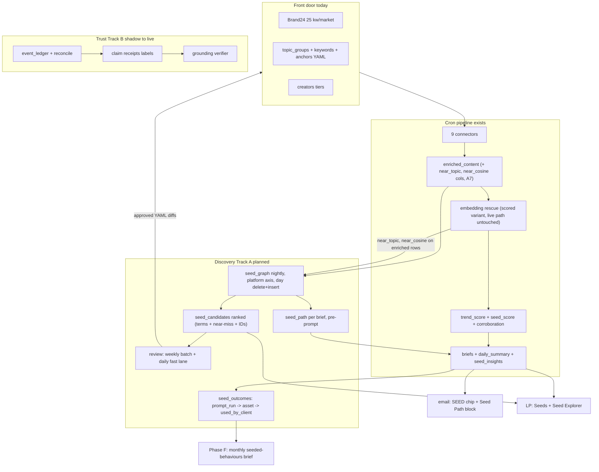
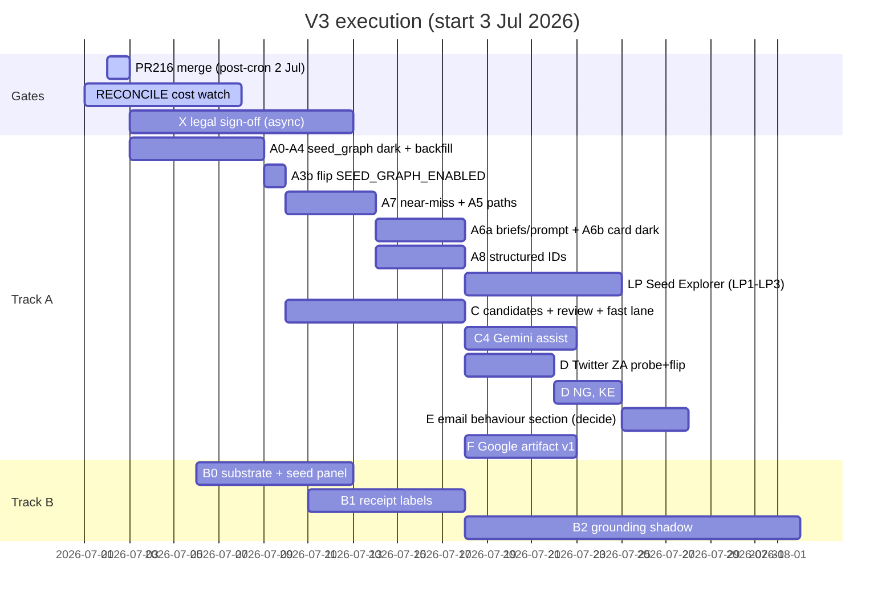

# Trends Engine V3 Blueprint (v3.5, master execution edition)

> Superseded by [`trends-engine-v3-blueprint-v3.6.md`](trends-engine-v3-blueprint-v3.6.md). Do not use for execution.

Status: master build document, produced 2 Jul 2026 by a second 16-agent adversarial audit, over v3.4 (26 delta claims line-verified, 28 gap candidates hunted, 10 findings confirmed by independent refutation). Supersedes v3.2, v3.3, v3.4. Every ticket carries a flag, tests, acceptance, rollback. Every code claim survived a line-level check or is tagged planned.

Scorecard on v3.4, honest both ways.

Where v3.4 beat v3.3 (both confirmed against the filesystem, v3.3 was wrong): (1) Some parent-folder workspace ignore rules use a `**/*.env` glob that catches `configs/cron_flags.env` in certain IDEs; that lives outside this repo. The protect-paths hook does not block cron_flags.env, so git/shell edits in a normal PR always work. (2) Hashtag provenance. driving_hashtags extracts SQL-side via `REGEXP_EXTRACT_ALL(IFNULL(text,''), r'#\w+')` at :306; there is no Python extraction regex to lift, so v3.3's "extract the regex into a shared util" chased a pattern that never existed. The shared util carries DEFAULT_STOPLIST (:48) and _PREFIX_RE (:39) only; the stricter `#([a-z]\w{2,29})` pattern is NEW to seed_graph. v3.4 also added genuinely useful mechanics: v_seed_first_seen DDL, distinctiveness cold-start fallback, the visual_audio formula skeleton, the fast-lane decile definition, the lead-time join skeleton, B1 option (a).

Where v3.4 broke things, all confirmed by refutation passes:

1. A7 would break the LIVE classifier. v3.4 dropped v3.3's "or add a scored variant" and mandates changing classify_batch's return contract, a prod-on path (EMBEDDING_CLASSIFIER_ENABLED) whose consumer at enrichment.py:607-619 pins `list[list[str]]`, with no flag protecting the signature change. And the near-miss band is not derivable from the current return, so a literal executor edits the live signature.
2. A7 has no transport at all. The rescue runs in-memory inside enrich_dataframe during per-market ingestion; the seed_graph builder reads a fixed 12-column BQ partition later. enriched_content has no near-miss column and the write whitelist at run_rss_now.py:1715-1748 drops any new enrichment field. As written, `near_topics` can never be populated. v3.5 adds the missing migration + whitelist + column-list ticket.
3. C2 still self-contradicts: "weekly stage gated on weekday()==0" plus a fast lane that "proposes DAILY" from "the day's scored pool". Tuesday through Sunday there is no pool. Fixed: the stage runs daily, the full-pool proposal is Monday-gated, the decile check is daily.
4. Ticket-ID collision: v3.4 has TWO "Track B" sections (LP Seed Explorer B1-B3 and Trust Layer B0-B4), so bare "B1" means two different tickets and the gantt/gate wording is ambiguous. LP explorer is now Track LP with tickets LP1-LP3.
5. Phase E and Phase F were nested under the hard-gated Twitter section, structurally implying the X legal gate covers the Google artifact. Pulled back out.
6. The lead-time join, v3.4's own flagship addition, had four defects: `LOWER(REGEXP_REPLACE(x, r'[^a-z0-9 ]', ''))` runs REGEXP_REPLACE first so uppercase letters are STRIPPED not lowered ('Springboks' becomes 'pringboks', matches nothing); the STRPOS substring leg has no boundary or length floor ('japa' matches every 'japan' query, 'sapa' re-creates the documented Sapa Vietnam leak class); `query_term` is the engine-copy column, the public table's is `term`; and the engine's own rows carry no country_code (dropped at normalisation), they carry market. Full corrected spec in section 12, including the fact the public dataset has ZERO KE rows all-time (bigquery_trends.py:59), so the Google-Trends leg covers ZA and NG only.
7. Merge losses restored: A6a's spot-check-three-briefs acceptance criterion (the one that catches the silent-empty-prompt-block failure both docs list as blast-radius #1), the A5 measured/thin thresholds (gone entirely from v3.4, unimplementable), the Phase A named test contents, engine_evolve.py in B0 (2 functional dataset literals, :214 and :407), the C2 novelty config enumeration with the keywords/ dual-block trap, LP cold-latency acceptance, the A3 dry-run bytes sizing requirement.
8. Smaller corrections: B1 option (b) referenced a channel_family column enriched_content does not have; v_seed_first_seen's GROUP BY included term_type, which splits first-seen per type and breaks A5 ordering and C2 novelty (grain is now market, term, platform); seed_outcomes does not belong in the dry_run_sql REGISTRY at C1 (REGISTRY entries wrap real daily read producers; the read arrives with Phase F); A0's "seed_insights daily read" names a read that does not exist (the cron only writes; the only engine-side read is the `_existing` idempotency COUNT); "mandatory env parity" overstates the test (test_workflow_env_parity.py:61-65 asserts one direction only, flags in _DURABLE_FLAGS must exist in cron_flags.env, never the reverse; ~10 live flags prove nothing fails when skipped). The discipline stands, the enforcement claim does not.

New in v3.5 beyond corrections: retention and privacy posture for the new tables (seed_graph gets a partition expiry; A8 handle capture bounded to public figures), C2 rejection memory (without it, one skipped review week refloods the cap with duplicates), a named owner for the section 12 metrics (engine_evolve seed loop), and the A2 persist pattern aligned to the real event_ledger daily rebuild it cites.

## 1. What V3 is

Two spines, parallel tracks, one engine.

Spine A, Discovery Loop, is the Google-facing product step. The paying client is Google; the commercial job is naming the cultural behaviour to seed Nanobanana (image) and Lyria (audio) into before it is obvious. V2 answers "what is loud" (`trend_score`). V3 answers "what is forming, how it moved across platforms, why, and what to watch next." The 25 Brand24 keyword slots per market plus the taxonomy are the front door, not the ceiling: discovery opens adjacent terms, handles, and sounds from the data, reconstructs behaviour paths, and feeds reviewed candidates back into what the engine watches. The loop compounds.

Two commercial commitments carried from v3.3/v3.4: earliness is measured, not asserted (lead-time receipts per discovered term, section 12, with corrected join mechanics and NULL-no-impute); and the loop closes to the client (seed_outcomes states: proposed, prompt_run, asset_generated, used_by_client), so "did Google use it" is a queryable fact.

Spine B, Trust Layer: corroboration live, event ledger + reconcile in shadow (3 batched Gemini calls/day in event_ledger.py; reconcile.py fully deterministic), promotion path labels first, corrections later, grounding verifier last. Trust without discovery is polish on a static watchlist. Discovery without trust is recommendations Google cannot defend.

## 2. Ground truth (line-verified 2 Jul 2026, two audit rounds)

### 2.1 What exists

| Component | Where | Verified detail |
|---|---|---|
| seed_score | run_rss_now.py `_seed_breakdown` :794, wrapper :865; scoring.yaml:111-126; persisted :1158-1163 | Live on trend_scores with decomposition |
| SEED chip + seed_recommend | card.py:309-318; verdict.py:65 | Live in email, self-hides when empty |
| seed_insights | generate_seed_intelligence.py:151; SEED_INTELLIGENCE_ENABLED default true | Live, LP-only. The cron only WRITES it; sole engine-side read is the `_existing` idempotency COUNT (:97-101). All analytical reads live in LP |
| LP Seeds page, get_seeds, seeds-first research | LP seeds.jsx; chat.py:378; research.py | Live |
| LP adjacency prior art | desk.py build_bridges :370, build_lexicon :442 | Live; Seed Explorer extends, does not replace |
| Corroboration | src/scoring/corroboration.py, pure; called run_rss_now.py:66 | Live, free. Counts n_factual/n_social computed then DISCARDED at :139-140; only 0..1 scores persist (:1178-1181). Matters for Trust B1 |
| Event ledger + reconcile shadow | event_ledger.py, reconcile.py, RECONCILE_ENABLED=true | Shadow ON, renders nothing |
| Twitter path | ensemble.py:214-224, /twitter/user/tweets, terms_key twitter_handles | Dark, lists empty. Rows would stamp source="EnsembleData", platform="twitter" |
| Wave 3 seed lists | sources.yaml yt_keywords / yt_channel_browse_ids / ig_user_ids / tt_music_ids | Empty, flags off; empty = silent no-op |
| Embedding rescue | embedding_classifier.py:84 threshold 0.65, :90 margin 0.05 | Live prod path (EMBEDDING_CLASSIFIER_ENABLED on); classify_batch returns list[list[str]], consumer enrichment.py:607-619 pins the contract; vectors and score lists never persisted |
| insert_dataframe + arrays | bigquery.py:51-89 load_table_from_dataframe | ARRAY<STRING> from python lists proven in prod daily by event_ledger (:594-622) |
| event_ledger daily rebuild | _delete_today_ledger event_ledger.py:548-563 | Deletes the WHOLE trend_date across markets in one DML, then one insert. The A2 pattern to mirror exactly |
| Channel family maps | run_rss_now.py:249-283 (9 families + news fallback); event_ledger.py:135 divergent variant; corroboration.py:29-32 pinned | Do not touch; seed_graph owns its own platform axis |
| Platform values actually written | rss 'web'; gdelt 'news'; bigquery_trends 'google_search'; apple_music 'apple_music'; reddit 'reddit'; youtube 'youtube'; ensemble 'tiktok'/'instagram'/'threads'/'youtube'/'twitter'(dark); brand24 'web'/'facebook'/'instagram'/'tiktok'/'twitter'/'youtube'/'linkedin'/'reddit'/'threads'/'news'/'podcast' + synthetic aggregates | No connector stamps 'music'; that is a family name only. Basis for the A1 normalisation table |
| Trends ingestion | bigquery_trends.py:114-132 runs infra/bigquery_queries/search_velocity_terms.sql daily | Public table `bigquery-public-data.google_trends.international_top_rising_terms`, columns incl. country_code, refresh_date, week, term, percent_gain; DAY-partitioned on refresh_date (filter refresh_date, not week: ~2GB vs ~9GB per market). Engine copy stores term AS query_term (mapping :296-310), market not country_code, LIMIT 100/market/day. KE has ZERO public-dataset rows all-time (:59, :65-69) |
| Re-ingest guard | _markets_already_ingested_today run_rss_now.py:1495-1533, wired :1849-1857 | ALREADY LIVE. B0 scope = FORCE_REINGEST override only |
| Vendor truth | fetch_units_history customer_units.py:92; engine_pulse.py:580-660 reads daily | EXISTS; B0 wires it into the cron pre-call path |
| Schema orphans | setup_bigquery.py:30-47 SCHEMA_ORDER | Missing seed_insights.sql AND system_events.sql (of 13 files). system_events table is LIVE (105 rows, DAY-partitioned event_time, written by today's cron) |
| enriched_content | partition DATE(collected_at), no expiry; raw_content expires 90d (raw_content.sql:37) | No trend_date column, no channel_family column; carries source :4, platform :5, published_at, genz_score :25, slang_score :29, query_term :9 |
| Env parity test | tests/unit/test_workflow_env_parity.py:61-65, _DURABLE_FLAGS :30-38 (7 flags) | One-directional: _DURABLE_FLAGS entries must exist in cron_flags.env. A new flag skipped from _DURABLE_FLAGS fails NOTHING (RECONCILE_ENABLED and ~10 others live that way today). Adding it is blueprint discipline, not CI enforcement |
| cron_flags.env editability | git-tracked; protect-paths blocks only exact `.env`, `.env.*` prefix, `.bak`/`.eml` suffixes, sources.yaml | git/shell in a normal PR always works; parent workspace ignore globs may hide `**/*.env` from some IDE file browsers |
| Hashtag prior art | driving_hashtags.py: SQL extraction `r'#\w+'` :306, DEFAULT_STOPLIST :48-92, _PREFIX_RE :39, digit guard is_generic :144 (rank-time) | Shared util = stoplist + prefix strip. Extraction regex for seed_graph is NEW |
| Discovery configs | configs/topic_groups/{za,ng,ke}.yaml; configs/keywords/{za,ng,ke}.yaml (slang key PLUS a parallel topic_groups keyword block); configs/topic_anchors/*.yaml; configs/creators/*.yaml | The keywords/ dual-block is the novelty-check trap; check BOTH |
| A3 insertion point | run_rss_now.py between trend_scores merge (:2035-2040) and PHASE_2_ENABLED gate (:2058) | Enriched dataframes are LOCAL to _ingest_market_frames (:1676-1713) and gone by then; the builder's BQ re-read is mandatory, not optional |
| bq-snapshot skill | bq-snapshot runbook, single inline Python heredoc | seed_graph line goes in the tables list (~:36), trend_date date_col group (~:38), plus a new per-market + PII spot-check section and a verdict rule |

### 2.2 What does not exist (the build)

seed_graph, seed_candidates, seed_outcomes, behaviour paths, seed_path on briefs or cards, keyword-first Seed Explorer, any writer from signal back into config, Twitter ingestion, lead-time or outcome metrics, near-miss persistence (and enriched_content near-miss columns).

### 2.3 Live constraints

| Constraint | Detail | Expires |
|---|---|---|
| RECONCILE cost watch | 7 days from 1 Jul; no NEW Gemini passes until it closes clean. A7 exempt: zero new Gemini or Vertex spend | ~8 Jul 2026 |
| PR #216 | Edits only the base pair (2400 to 3000 / 800 to 1000). With CREATOR_INGEST_BOOST=true live, the connector reads budget_units_per_run_boost (default 1500, ensemble.py:696-703); the raise is inert on the live path. All Twitter/Wave-3 headroom maths use the 1500 boost ledger plus fetch_units_history vendor truth | merge post-cron 2 Jul |
| One charging surface per day | 5000 units/day account cap shared with Reddit | Standing |
| Probe before flip | Vendor shape + downstream consumer grep, scripts/verify_live.py | Standing |
| Protected files | .env, .env.*, *.bak, *.eml, sources.yaml (hook). cron_flags.env NOT hook-blocked; edit via git/shell/PR | Standing |
| X data legal check | EnsembleData Twitter for a Google-facing product needs WPP/Ogilvy compliance sign-off BEFORE any spend | Blocking gate for D |
| pd.isna() rule | Every BQ-derived scalar | Standing |
| Flag discipline | Every new cron flag: cron_flags.env entry (required, only path to the Cloud Run jobs) + _DURABLE_FLAGS entry in the same PR (blueprint discipline; CI will NOT catch you if you forget, which is exactly why you should not) | Standing |
| Live-contract isolation | Never change the return signature of a prod-on code path for a dark feature; add an additive variant and leave the live path byte-identical (A7 rule, generalises) | Standing |

## 3. Architecture



Principles: reuse-first, additive tables and columns, every stage dark behind a flag with the OFF path byte-identical and unit-tested, generative proposes and deterministic disposes, no auto-charging surface without probe and review, writer (TEV2) before reader (LP), every dark flag ships with its own flip ticket, and never mutate a live contract for a dark feature.

## 4. Track A: Discovery Loop, ticket level

### Phase A: seed_graph + behaviour paths (zero new vendor or Gemini spend)

#### A0. Retro-fix the new-table pattern (hygiene, no flag)

Add BOTH seed_insights.sql AND system_events.sql to setup_bigquery.py SCHEMA_ORDER (system_events table is live, 105 rows; migration create_system_events_table.py; writer src/observability/events.py). REGISTRY correction: there is no engine-side "seed_insights daily read" to register (the cron only writes it). Either wrap the `_existing` idempotency COUNT (generate_seed_intelligence.py:97-101) in a shim mirroring the `_ledger_factual_read` pattern (dry_run_sql.py:89-100) and register that, or skip and let the first real REGISTRY entry land with A1's seed_graph read. Guard test in new tests/unit/test_schema_order_parity.py: every file in infra/bigquery_schemas/ appears in SCHEMA_ORDER. v_seed_first_seen lives INSIDE seed_graph.sql (single file), so the guard test is unaffected. Rollback: revert, purely additive.

#### A1. seed_graph table + view

New infra/bigquery_schemas/seed_graph.sql (table + view in one file) + scripts/migrations/create_seed_graph_table.py (clone create_seed_insights_table.py dry-run/apply) + SCHEMA_ORDER + REGISTRY read.

```sql
CREATE TABLE IF NOT EXISTS `{project}.{dataset}.seed_graph` (
  market STRING NOT NULL,             -- za | ng | ke
  term STRING NOT NULL,               -- normalised (see A2)
  term_type STRING NOT NULL,          -- slang | hashtag | token | music | handle | channel
  platform STRING NOT NULL,           -- normalised platform axis (table below)
  trend_date DATE NOT NULL,           -- partition; ingest day
  event_date DATE,                    -- DATE(COALESCE(published_at, collected_at)); behaviour timing
  row_count INT64,                    -- rows carrying the term that day on that platform (per-row presence, never per-occurrence)
  avg_genz_score FLOAT64,             -- mean genz_score over carrying rows (C2 input)
  slang_row_share FLOAT64,            -- share of carrying rows with slang_score > 0 (C2 input)
  topic_groups ARRAY<STRING>,         -- topics co-occurring that day (classified rows)
  near_topics ARRAY<STRING>,          -- A7 nearest-anchor topics from near-miss rows, provisional
  co_occur_terms ARRAY<STRING>,       -- top 10 same-row co-occurring terms that day
  sample_row_ids ARRAY<STRING>,       -- up to 5 enriched_content ids as receipts
  generated_at TIMESTAMP
)
PARTITION BY trend_date
CLUSTER BY market, term
OPTIONS (partition_expiration_days = 365);

CREATE OR REPLACE VIEW `{project}.{dataset}.v_seed_first_seen` AS
SELECT market, term, platform,
       MIN(event_date) AS first_seen_event_date,
       MIN(trend_date) AS first_seen_ingest_date
FROM `{project}.{dataset}.seed_graph`
GROUP BY market, term, platform;
```

View grain correction from v3.4: NO term_type in the GROUP BY. The same string legitimately lands as both hashtag and token (dedupe identity includes term_type), and a per-type grain gives one (market, term, platform) two first-seen rows, breaking A5's platform ordering and C2's novelty window. Candidate typing happens at candidate-build time from seed_graph.term_type, not from this view. The WHERE event_date IS NOT NULL that v3.4 carried is dead code (collected_at is NOT NULL so the COALESCE never yields NULL) and is dropped.

Retention, stated: 365-day partition expiry on seed_graph (raw social vocabulary and row-id receipts should not outlive their usefulness; the cardinality maths already assume a one-year horizon). seed_candidates and seed_outcomes are small decision-audit tables and keep no expiry, that is deliberate.

Platform axis normalisation table (owned by the A2 builder, never touching _channel_family):

| Raw (source, platform) | seed_graph platform |
|---|---|
| ensemble tiktok / instagram / threads / youtube / twitter | as stamped |
| brand24 facebook / tiktok / instagram / twitter / youtube / threads / reddit | as stamped (vendor-inferred; excluded from C2 visual_audio share, matching live seed_score which buckets all brand24 as its own family) |
| brand24 web / news / podcast / linkedin | web |
| brand24 synthetic aggregates (link/author rows) | excluded from ALL term extraction |
| rss web | news |
| gdelt news | news (gdelt rows excluded from token extraction per A2, still countable for hashtag/slang presence) |
| bigquery_trends google_search | search |
| apple_music apple_music | music |
| reddit reddit | reddit |
| youtube youtube | youtube |
| anything else | other (excluded from path ordering) |

Cardinality: 5k terms/market/day cap x ~11 platform values x 3 markets x 365 days is a ~60M row worst case; realistic volume far under, and the 365-day expiry bounds it. Scan growth is a non-issue: A2 writes with day delete+insert, not MERGE.

#### A2. Builder module `src/analysis/seed_graph.py`

Pure function `build_seed_graph_rows(df, market, trend_date)` plus a persist wrapper matching the event_ledger daily-rebuild pattern EXACTLY (_delete_today_ledger, event_ledger.py:548-563): build all three markets' rows in one pass, ONE whole-trend_date DELETE, one insert_dataframe append. v3.4's per-(market, trend_date) delete deviated from the pattern it cited; whole-day is simpler and the rerun test is cleaner (same day twice, identical table state). insert_dataframe handles ARRAY<STRING> from python lists (event_ledger proves it in prod daily), but the wrapper passes an explicit LoadJobConfig schema fetched from the target table (copy the merge_dataframe :139-141 pattern) so all-empty ARRAY columns can never mis-infer; unit test with near_topics=[] on every row.

Input is a BQ read, not the in-memory frames: the daily source read pulls only `id, market, platform, source, title, text, slang_terms, topic_groups, genz_score, slang_score, near_topic, near_cosine, published_at, collected_at` from the day's enriched_content partition (the enriched dataframes are local to _ingest_market_frames and gone by the A3 insertion point; do not try to thread them out). REGISTRY entry covers the read. The A3 PR description states the dry-run bytes number for the daily read so "minutes not tens of minutes" is a sized claim.

Term extraction:

Slang: split `slang_terms` on comma (term_type slang).

Hashtags: NEW pattern `#([a-z]\w{2,29})` applied post-lowercase over title + " " + text; all-digit and non-`[a-z0-9_]` captures drop at extraction (the leading-letter requirement makes the HTML-entity digit-tag class structurally impossible). Shared util extracted from driving_hashtags carries DEFAULT_STOPLIST (:48) and _PREFIX_RE (:39) ONLY; do not go hunting for a Python extraction regex in that file, extraction there is SQL-side `r'#\w+'` (:306). Seed configs/seed_graph_stoplist.yaml cold-start from DEFAULT_STOPLIST plus per-market function-word lists; C3 rejections tagged junk append to it.

Tokens: Unicode word regex with NFKC + diacritic-fold normalisation, folded length >= 4, store the folded form. Sources: (a) unclassified rows; (b) bounded top-N novel tokens per topic from CLASSIFIED rows (absent from all taxonomy/slang configs). Ranking within the top-30/market/day cap by distinctiveness (day frequency over trailing 28-day seed_graph baseline per market); until a market has 28 days of history, frequency-only fallback (no bogus baseline). All frequency and co-occurrence counting is per-row presence, set semantics: ensemble rows carry title = text[:100], so occurrence counting doubles every term in short comments.

Token-row exclusions: _PREFIX_RE strips the Reddit `[r/<sub>]` prefix; Brand24 synthetic rows and GDELT rows are excluded from token extraction (their text is not human language).

Safety filtering, row-level BEFORE extraction: classified rows `row_matches_geo_blocklist(row, tg)` per topic; unclassified token rows `has_non_ssa_script` + `has_foreign_latin_density` (geo_blocklist.py) PLUS `is_hard_foreign_text` (language_guard.py) inside the builder regardless of the global langdetect flag (the script-block and two-language Latin-density checks pass Tagalog, Indonesian, Portuguese, French, Spanish clean). Drop terms hitting _RISK_TEXT_MARKERS (generate_briefs.py:1140) and the stoplist.

PII guard: scan raw row text for @-mention spans FIRST, add each mention body (post-normalisation) to a per-row drop set, then extract (the naive @-in-term check is dead code, no extraction path can emit @; the real leak is '@thandi_m' tokenising as 'thandi'). Watchlist creator handles pass only as term_type handle. Required test: "love this @thandi_m 🔥" yields no thandi token.

Dedupe: one row per (market, term, term_type, platform, trend_date).

#### A3. Cron wiring + day-one monitoring (one PR)

New stage in run_rss_now.py between the trend_scores merge (:2035-2040) and the PHASE_2_ENABLED gate (:2058), gated SEED_GRAPH_ENABLED (cron_flags.env, default false), non-fatal try/except like FORECAST (:2170) and RECONCILE (:2314). Same PR: cron_flags.env entry (required) + _DURABLE_FLAGS entry (discipline; CI does not enforce it, add it anyway). No Dockerfile or cloudbuild change; deploy pushes cron_flags.env to all four jobs.

Monitoring in the SAME PR, bq-snapshot runbook ( add seed_graph to the tables list (~:36) in the trend_date date_col group (~:38); add a per-market rows section with the PII spot check (no stored term contains @ or non-SSA script); extend the output-format section count; verdict rule: SEED_GRAPH_ENABLED true + 0 rows = FAIL.

#### A3b. Flip ticket

Own PR after the dark merge is CI-green: SEED_GRAPH_ENABLED=true. Confirm the deploy applied it to all four jobs (gcloud run jobs describe, env grep). First rows next 00:30 cron. Same pattern later for SEED_CANDIDATES_ENABLED and SEED_PATH_RENDER_ENABLED. Unflippable acceptance criteria are a bug in the plan.

#### A4. Backfill

`scripts/backfill_seed_graph.py --start --end [--dry-run] [--resume-from DATE]`, local one-off under ADC (the three existing backfill scripts are the pattern), oldest-to-newest, chunked per trend_date. enriched_content has no trend_date column: select `DATE(collected_at) AS trend_date` and filter `WHERE DATE(collected_at) BETWEEN @start AND @end` (partition-pruned). Same narrow column list as A2 (near_topic/near_cosine will be NULL pre-A7; fine). --dry-run prints bytes-scanned first. Avoid 00:00-04:00 UTC so the backfill never contends with the cron's daily delete+insert.

#### A5. Behaviour path builder `src/analysis/seed_path.py`

`build_seed_path(market, topic_group, trend_date)`: topic's top terms from seed_graph, platforms ordered by first_seen_event_date from v_seed_first_seen. Emit:

```python
{
  "term": str,
  "channels": [{"platform": str, "first_seen": "YYYY-MM-DD", "row_count": int}],
  "span_days": int,
  "confidence": "measured" | "thin",   # measured = >=2 platforms AND span >=2 days AND >=10 rows total
  "coverage_note": str,                 # names platforms NOT ingested (e.g. twitter), absence is explicit
}
```

(Thresholds restored; v3.4 dropped them and left measured/thin unimplementable.) Connector go-live guard: a platform whose first-seen equals our watch-start for that (market, platform) (MIN(trend_date) per market+platform across seed_graph) contributes no ordering claim, renders "watched since". "thin" renders with "in our data" phrasing, never a market claim. No cross-correlation in v1.

#### A6a. seed_path into briefs, prompt, persistence (writer side)

build_seed_path called per topic BEFORE prompt assembly; sanitised block passed into build_brief_prompt (called generate_briefs.py:1678, template src/analysis/prompts/trend_brief.py:467) so the Gemini calls at :1714/:1769 see it. The dict attaches to the brief for render and persistence; note :1732 is the _to_topic_brief CALL site, the field itself goes on the TopicBrief dataclass DEFINITION (`seed_path: dict = field(default_factory=dict)`; grep `class TopicBrief` for the definition, do not add at the call site).

Persistence, all three seams or resends silently drop it: (1) persist_render_payloads dict (:1344-1358, the seed_score seam); (2) _row_to_entry whitelist in src/alerts/brief_loader.py (mirror seed_score :119-120) + test in test_brief_loader.py, the path every resend uses; (3) preserve list in scripts/backfill_render_payload.py (~:104) so recovery-day rebuilds keep it.

Prompt-injection guard: length cap ~40 chars, charset allowlist on the normalised space, URL and @ strip, quoted-data framing ("channel trail, cite it, do not invent ordering"). Acceptance criterion, restored from v3.3 (it exists to catch blast-radius #1, the silent empty prompt block): a generated brief on a path-bearing topic actually references the trail; spot-check three briefs.

#### A6b. Email card render (reader side)

`_seed_path(brief, pal, dark)` in card.py between hashtags and kit (~:566), self-hiding when absent, gated SEED_PATH_RENDER_ENABLED default false. Email has no LP-style mask_handle: handle-like terms render masked or not at all. Path-coverage query joins morning-check when this flag flips (the bq-snapshot seed_graph line from A3 already exists by then).

#### A7. Embedding near-miss capture (zero new spend; additive to the live path, non-negotiable)

The engine already pays to embed every residual row and score it against every anchor per cron, then discards everything below threshold. That near-miss band IS the discovery signal, and it is language-agnostic where the token leg is not.

Hard rule restored and strengthened from v3.3 (v3.4 dropped it and would have broken prod): classify_batch stays byte-identical. Its list[list[str]] contract is a LIVE cron path with the consumer at enrichment.py:607-619 pinned to it, and no flag guards a signature change. Add an ADDITIVE `classify_batch_scored` returning the decided lists PLUS per-row top-2 (topic, cosine); the rescue call site switches to it only under the near-miss feature and the live output must be provably unchanged (test: rescue output identical with SEED_GRAPH_ENABLED on and off).

Transport, the piece v3.4 had none of (as written there, near_topics could never populate): the rescue runs in-memory during per-market ingestion, the builder reads BQ later, and the enriched-row whitelist at run_rss_now.py:1715-1748 drops unknown fields. So A7 ships three additive pieces together: (1) enriched_content migration adding `near_topic STRING` + `near_cosine FLOAT64` (idempotent ALTER, clone add_sentiment_lexicon_column.py); (2) the whitelist entries at :1715-1748; (3) the A2 column list + near_topics aggregation (rows with near_cosine in the 0.50-0.65 band, or margin-rejected, contribute their near_topic to their terms' near_topics arrays; never to topic_groups). C2 reads near_topics at half co-occurrence weight. Backfilled history has NULL near-miss columns; the builder treats NULL as no contribution.

#### A8. Structured ID capture (music, handles, channels)

In ensemble.py normalisation, capture aweme music id + title, author handles, YouTube channel ids into a compact side-channel the builder persists as term_type music, handle, channel (this is the only data-driven fill path for the empty Wave 3 lists and D2's shortlist; TikTok music metadata is currently discarded at normalisation and unrecoverable after raw_content's 90-day expiry). Privacy bound, new: author handles are captured as handle candidates ONLY for accounts that are watchlisted creators or clear public figures (tier lists, verified/high-follower signals available in the payload); private individuals' handles never land in seed_graph. Mention-derived handles are already excluded by the A2 PII guard.

Phase A tests, named (restored): tests/unit/test_seed_graph.py (extraction legs incl. classified-token source; stoplist / geo / language / PII drops; the @thandi_m test; per-row presence counting on an ensemble-shaped row with title == text[:100]; whole-day delete+insert rerun idempotency; platform normalisation table incl. brand24 web-to-web vs social pass-through, rss-to-news, google_search-to-search, twitter), tests/unit/test_seed_path.py (first-seen stability, watch-start guard, measured/thin thresholds, coverage_note), test_brief_loader.py seed_path carry, classify_batch_scored parity test (live rescue unchanged), OFF-path byte-identical asserts for both flags, card golden render. Acceptance: two consecutive cron days of rows in all three markets, sane cardinality (< 5k terms/market/day), at least one real multi-platform path with the watch-start guard exercised, email unchanged with render flag off, bq-snapshot line green. Rollback: flags off; tables additive, expiry bounds residue.

## 5. Track LP: Listening Post Seed Explorer (reader, LP repo)

(Renamed from v3.4's second "Track B" to kill the B1/B2/B3 ticket-ID collision with the Trust Layer.)

LP1: bq.py adds `fetch_seed_graph_adjacency(keyword, market)` (co_occur_terms + topic overlap + bridge creators + lexicon hits) and `fetch_seed_path(keyword, market)`. Queries are synchronous (1-3 s cold each): either collapse adjacency into one combined query or run sub-queries on a ThreadPoolExecutor (research.py pattern). TTL cache ~10 min (`_channel_totals_cache` pattern), keyword-keyed so cap or LRU it. Input safety, explicit: keyword normalised via normalize_query, `re.escape`d before any REGEXP parameter, bound only through _run_query parameters (the existing house pattern at bq.py:312-313, :356; never string-concatenated into SQL).

LP2: main.py route GET /api/seed-path behind the existing passcode gate (restored; v3.4 dropped the gate wording), chat.py TOOL_SCHEMAS + _TOOLS entry following get_seeds (:378), handles masked via mask_handle/is_real_handle. Test: 401 without X-Passcode on /api/seed-path.

LP3: seedpath.jsx in App.jsx STANDALONE set + router, keyword input, trail visual, adjacent chips linking to Console research.

Deploy: LP main push, keyless CI gate, no engine deploy. Acceptance: "amapiano" returns adjacency + trail + candidate handles, under 3 s warm, under ~5 s cold with parallel fetch (restored). Rollback: additive route removal. LP pending-queue view for candidates stays a stretch goal, not a dependency.

## 6. Track C: seed_candidates + review loop

#### C1. Tables

seed_candidates.sql + migration + SCHEMA_ORDER + REGISTRY: candidate_id STRING, proposed_date DATE (partition), market, candidate_type (keyword|slang|handle|music_id|channel_id|yt_keyword), candidate_value, source (seed_graph|embedding_near_miss|coverage|manual), score FLOAT64, seed_fit STRUCT<genz FLOAT64, slang FLOAT64, visual_audio FLOAT64, co_occur FLOAT64>, safety_flags ARRAY<STRING>, evidence_topics ARRAY<STRING>, sample_row_ids ARRAY<STRING>, status (pending|approved|rejected|applied|reverted), status_by, status_at, rationale.

seed_outcomes.sql + create_seed_outcomes_table.py + SCHEMA_ORDER, same PR: behaviour_or_candidate_id, market, outcome (proposed|prompt_run|asset_generated|used_by_client), noted_by, noted_at, note. REGISTRY correction from v3.4: NO REGISTRY entry at C1. REGISTRY entries wrap real daily read producers (fn(trend_date) contract, dry_run_sql.py:103-112) and seed_outcomes has no reader until Phase F; register the actual monthly read function when Phase F builds it.

#### C2. Deterministic ranker `src/analysis/seed_candidates.py`

Contradiction from v3.4 resolved: the stage runs DAILY inside the cron (SEED_CANDIDATES_ENABLED default false). The FULL-POOL weekly proposal is gated on trend_date.weekday() == 0, idempotent by skipping when pending candidates exist for that proposed_date (00:30 + 02:30 schedulers cannot double-propose). The C2a fast-lane check runs on EVERY day's scored pool. Test: fast lane proposes on a non-Monday; weekly pool does not.

Candidates = seed_graph terms with first_seen_event_date (v_seed_first_seen) inside the 7-day window, frequency >= 5, absent from ALL discovery configs, enumerated because the trap is real: configs/topic_groups/{za,ng,ke}.yaml, configs/keywords/{za,ng,ke}.yaml checking BOTH the slang key AND its parallel topic_groups keyword block, configs/topic_anchors/*.yaml, and configs/creators/*.yaml for handle types. Slang-type terms auto-fail novelty by construction (slang_terms is a closed config vocabulary), correct and expected; the live pool is hashtags, tokens, near-miss terms, A8 IDs.

Rejection memory, new (without it one skipped review week refloods the cap with duplicates): generation excludes any candidate_value with an existing seed_candidates row in status pending, applied, or rejected within the last 28 days, for that market. Test: cross-week dedupe case.

Score = 0.35 x co-occurrence with topics whose seed_score >= 0.5 (topic_groups full weight, near_topics half weight) + 0.25 x visual_audio platform share + 0.25 x distinctiveness velocity (the A2 ranking stat) + 0.15 x genz/slang context (avg_genz_score, slang_row_share). visual_audio platform share, stated as what it is: a deliberate APPROXIMATION of seed_score's format_fit on the seed_graph platform axis, not a reproduction (live format_fit derives from _CHANNEL_FAMILY_BY_SOURCE keyed on source). Numerator platforms: tiktok, instagram, threads, twitter, youtube, music (twitter included so Track D rows stay consistent with live seed_score's ensemble family; brand24 vendor-inferred social platforms EXCLUDED, matching live seed_score which buckets all brand24 separately). Denominator: total row_count across all platforms that day. Clamp 0..1. Document the map in seed_candidates.py.

Safety pre-filter stamps safety_flags (geo blocklist, _RISK_SIGNALS, foreign script, langdetect-foreign); any flag forces status=rejected at insert. Cap 15 pending per market per week.

C2a fast lane: candidates at or above the 90th percentile of the day's scored pool per market propose daily, surfaced as a one-line entry in the morning-check/bq-snapshot output (the shipped surface; an LP chip is a later nice-to-have) for same-day approve/reject. If the first weekly batch shows the decile pool too thin (< 3 terms/market), switch to a fixed score floor in a follow-up tune.

#### C3. Review workflow (the gate is Albert, admitted and bounded)

Weekly 15 minutes batched plus the daily fast-lane glance: scripts/review_seed_candidates.py --list / --approve ID --target topic_group:X / --reject ID --reason. Approved candidates emit a ready-to-paste YAML diff labelled with its target path; the script never writes configs. sources.yaml diffs apply via explicit user-approved shell-side write (protect-paths hook blocks Edit/Write there); taxonomy-file diffs apply through normal Edit. Un-apply exists: revert the YAML commit (own PR, redeploys via the configs path filter), set status=reverted with reason, and if the term caused a geo leak or brief pollution, regen the affected day via trends-engine-regen. Applying is a normal reviewed commit; then --applied ID. Reviewer-absence behaviour is graceful by construction: pending candidates queue, rejection memory stops re-proposal churn, the cap bounds the pile.

#### C4. Gemini assist (only after RECONCILE watch closes clean, ~8 Jul+)

scripts/propose_taxonomy_candidates.py: one batched Vertex call per market per WEEK over the unclassified residual + top new seed_graph terms, source=coverage, same table, same gate, ~$1-2/mo. A7 already ships the embedding leg deterministically for free. C4 is earned by the precision metric (section 12), not yield.

Phase C tests: tests/unit/test_seed_candidates.py (daily stage + Monday full-pool gate, fast-lane fires non-Monday, double-fire idempotency, novelty against the REAL config directories incl. the keywords/ dual block, rejection-memory dedupe, near_topics half-weight, safety auto-reject, per-market cap). Acceptance: first weekly batch <= 45 candidates, >= 3 survive review, >= 1 applied term classifies real rows within 7 days, review latency measured. Rollback: flag off; un-apply for anything applied.

## 7. Track D: Twitter/X activation (hard-gated)

D1 legal sign-off (no spend before it clears). D2 shortlist 5 handles per market: tier_1 creator lists give the PEOPLE, not X handles (watchlists carry only tiktok/instagram/threads sections; "uncle.waffles" is not a valid X username); verify each X username manually, the 2-unit /twitter/user/info resolve in the D3 probe doubles as the existence check; is_real_handle is LP-only (bq.py:483), copy the trivial logic. D3 probe: fetch_units_history baseline, then `py -3.13 scripts/verify_live.py ensemble-probe twitter_user <handle> za` (no `twitter` target in main(); twitter_user is the registered ensemble-probe endpoint); record shape (GraphQL envelope: legacy.favorite_count/retweet_count/reply_count per flip-readiness row 084) and real units/call. D4 flip ZA only, one cron, morning-check + units delta, tweets land with metrics and non-null published_at. D5 NG then KE on separate days, gated on the LIVE boost ledger (1500/run) plus fetch_units_history account truth, never the inert 3000/1000 base pair. Rollback: flag false.

Twitter rows stamp source="EnsembleData", platform="twitter". The A1/A2 platform axis reads the platform column, so seed_graph and behaviour paths get the discourse leg with zero extra code; C2's visual_audio numerator already includes twitter. Corroboration still sees family "ensemble"; widening corroboration's vocabulary stays out of scope (it moves live scoring).

## 8. Phase E and Phase F (own section; NOT gated by Track D's legal gate, which v3.4's nesting implied)

Phase E, optional email promotion: seed_insights rank-1 behaviour as a top-level digest section (_section_row pattern), gated SEED_BEHAVIOUR_EMAIL_ENABLED default false. Decide after Seed Path has run visibly a week and Jo/Thapelo react.

Phase F, the Google-facing artifact: a monthly seeded-behaviours brief (hosted read, GCS MAILER_ARCHIVE_BUCKET pattern) pairing each behaviour with its lead-time receipt (section 12) and its Nanobanana/Lyria prompt plus seed_outcomes state. Owned by Jo for the Google relationship. Forces "who at Google consumes this" to be answered before Track A finishes. The Phase F PR also registers the seed_outcomes monthly read in the dry_run_sql REGISTRY (deferred from C1 because REGISTRY entries wrap real producers). White-label note: the discovery substrate (seed_graph, candidates, review) is client-agnostic; the seeding lens (C2 weights, seed_score audience_weights) follows the configs/mailer_brands/ per-client pattern when the second tenant (BSA) arrives.

## 9. Track B: Trust Layer (this name now unique to the Trust Layer)

| Phase | Content | Gate |
|---|---|---|
| B0 | get_dataset() routing: ~15 literals in accuracy_watchdog.py, 2 functional in engine_pulse.py (:165, :201), AND 2 functional in engine_evolve.py (:214, :407; restored, v3.4 dropped the file). Wire the EXISTING fetch_units_history read (engine_pulse.py:580-660, customer_units.py:92) into the cron pre-call path; do not build a new fetch. Re-ingest guard ALREADY LIVE; scope is the FORCE_REINGEST override flag only. Seed panel in accuracy_watchdog (seed_score distribution drift, chip-hot rate, seed_insights rank-1 recurrence) + one-off seed_score backtest BEFORE C2 hard-codes 0.5 as its quality bar | None, start any time |
| B1 | claim_receipt labels: corroboration chip on cards. Counts n_factual/n_social are computed then DISCARDED (corroboration.py:139-140); only 0..1 scores persist. Option (a), preferred: persist n_factual and n_social as two new trend_scores columns at the :1178-1181 seam and carry through brief_loader into render_payload (resend-stable). Option (b), corrected from v3.4 (enriched_content has NO channel_family column): re-derive family from enriched_content (source, platform) at brief-build time, duplicating _CHANNEL_FAMILY_BY_SOURCE in SQL, which is another reason to pick (a). Cards render from the brief dict via the A6a render_payload bridge; cards never call corroboration directly | ~10 clean shadow days from 1 Jul, watchdog green |
| B2 | Grounding verifier SHADOW (Key-tier topics, batched, 100-200 human-labelled claims) + ledger validity_window + widened factual fetch | B1 live, cost approved |
| B3 | Reconcile stale-correct/suppress live + future-tense validator | B2 sign-off, zero true-to-false inversions |
| B4 | THE READ swap, VECTOR_SEARCH hybrid, pattern detectors (emergence first, each beats persistence backtest), relevance.py | B3 |

Pinned facts: ledger emits resolved|scheduled|unknown only; ledger Gemini cost is 3 batched calls/day; reconcile is zero-Gemini; schema_version on render_payload ships with B1; $30/mo Vertex RED is a morning-check procedure, not a deployed script.

## 10. Sequence and dependencies



Rules: nothing Gemini-new before the RECONCILE watch closes (C4 waits; A7 exempt, zero new spend); Twitter waits on legal AND verified handles AND boost-ledger headroom; one charging surface per day; writer before reader; trust labels after clean shadow days; every flag has a flip ticket; live contracts never mutate for dark features.

## 11. Cost model

| Item | Cadence | Monthly est. | Status |
|---|---|---|---|
| Per-topic briefs (~20-30 calls/day) | Daily | Dominant existing line | Live |
| daily_summary + seed_intelligence | Daily | ~$0.5-1 | Live |
| event_ledger shadow | 3 calls/day | ~$3-5 | Live, under watch |
| seed_graph build + backfill | Daily narrow read + day delete/insert | BQ pennies; one-time backfill, dry-run first | Planned A |
| A7 near-miss capture | Daily | $0 incremental (vectors already paid) | Planned A |
| seed_candidates ranker + outcomes | Daily check, weekly pool, SQL only | Negligible | Planned C |
| Lead-time baseline (public dataset) | One-off + weekly refresh | Pennies with refresh_date pruning (~2GB/market; ~9GB if you filter week instead, do not) | Planned, section 12 |
| Taxonomy Gemini assist | 3 calls/week | ~$1-2 | Planned C4, gated |
| Twitter ingestion | ~15 handles daily | Ensemble units (probe gives real number), $0 Vertex | Planned D, gated |
| Grounding verifier | Shadow then scale | $8-15+ at scale | Planned B2 |

Guardrails: $50 Cloud Billing outer bound, $30/mo Vertex RED via morning-check, fetch_units_history before/after every Ensemble change.

## 12. Success metrics with measurement mechanisms

Owner, new and explicit (v3.4 left every discovery metric homeless, making the C4 gate undecidable): engine_evolve.py gains a fourth loop, the SEED LOOP, computing lead-time distribution, discovery precision, review latency, and yield, reported through the existing weekly engine-evolve skill run and history file. Path coverage stays in morning-check (daily, per A6b). engine_evolve is the right home: every one of these is a rolling cross-day metric, which is that script's shape (accuracy_watchdog is a per-trend_date daily harness).

Lead-time join, corrected spec replacing v3.4's:

Leg (a), Google Trends rising. Two sources, two different joins. Engine copy (go-forward daily metric): enriched_content rows with content_type='search_term', join on `query_term`, scope `seed_graph.market = row.market`, date = published_at week; never raw_content (90-day expiry); caveat: engine ingest is LIMIT 100 rising terms/market/day, so sub-rank-100 risers are invisible to this leg. Public dataset (one-off backfilled baseline + weekly refresh): `bigquery-public-data.google_trends.international_top_rising_terms`, join on `term` (the public column; `query_term` does not exist there), scope `UPPER(seed_graph.market) = country_code` (mirror COUNTRY_CODE_MAP, bigquery_trends.py:52), ALWAYS filter refresh_date for partition pruning. Normalisation on BOTH sides: `REGEXP_REPLACE(LOWER(x), r'[^a-z0-9 ]', '')`, LOWER first (v3.4 had the functions inverted, which strips uppercase letters: 'Springboks' became 'pringboks' and matched nothing). Substring fallback: word-boundary REGEXP_CONTAINS with the seed term regex-escaped, plus a length floor (substring leg only for terms >= 5 chars; exact-match only below, or 'japa' matches every Japan query and 'sapa' re-creates the Sapa Vietnam class). Count equality-leg and substring-leg matches separately so precision is auditable. Lead time = days from first_seen_event_date to MIN(rising date); NULL when no match, never imputed. Coverage: ZA and NG only; the public dataset has ZERO KE rows all-time (bigquery_trends.py:59), so KE earliness is measured by leg (b) alone.

Leg (b), trend_score peak: days from first_seen_event_date to argmax(trend_score) for topics where the term appears in that day's seed_graph topic_groups or co_occur_terms. Computable from trend_scores + seed_graph as designed.

| Metric | Mechanism | Target |
|---|---|---|
| Lead time (THE product metric) | Seed loop, spec above; baseline off the A4 backfill BEFORE any client conversation | Median lead > 0 days where non-NULL; growing |
| Client loop closure | seed_outcomes states per month | >= 1 asset_generated/month by F+60; headline commercial number |
| Path coverage | Morning-check: share of top-10 seed_score topics with seed_path.confidence != "" in render_payload | >= 60% by A+14 days |
| Discovery precision | Share of applied candidates whose topic reaches seed_score >= 0.5 or spawns a seed_insights behaviour within 14 days. Precision, not yield, gates C4 | >= 30% by C+45 days |
| Discovery yield | seed_candidates GROUP BY status weekly (throughput gauge; measures the reviewer, not the market) | >= 3 approved/week by C+30 days |
| Review latency | Median days first_seen_event_date to applied, fast lane vs weekly split | Fast lane < 3 days |
| Loop closure to taxonomy | status=applied count + applied term's row_count 7 days later | >= 2 applied/month, each classifying real rows |
| Unclassified rate | Weekly per market vs 4-week baseline | -20% relative by C+60 days, zero new geo collisions |
| Twitter health | tweets/day per market, % null published_at, units delta | Present, <5% null, inside boost-ledger headroom |
| Trust promotion | reconcile_actions stale-catch audit at B3 | Zero true-to-false inversions |
| Google resonance | Jo/Thapelo qualitative on Seed Path + behaviours | Directional |

## 13. Risks

| Risk | Mitigation |
|---|---|
| A7 destabilises the live classifier | Hard rule: classify_batch byte-identical, additive scored variant, parity test with the feature on and off |
| Near-miss columns never populate | Transport shipped as one unit: enriched_content migration + write whitelist + builder columns; test asserts near_topic lands in BQ |
| Token junk floods the cap | Distinctiveness ranking with 28-day cold-start fallback; stoplist cold-started from DEFAULT_STOPLIST + per-market function words; junk rejects append; boilerplate rows excluded |
| Non-English signal missed | Unicode + fold token regex; is_hard_foreign_text inside builder; A7 near-miss leg language-agnostic |
| PII leak via mention bodies or A8 handles | @-mention span strip pre-extraction; A8 bounded to watchlisted/public-figure accounts; email masks or drops handle-like survivors; 365-day seed_graph expiry bounds residue |
| Path ordering mirrors ingest rollout | event_date basis + watch-start guard renders "watched since"; coverage_note; thin = "in our data" |
| Writer bug fails silently | bq-snapshot line + 0-rows FAIL + PII/script spot check in the A3 PR, day one |
| Review bottleneck or reviewer absence | Weekly batch + daily fast lane, 15/market cap, safety auto-reject, rejection memory (28-day) stops duplicate reflood; queue degrades gracefully |
| Bad applied term pollutes classification | reverted status + un-apply (YAML revert PR + optional day regen) from day one |
| Lead-time joins mismeasure | LOWER-first normalisation, word-boundary + length-floor matching, separate leg counts for auditability, NULL-no-impute, KE scoped to leg (b) |
| Prompt injection via discovered terms | A6a sanitises: length cap, charset allowlist, URL/@ strip, quoted-data framing |
| Gemini cost stack opaque during watch | C4 and B2 wait; A7 provably zero-Gemini |
| Two-repo skew | schema_version ships with B1; LP reads defensively; writer-first |
| Cron time budget at 00:30 | Narrow-column partition read + in-memory pass + day delete/insert; non-fatal try/except; A3 PR states the dry-run bytes number |
| seed_score unvalidated as fitness function | B0 seed panel + backtest before C2 hard-codes 0.5 |
| Fast-lane decile pool too thin at launch | Switch to fixed score floor after first weekly batch |

## 14. What V3 is NOT

Not a rewrite of ingestion or composite scoring. Not a change to _channel_family, event_ledger's family map, corroboration's vocabulary, or classify_batch's contract (all pinned to live paths; seed_graph owns its own platform axis and the scored classifier variant is additive). Not forecast-on until something beats persistence. Not autonomous config writes, ever; the script emits diffs, a human commits, un-apply exists. Not batch-flipping Wave 3 lists or Twitter markets. Not external vector stores or non-Vertex models (WPP). Not behaviour paths as ground truth without the "in our data" qualifier. Not client-facing trust corrections before shadow sign-off.

## 15. Immediate next actions (in order)

1. Confirm 2 Jul cron completed, then merge PR #216 (one flip that day; inert on the live boost path).
2. Kick off X legal question with compliance (async, long pole for D).
3. Build A0-A4 on a feature branch, flags default false, monitoring + _DURABLE_FLAGS in the A3 PR, dry-run bytes number in the PR description.
4. Start B0 substrate in parallel (re-ingest guard exists; FORCE_REINGEST override, dataset routing incl. engine_evolve.py, seed panel, seed_score backtest).
5. A3b flip PR once the dark merge is CI-green; first rows next 00:30 cron.
6. After two clean seed_graph days: A7 (additive variant + transport) + A5, then A6a/A6b (render flag still off). Run the lead-time baseline off the A4 backfill with the corrected section 12 joins.
7. RECONCILE watch closes ~8 Jul: review Vertex spend, unlock C4 planning.

## 16. Document lineage

| Version | Date | Focus |
|---|---|---|
| v3.0 | 30 Jun | Trust-first, stale on reconcile state |
| v3.1 | 1 Jul | Audit-corrected trust, no discovery spine |
| v3.2 | 2 Jul | Ticket-level execution edition |
| v3.3 | 2 Jul | 27-agent audit: platform axis, delete+insert, A6 split, A7/A8, Phase F, flip tickets |
| v3.4 | 2 Jul | Internal merge: caught v3.3's cron_flags edit path and hashtag-provenance errors; added v_seed_first_seen DDL, formulas, lead-time skeleton; introduced the A7 live-contract break, the missing near-miss transport, the Track B collision, the C2 gate contradiction, and dropped v3.3 acceptance criteria |
| v3.5 | 2 Jul | Second 16-agent audit of v3.4: A7 made additive with real transport (enriched_content near-miss columns), C2 daily-stage fix + rejection memory, Track LP rename, lead-time joins corrected (LOWER-first, word-boundary, term vs query_term, market vs country_code, KE scoped out of leg a), v_seed_first_seen grain fixed, retention + A8 privacy bounds, metrics owner (engine_evolve seed loop), restored v3.3 acceptance criteria and named tests |

Update triggers: PR #216 merged, RECONCILE watch closed, first seed_graph migration landed, X legal answer, first lead-time baseline computed.
