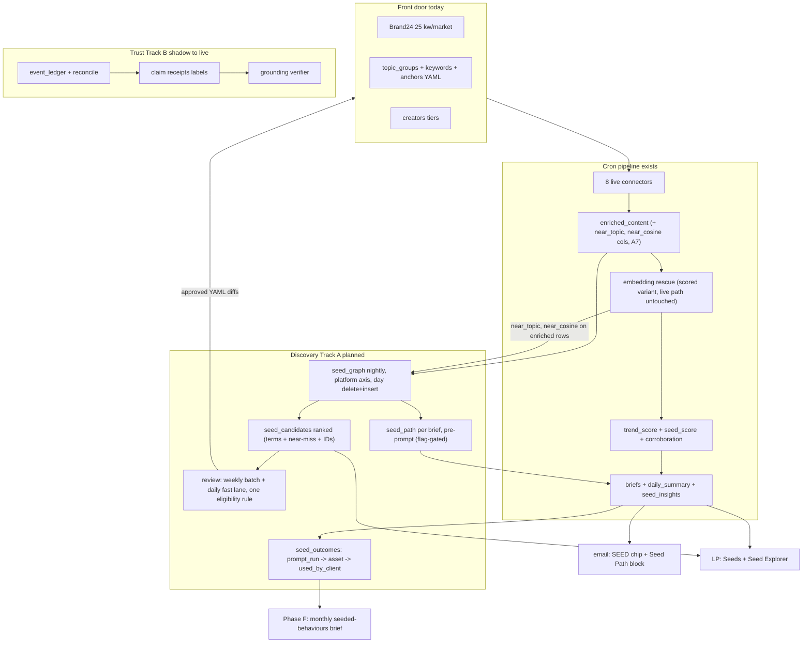
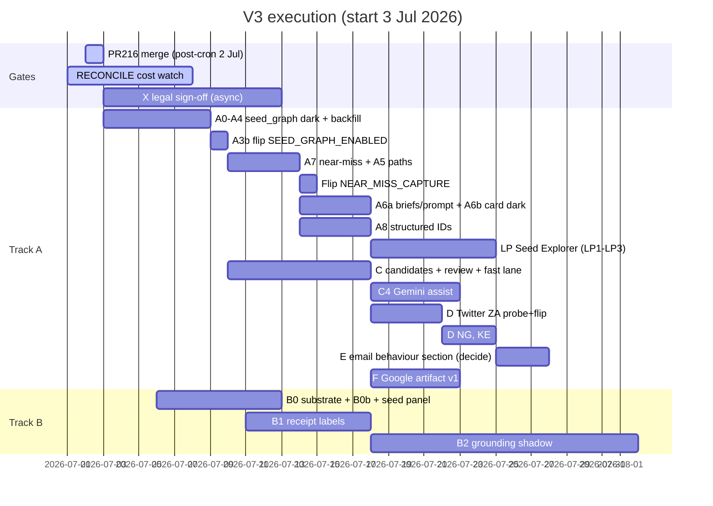

# Trends Engine V3 Blueprint (v3.7)

> Superseded by [`trends-engine-v3-blueprint-v3.8.md`](trends-engine-v3-blueprint-v3.8.md). Do not use for execution.

Status: master build document, produced 2 Jul 2026 by a fourth adversarial audit (12-agent audit over v3.6: 10 delta claims line-verified, 21 gap candidates, 6 findings confirmed by independent refutation, 2 proposed additions refuted and kept out). Supersedes v3.2 through v3.6. Every ticket carries a flag, tests, acceptance, rollback. Every code claim survived a line-level check or is tagged planned.

Scorecard on v3.6, honest both ways.

Where v3.6 held (keep intact): the QA layer is mostly right. 14 hardcoded dataset strings in accuracy_watchdog.py is exact (all functional, in SQL). TopicBrief dataclass at generate_briefs.py:120 with :1732 as the call site. persist_render_payloads def :1314, seed_score key :1356. Re-ingest seam pinned to the skip_markets assignment at run_rss_now.py:1854. 8 live connectors is right (rss, apple_music, bigquery_trends, youtube, gdelt, ensemble, reddit, brand24). src/ path prefixes. The _RISK_SIGNALS (:1127) vs _RISK_TEXT_MARKERS (:1140) cross-reference. system_events settled by live query: 105 rows, verified 2 Jul via bq.

Where v3.6 broke or under-specified things, all confirmed by refutation:

1. It "corrected" a right line ref to a wrong one: compute_seed_score is defined at run_rss_now.py:865 (v3.5 was right); :876 is a docstring line inside the same function. Reverted.
2. The C2a scored-pool SQL, v3.6's flagship addition, had eight defects, three at high severity: (a) the fast lane applies no novelty or config-absence filter, so the closed config vocabulary (#amapiano, sapa, gengetone: ZA 49 / NG 46 / KE 39 config slang terms plus taxonomy hashtags) proposes itself every single day at top score; (b) compute_c2_score(d) is uncomputable from the daily CTE, 0.85 of the score weight has no inputs there (the seed_score >= 0.5 topic set lives in trend_scores, visual_audio needs per-platform grain the GROUP BY destroys, distinctiveness needs the 28-day baseline, safety needs Python-side geo/langdetect); (c) on Mondays the fast lane's pending inserts can trip the weekly pool's idempotency skip and silently kill the flagship weekly proposal. Plus ANY_VALUE picking an arbitrary platform's genz score, ARRAY_CONCAT_AGG double-counting topics across platforms, SUM(row_count) double-counting term_type duplicates, p90 as a relative gate that manufactures a proposal even on dead days, and unspecified cap accounting. C2a is rewritten below as a Python stage, which is what the repo's own precedent says it should have been.
3. B0b FORCE_REINGEST as a global boolean is only reachable in the exact state where it does damage: it re-ingests ALL markets including clean ones, appending duplicate raw_content/enriched_content day rows (insert-only, no dedup) and double-charging the 5000/day Ensemble cap, the incident class the guard exists to prevent. And the override mechanism was unpinned in a repo whose own docs teach the persistent form (`gcloud run jobs update` merge semantics in cloudbuild.yaml; flip-readiness names the live job as a flag home). Reshaped below: market-scoped, per-execution only, with day-row cleanup.
4. A blueprint-wide bug that survived three prior rounds, caught by the executor-layer pass: A6a's prompt block had NO flag. SEED_PATH_RENDER_ENABLED gated only the A6b card, and by A6a's gantt slot SEED_GRAPH_ENABLED is already true, so the PR would change live Gemini brief prose in the exec digest the day Cloud Build deploys it. Same class for A7: "only under the near-miss feature" named no flag, and reading it as SEED_GRAPH_ENABLED means near-miss capture goes live on deploy. Two flags are now named: SEED_PATH_RENDER_ENABLED widened to gate BOTH the prompt block and the card (one surface, the MAILER_V2_ENABLED pattern), and NEAR_MISS_CAPTURE_ENABLED for the A7 call-site switch and whitelist passthrough.
5. Two capability proposals were adversarially REFUTED and stay out, so the doc does not bloat: a per-PR exact-file-list map (the tickets already encode PR boundaries; a parallel map rots) and a nine-row open-decisions register (seven of nine were already decided in the doc). What survived from that pass, folded in: the flip queue, the execution log, the migration sequence, the runbook updates, the LP cross-repo gate, and the stoplist cold-start spec.
6. Small completions: the dark-connector inventory now names all four non-live registry entries (semrush dark behind sources.yaml:914, spotify permanently disabled, wikipedia and bluesky wired dark with no sources.yaml block); the _RISK_SHORT_MARKERS nuance (:1160: died/death/fraud are word-boundary matched, not bare substring, so a C2 port must not flag "studied").

## 1. What V3 is

Two spines, parallel tracks, one engine.

Spine A, Discovery Loop, is the Google-facing product step. The paying client is Google; the commercial job is naming the cultural behaviour to seed Nanobanana (image) and Lyria (audio) into before it is obvious. V2 answers "what is loud" (`trend_score`). V3 answers "what is forming, how it moved across platforms, why, and what to watch next." The 25 Brand24 keyword slots per market plus the taxonomy are the front door, not the ceiling: discovery opens adjacent terms, handles, and sounds from the data, reconstructs behaviour paths, and feeds reviewed candidates back into what the engine watches. The loop compounds.

Two commercial commitments: earliness is measured, not asserted (lead-time receipts per discovered term, section 12, NULL-no-impute); and the loop closes to the client (seed_outcomes states: proposed, prompt_run, asset_generated, used_by_client), so "did Google use it" is a queryable fact.

Spine B, Trust Layer: corroboration live, event ledger + reconcile in shadow (3 batched Gemini calls/day in event_ledger.py; reconcile.py fully deterministic), promotion path labels first, corrections later, grounding verifier last. Trust without discovery is polish on a static watchlist. Discovery without trust is recommendations Google cannot defend.

## 2. Ground truth (line-verified 2 Jul 2026, four audit rounds)

### 2.1 What exists

| Component | Where | Verified detail |
|---|---|---|
| seed_score | run_rss_now.py `_seed_breakdown` :794, wrapper `compute_seed_score` :865; scoring.yaml:111-126; persisted :1158-1163 | Live on trend_scores with decomposition |
| SEED chip + seed_recommend | card.py:309-318; verdict.py:65 | Live in email, self-hides when empty |
| seed_insights | generate_seed_intelligence.py:151; SEED_INTELLIGENCE_ENABLED default true | Live, LP-only. Cron only WRITES it; sole engine-side read is the `_existing` idempotency COUNT (:97-101) |
| LP Seeds page, get_seeds, seeds-first research | LP seeds.jsx; chat.py:378; research.py | Live |
| LP adjacency prior art | desk.py build_bridges :370, build_lexicon :442 | Live; Seed Explorer extends, does not replace |
| Corroboration | src/scoring/corroboration.py, pure; called run_rss_now.py:66 | Live, free. Counts n_factual/n_social computed then DISCARDED at :139-140; only 0..1 scores persist (:1178-1181). Matters for Trust B1 |
| Event ledger + reconcile shadow | event_ledger.py, reconcile.py, RECONCILE_ENABLED=true | Shadow ON, renders nothing |
| Twitter path | ensemble.py:214-224, /twitter/user/tweets, terms_key twitter_handles | Dark, lists empty. Rows would stamp source="EnsembleData", platform="twitter" |
| Wave 3 seed lists | sources.yaml yt_keywords / yt_channel_browse_ids / ig_user_ids / tt_music_ids | Empty, flags off; empty = silent no-op |
| Comments ingestion | tt_comments_enabled all markets; ZA ig_post_comments pilot | Live; comment rows are slang-scored and topic-classified |
| Connector registry | run_rss_now.py:81-121, 12 entries | 8 LIVE (rss, apple_music, bigquery_trends, youtube, gdelt, ensemble, reddit, brand24); 4 dark/dormant: semrush (sources.yaml:914 enabled false), spotify (permanently disabled, :821-826), wikipedia + bluesky (Wave 2, no sources.yaml block, connector default false) |
| Embedding rescue | src/enrichment/embedding_classifier.py:84 threshold 0.65, :90 margin 0.05 | Live prod path (EMBEDDING_CLASSIFIER_ENABLED on); classify_batch returns list[list[str]], consumer enrichment.py:607-619 pins the contract; vectors and score lists never persisted |
| Manual discovery | topic-coverage-report runbook frequency count | Manual only; the "weekly taxonomy cron" in topic_classifier.py:122 docstring does not exist |
| MERGE upsert helper | src/utils/bigquery.py:92 merge_dataframe(df, table_name, merge_keys) | Exists, identifier-hardened; fixed `c = S.c` UPDATE, no partition pruning. seed_graph does not use MERGE |
| insert_dataframe + arrays | bigquery.py:51-89 load_table_from_dataframe | ARRAY<STRING> from python lists proven in prod daily by event_ledger (:594-622) |
| event_ledger daily rebuild | _delete_today_ledger event_ledger.py:548-563 | Deletes the WHOLE trend_date across markets in one DML, then one insert. The A2 pattern to mirror exactly |
| Channel family maps | run_rss_now.py:249-283 (9 families + news fallback); event_ledger.py:135 divergent variant; corroboration.py:29-32 pinned | Do not touch; seed_graph owns its own platform axis |
| Platform values actually written | rss 'web'; gdelt 'news'; bigquery_trends 'google_search'; apple_music 'apple_music'; reddit 'reddit'; youtube 'youtube'; ensemble 'tiktok'/'instagram'/'threads'/'youtube'/'twitter'(dark); brand24 'web'/'facebook'/'instagram'/'tiktok'/'twitter'/'youtube'/'linkedin'/'reddit'/'threads'/'news'/'podcast' + synthetic aggregates | No connector stamps 'music'; family name only. Basis for the A1 normalisation table |
| Trends ingestion | bigquery_trends.py:114-132 runs infra/bigquery_queries/search_velocity_terms.sql daily | Public table `bigquery-public-data.google_trends.international_top_rising_terms` (country_code, refresh_date, week, term, percent_gain; DAY-partitioned on refresh_date, filter refresh_date not week: ~2GB vs ~9GB/market). Engine copy stores term AS query_term (:296-310), market not country_code, LIMIT 100/market/day. KE has ZERO public-dataset rows all-time (:59, :65-69) |
| Re-ingest guard | _markets_already_ingested_today run_rss_now.py:1495-1533, wired via `skip_markets = ...` at :1854 (consumers :1873, :2357, :2499) | ALREADY LIVE. B0b adds the scoped override |
| Vendor truth | fetch_units_history customer_units.py:92; engine_pulse.py:580-660 reads daily | EXISTS; B0 wires it into the cron pre-call path |
| Schema orphans | setup_bigquery.py:30-47 SCHEMA_ORDER | Missing seed_insights.sql AND system_events.sql (of 13 files). system_events table LIVE: 105 rows, verified 2 Jul via bq, DAY-partitioned event_time, writer src/observability/events.py |
| enriched_content | partition DATE(collected_at), no expiry; raw_content expires 90d (raw_content.sql:37) | No trend_date column, no channel_family column; carries source :4, platform :5, published_at, genz_score :25, slang_score :29, query_term :9 |
| Risk marker sets | generate_briefs.py _RISK_SIGNALS :1127 (politics/crisis/protest/religion, matched on topic category/slug), _RISK_TEXT_MARKERS :1140 (substring), _RISK_SHORT_MARKERS :1160 (died/death/fraud, WORD-BOUNDARY matched, a port must not flag "studied") | C2 safety pre-filter uses all three, faithful to the code shapes |
| Env parity test | tests/unit/test_workflow_env_parity.py:61-65, _DURABLE_FLAGS :30-38 (7 flags) | One-directional: _DURABLE_FLAGS entries must exist NON-EMPTY in cron_flags.env. A flag skipped from _DURABLE_FLAGS fails nothing; an EMPTY-valued entry listed there fails (matters for B0b) |
| cron_flags.env editability | git-tracked; protect-paths blocks only exact `.env`, `.env.*` prefix, `.bak`/`.eml` suffixes, sources.yaml | git/shell in a normal PR always works; parent workspace ignore globs may hide `**/*.env` from some IDE file browsers |
| Hashtag prior art | driving_hashtags.py: SQL extraction `r'#\w+'` :306, DEFAULT_STOPLIST :48-92, _PREFIX_RE :39, digit guard is_generic :144 (rank-time) | Shared util = stoplist + prefix strip. Extraction regex for seed_graph is NEW |
| Discovery configs | configs/topic_groups/{za,ng,ke}.yaml; configs/keywords/{za,ng,ke}.yaml (slang key PLUS a parallel topic_groups keyword block); configs/topic_anchors/*.yaml; configs/creators/*.yaml | The keywords/ dual-block is the novelty-check trap; check BOTH. Config slang counts: ZA 49 / NG 46 / KE 39 |
| A3 insertion point | run_rss_now.py between trend_scores merge (:2035-2040) and PHASE_2_ENABLED gate (:2058) | Enriched dataframes are LOCAL to _ingest_market_frames (:1676-1713) and gone by then; the builder's BQ re-read is mandatory |
| bq-snapshot skill | bq-snapshot runbook, single inline Python heredoc | seed_graph line goes in the tables list (~:36), trend_date date_col group (~:38), plus a per-market + PII spot-check section and a verdict rule |
| Incident runbooks | docs/runbooks/incident-response.md:56, pipeline-failure.md:55, quota-exhaustion.md:17 | All say bare `gcloud run jobs execute` with no env flags; post-guard that silently skips already-ingested markets. B0b updates all three |

### 2.2 What does not exist (the build)

seed_graph, seed_candidates, seed_outcomes, behaviour paths, seed_path on briefs or cards, keyword-first Seed Explorer, any writer from signal back into config, Twitter ingestion, lead-time or outcome metrics, near-miss persistence (and enriched_content near-miss columns), FORCE_REINGEST_MARKETS.

### 2.3 Live constraints

| Constraint | Detail | Expires |
|---|---|---|
| RECONCILE cost watch | 7 days from 1 Jul; no NEW Gemini passes until it closes clean. A7 exempt: zero new Gemini or Vertex spend | ~8 Jul 2026 |
| PR #216 | Edits only the base pair (2400 to 3000 / 800 to 1000). With CREATOR_INGEST_BOOST=true live, the connector reads budget_units_per_run_boost (default 1500, ensemble.py:696-703); the raise is inert on the live path. All Twitter/Wave-3 headroom maths use the 1500 boost ledger plus fetch_units_history vendor truth | merge post-cron 2 Jul |
| One charging surface per day | 5000 units/day account cap shared with Reddit | Standing |
| One flip per observed cron | Every flag flip or budget merge consumes one cron day for attribution; the section 15 flip queue sequences them | Standing |
| Probe before flip | Vendor shape + downstream consumer grep, scripts/verify_live.py; every new flag gets a docs/flip-readiness.md row | Standing |
| Protected files | .env, .env.*, *.bak, *.eml, sources.yaml (hook). cron_flags.env NOT hook-blocked | Standing |
| X data legal check | EnsembleData Twitter for a Google-facing product needs WPP/Ogilvy compliance sign-off BEFORE any spend | Blocking gate for D |
| pd.isna() rule | Every BQ-derived scalar | Standing |
| Flag discipline | Every new cron flag: cron_flags.env entry (required) + _DURABLE_FLAGS entry in the same PR (discipline; CI will NOT catch you if you forget). Exception: ops overrides with empty defaults (B0b) stay OUT of _DURABLE_FLAGS, the non-empty assert would fail them | Standing |
| Live-contract isolation | Never change the return signature or output of a prod-on code path for a dark feature; additive variant, live path byte-identical | Standing |
| Ops env overrides | One-off env for a Cloud Run job goes on `gcloud run jobs execute --update-env-vars` (per-execution, does not persist). NEVER `gcloud run jobs update` for a one-off; never flip ops overrides in cron_flags.env | Standing |

## 3. Architecture



Principles: reuse-first, additive tables and columns, every stage dark behind a flag with the OFF path byte-identical and unit-tested, generative proposes and deterministic disposes, no auto-charging surface without probe and review, writer (TEV2) before reader (LP), every dark flag ships with its own flip ticket, live contracts never mutate for dark features, and ops overrides are per-execution, never persisted.

## 4. Track A: Discovery Loop, ticket level

### Phase A: seed_graph + behaviour paths (zero new vendor or Gemini spend)

#### A0. Retro-fix the new-table pattern (hygiene, no flag)

Add BOTH seed_insights.sql AND system_events.sql to setup_bigquery.py SCHEMA_ORDER (system_events LIVE, 105 rows verified 2 Jul; migration create_system_events_table.py; writer src/observability/events.py). REGISTRY: no engine-side seed_insights daily read exists (cron only writes); default is SKIP and let the first REGISTRY entry land with A1's seed_graph read (wrapping the `_existing` COUNT in a `_ledger_factual_read`-style shim is the sanctioned alternative). Guard test in new tests/unit/test_schema_order_parity.py: every file in infra/bigquery_schemas/ appears in SCHEMA_ORDER. v_seed_first_seen lives INSIDE seed_graph.sql, guard test unaffected. Rollback: revert, purely additive.

#### A1. seed_graph table + view

New infra/bigquery_schemas/seed_graph.sql (table + view, one file) + scripts/migrations/create_seed_graph_table.py (clone create_seed_insights_table.py dry-run/apply) + SCHEMA_ORDER + REGISTRY read.

```sql
CREATE TABLE IF NOT EXISTS `{project}.{dataset}.seed_graph` (
  market STRING NOT NULL,             -- za | ng | ke
  term STRING NOT NULL,               -- normalised (see A2)
  term_type STRING NOT NULL,          -- slang | hashtag | token | music | handle | channel
  platform STRING NOT NULL,           -- normalised platform axis (table below)
  trend_date DATE NOT NULL,           -- partition; ingest day
  event_date DATE,                    -- DATE(COALESCE(published_at, collected_at)); behaviour timing
  row_count INT64,                    -- rows carrying the term that day on that platform (per-row presence, never per-occurrence)
  avg_genz_score FLOAT64,             -- mean genz_score over carrying rows (C2 input)
  slang_row_share FLOAT64,            -- share of carrying rows with slang_score > 0 (C2 input)
  topic_groups ARRAY<STRING>,         -- topics co-occurring that day (classified rows)
  near_topics ARRAY<STRING>,          -- A7 nearest-anchor topics from near-miss rows, provisional
  co_occur_terms ARRAY<STRING>,       -- top 10 same-row co-occurring terms that day
  sample_row_ids ARRAY<STRING>,       -- up to 5 enriched_content ids as receipts
  generated_at TIMESTAMP
)
PARTITION BY trend_date
CLUSTER BY market, term
OPTIONS (partition_expiration_days = 365);

CREATE OR REPLACE VIEW `{project}.{dataset}.v_seed_first_seen` AS
SELECT market, term, platform,
       MIN(event_date) AS first_seen_event_date,
       MIN(trend_date) AS first_seen_ingest_date
FROM `{project}.{dataset}.seed_graph`
GROUP BY market, term, platform;
```

View grain: NO term_type in the GROUP BY (the same string legitimately lands as both hashtag and token; a per-type grain gives one (market, term, platform) two first-seen rows and breaks A5 ordering and C2 novelty). Candidate typing happens at candidate-build time from seed_graph.term_type.

Retention: 365-day partition expiry on seed_graph. seed_candidates and seed_outcomes are small decision-audit tables, no expiry, deliberate.

Platform axis normalisation table (owned by the A2 builder, never touching _channel_family):

| Raw (source, platform) | seed_graph platform |
|---|---|
| ensemble tiktok / instagram / threads / youtube / twitter | as stamped |
| brand24 facebook / tiktok / instagram / twitter / youtube / threads / reddit | as stamped (vendor-inferred; excluded from C2 visual_audio share, matching live seed_score which buckets all brand24 as its own family) |
| brand24 web / news / podcast / linkedin | web |
| brand24 synthetic aggregates (link/author rows) | excluded from ALL term extraction |
| rss web | news |
| gdelt news | news (gdelt rows excluded from token extraction per A2, still countable for hashtag/slang presence) |
| bigquery_trends google_search | search |
| apple_music apple_music | music |
| reddit reddit | reddit |
| youtube youtube | youtube |
| anything else | other (excluded from path ordering) |

Cardinality: 5k terms/market/day cap x ~11 platform values x 3 markets x 365 days is ~60M rows worst case; realistic volume far under, and the expiry bounds it. Scan growth is a non-issue: day delete+insert, not MERGE.

#### A2. Builder module `src/analysis/seed_graph.py`

Pure function `build_seed_graph_rows(df, market, trend_date)` plus a persist wrapper matching the event_ledger daily-rebuild pattern EXACTLY (_delete_today_ledger, event_ledger.py:548-563): build all three markets' rows in one pass, ONE whole-trend_date DELETE, one insert_dataframe append. Rerun test: same day twice, identical table state. The wrapper passes an explicit LoadJobConfig schema fetched from the target table (merge_dataframe :139-141 pattern) so all-empty ARRAY columns can never mis-infer; unit test with near_topics=[] on every row.

Input is a BQ read, not the in-memory frames: pull only `id, market, platform, source, title, text, slang_terms, topic_groups, genz_score, slang_score, near_topic, near_cosine, published_at, collected_at` from the day's enriched_content partition (the enriched dataframes are local to _ingest_market_frames and gone by the A3 insertion point). REGISTRY entry covers the read. The A3 PR description states the dry-run bytes number so "minutes not tens of minutes" is a sized claim.

Term extraction:

Slang: split `slang_terms` on comma (term_type slang).

Hashtags: NEW pattern `#([a-z]\w{2,29})` post-lowercase over title + " " + text; all-digit and non-`[a-z0-9_]` captures drop at extraction. Shared util from driving_hashtags carries DEFAULT_STOPLIST (:48) and _PREFIX_RE (:39) ONLY (extraction there is SQL-side `r'#\w+'` :306; no Python regex exists to lift).

Stoplist cold-start, now specified (was the one real hole in the decisions-register debate): configs/seed_graph_stoplist.yaml ships in the A2 PR seeded from driving_hashtags.DEFAULT_STOPLIST plus authored per-market function-word lists (ZA: Afrikaans + isiZulu function words; NG: Pidgin function words; KE: Swahili + Sheng function words), reviewed as part of the PR, plus the rule: C3 rejections tagged junk append to it.

Tokens: Unicode word regex with NFKC + diacritic-fold normalisation, folded length >= 4, store the folded form. Sources: (a) unclassified rows; (b) bounded top-N novel tokens per topic from CLASSIFIED rows. Ranking within the top-30/market/day cap by distinctiveness (day frequency over trailing 28-day seed_graph baseline per market); frequency-only fallback until a market has 28 days of history. All frequency and co-occurrence counting is per-row presence, set semantics (ensemble rows carry title = text[:100]; occurrence counting doubles every term in short comments).

Token-row exclusions: _PREFIX_RE strips the Reddit `[r/<sub>]` prefix; Brand24 synthetic rows and GDELT rows excluded from token extraction.

Safety filtering, row-level BEFORE extraction: classified rows `row_matches_geo_blocklist(row, tg)` per topic; unclassified token rows `has_non_ssa_script` + `has_foreign_latin_density` (src/utils/geo_blocklist.py) PLUS `is_hard_foreign_text` (language_guard.py) inside the builder regardless of the global langdetect flag. Drop terms hitting _RISK_TEXT_MARKERS (:1140; the short markers died/death/fraud are word-boundary matched via _RISK_SHORT_MARKERS :1160, keep that behaviour) and the stoplist.

PII guard: scan raw row text for @-mention spans FIRST, add each mention body (post-normalisation) to a per-row drop set, then extract. Watchlist creator handles pass only as term_type handle. Required test: "love this @thandi_m 🔥" yields no thandi token.

Dedupe: one row per (market, term, term_type, platform, trend_date).

#### A3. Cron wiring + day-one monitoring (one PR)

New stage in run_rss_now.py between the trend_scores merge (:2035-2040) and the PHASE_2_ENABLED gate (:2058), gated SEED_GRAPH_ENABLED (cron_flags.env, default false), non-fatal try/except like FORECAST (:2170) and RECONCILE (:2314). Same PR: cron_flags.env entry + _DURABLE_FLAGS entry + docs/flip-readiness.md row. No Dockerfile or cloudbuild change.

Monitoring in the SAME PR, bq-snapshot skill: seed_graph in the tables list (~:36) under the trend_date date_col group (~:38); a per-market rows section with the PII spot check (no stored term contains @ or non-SSA script); verdict rule: SEED_GRAPH_ENABLED true + 0 rows = FAIL.

#### A3b. Flip ticket

Own PR after the dark merge is CI-green: SEED_GRAPH_ENABLED=true. Confirm the deploy applied it to all four jobs (gcloud run jobs describe, env grep). First rows next 00:30 cron. Enters the section 15 flip queue. Same pattern later for NEAR_MISS_CAPTURE_ENABLED, SEED_PATH_RENDER_ENABLED, SEED_CANDIDATES_ENABLED.

#### A4. Backfill

`scripts/backfill_seed_graph.py --start --end [--dry-run] [--resume-from DATE]`, local one-off under ADC, oldest-to-newest, chunked per trend_date. Select `DATE(collected_at) AS trend_date`, filter `WHERE DATE(collected_at) BETWEEN @start AND @end` (partition-pruned). Same column list as A2 (near-miss columns NULL pre-A7, fine). --dry-run prints bytes first. Avoid 00:00-04:00 UTC.

#### A5. Behaviour path builder `src/analysis/seed_path.py`

`build_seed_path(market, topic_group, trend_date)`: topic's top terms from seed_graph, platforms ordered by first_seen_event_date from v_seed_first_seen. Emit:

```python
{
  "term": str,
  "channels": [{"platform": str, "first_seen": "YYYY-MM-DD", "row_count": int}],
  "span_days": int,
  "confidence": "measured" | "thin",   # measured = >=2 platforms AND span >=2 days AND >=10 rows total
  "coverage_note": str,                 # names platforms NOT ingested (e.g. twitter), absence is explicit
}
```

Connector go-live guard: a platform whose first-seen equals our watch-start for that (market, platform) contributes no ordering claim, renders "watched since". "thin" renders with "in our data" phrasing, never a market claim. No cross-correlation in v1.

#### A6a. seed_path into briefs, prompt, persistence (writer side, FLAG-GATED, the v3.6 hole)

Gating first, because v3.6 shipped this live by accident: the ENTIRE writer side (build_seed_path call, prompt block injection, brief attach) is gated by SEED_PATH_RENDER_ENABLED, which now gates BOTH the A6a prompt block AND the A6b card, one flag for one surface (the MAILER_V2_ENABLED pattern: writer and reader flip together). OFF path: build_brief_prompt output byte-identical, unit-tested. Without this, the PR changes live Gemini brief prose in the exec digest the day Cloud Build deploys it, because SEED_GRAPH_ENABLED is already true by this gantt slot.

Mechanics: build_seed_path called per topic BEFORE prompt assembly; sanitised block passed into build_brief_prompt (called generate_briefs.py:1678, template src/analysis/prompts/trend_brief.py:467) so the Gemini calls at :1714/:1769 see it. Field lands on the TopicBrief dataclass definition at generate_briefs.py:120 (`seed_path: dict = field(default_factory=dict)`); :1732 is the _to_topic_brief call site, not the class.

Persistence, all three seams: (1) persist_render_payloads (def :1314), seed_path beside the seed_score key at :1356; (2) _row_to_entry whitelist in src/alerts/brief_loader.py (mirror seed_score :119-120) + test in test_brief_loader.py; (3) preserve list in scripts/backfill_render_payload.py (~:104).

Prompt-injection guard: length cap ~40 chars, charset allowlist, URL and @ strip, quoted-data framing. Acceptance criterion: a generated brief on a path-bearing topic actually references the trail; spot-check three briefs.

#### A6b. Email card render (reader side)

`_seed_path(brief, pal, dark)` in card.py between hashtags and kit (~:566), self-hiding when absent, gated by the same SEED_PATH_RENDER_ENABLED. Email has no LP-style mask_handle: handle-like terms render masked or not at all. Path-coverage query joins morning-check when the flag flips.

#### A7. Embedding near-miss capture (zero new spend; additive; own flag)

classify_batch stays byte-identical (list[list[str]] is a LIVE contract, consumer enrichment.py:607-619). Add ADDITIVE `classify_batch_scored` returning the decided lists PLUS per-row top-2 (topic, cosine).

Gating, now named (v3.6's "only under the near-miss feature" named no flag, and SEED_GRAPH_ENABLED is already true by this slot, so the capture would go live on deploy): NEW flag NEAR_MISS_CAPTURE_ENABLED (default false, cron_flags.env + _DURABLE_FLAGS + flip-readiness row, own flip PR after one clean post-merge cron). It gates the rescue call-site switch to classify_batch_scored AND the whitelist passthrough. Parity test asserts rescue output identical with the flag in both states.

Transport, shipped as one unit: (1) enriched_content migration adding `near_topic STRING` + `near_cosine FLOAT64` (idempotent ALTER, clone add_sentiment_lexicon_column.py); (2) whitelist entries at run_rss_now.py:1715-1748; (3) A2 column list + near_topics aggregation (rows with near_cosine in the 0.50-0.65 band, or margin-rejected, contribute their near_topic to their terms' near_topics arrays; never to topic_groups). Backfilled history has NULL near-miss columns; NULL = no contribution.

#### A8. Structured ID capture (music, handles, channels)

In ensemble.py normalisation, capture aweme music id + title, author handles, YouTube channel ids into a compact side-channel the builder persists as term_type music, handle, channel (the only data-driven fill path for the empty Wave 3 lists and D2's shortlist; TikTok music metadata is currently discarded at normalisation and unrecoverable after raw_content's 90-day expiry). Privacy bound: author handles captured ONLY for watchlisted creators or clear public figures; private individuals never land in seed_graph. Mention-derived handles already excluded by the A2 PII guard.

Phase A tests, named: tests/unit/test_seed_graph.py (extraction legs incl. classified-token source; stoplist / geo / language / PII drops; @thandi_m; per-row presence on an ensemble-shaped row with title == text[:100]; whole-day delete+insert rerun idempotency; platform normalisation incl. brand24 web-vs-social, rss-to-news, google_search-to-search, twitter), tests/unit/test_seed_path.py (first-seen stability, watch-start guard, measured/thin thresholds, coverage_note), test_brief_loader.py seed_path carry, classify_batch_scored parity keyed on NEAR_MISS_CAPTURE_ENABLED, OFF-path byte-identical asserts for SEED_GRAPH_ENABLED and SEED_PATH_RENDER_ENABLED (prompt AND card), card golden render. Acceptance: two consecutive cron days of rows in all three markets, sane cardinality (< 5k terms/market/day), one real multi-platform path with the watch-start guard exercised, email unchanged with render flag off, bq-snapshot line green. Rollback: flags off; tables additive, expiry bounds residue.

## 5. Track LP: Listening Post Seed Explorer (reader, LP repo)

LP1: bq.py adds `fetch_seed_graph_adjacency(keyword, market)` (co_occur_terms + topic overlap + bridge creators + lexicon hits) and `fetch_seed_path(keyword, market)`. Queries are synchronous (1-3 s cold each): collapse adjacency into one combined query or ThreadPoolExecutor (research.py pattern). TTL cache ~10 min (`_channel_totals_cache` pattern), keyword-keyed so cap or LRU it. Input safety: keyword normalised via normalize_query, `re.escape`d before any REGEXP parameter, bound only through _run_query parameters. Defensive column list: LP reads name columns explicitly so an engine-side additive schema change cannot break the fetchers.

LP2: main.py route GET /api/seed-path behind the existing passcode gate; chat.py TOOL_SCHEMAS + _TOOLS entry following get_seeds (:378); handles masked via mask_handle/is_real_handle. Test: 401 without X-Passcode.

LP3: seedpath.jsx in App.jsx STANDALONE set + router, keyword input, trail visual, adjacent chips linking to Console research.

Cross-repo gate, now checkable (writer-before-reader was principle-only): LP1 merges only after the Phase A live row exists in TEV2's docs/v3-execution-log.md (link it in the LP PR description). LP acceptance evidence appends to LP docs/qa_log.md.

Deploy: LP main push, keyless CI gate. Acceptance: "amapiano" returns adjacency + trail + candidate handles, under 3 s warm, under ~5 s cold with parallel fetch. Rollback: additive route removal. LP pending-queue view stays a stretch goal.

## 6. Track C: seed_candidates + review loop

#### C1. Tables

seed_candidates.sql + migration + SCHEMA_ORDER + REGISTRY: candidate_id STRING (deterministic hash of market + candidate_value + candidate_type + proposed_date, so double-fires are natural no-ops and the CLI has stable handles), proposed_date DATE (partition), market, candidate_type (keyword|slang|handle|music_id|channel_id|yt_keyword), candidate_value, source (seed_graph|embedding_near_miss|coverage|manual), lane STRING (weekly|fast), score FLOAT64, seed_fit STRUCT<genz FLOAT64, slang FLOAT64, visual_audio FLOAT64, co_occur FLOAT64>, safety_flags ARRAY<STRING>, evidence_topics ARRAY<STRING>, sample_row_ids ARRAY<STRING>, status (pending|approved|rejected|applied|reverted), status_by, status_at, rationale.

seed_outcomes.sql + create_seed_outcomes_table.py + SCHEMA_ORDER, same PR: behaviour_or_candidate_id, market, outcome (proposed|prompt_run|asset_generated|used_by_client), noted_by, noted_at, note. NO REGISTRY entry at C1 (no reader until Phase F; register the monthly read when Phase F builds it).

#### C2. Deterministic ranker `src/analysis/seed_candidates.py` (Python stage; v3.6's SQL pseudocode is retired)

v3.6 specified the fast lane as a SQL query. Refutation-confirmed, that shape cannot work: 0.85 of the score weight has no inputs in its CTE (the seed_score >= 0.5 topic set lives in trend_scores, visual_audio needs per-platform grain its GROUP BY destroyed, distinctiveness needs the 28-day baseline, and safety needs Python-side geo/langdetect/marker functions). C2 is a Python stage like every other analysis stage: three bounded BQ reads (day's seed_graph rows AT ROW GRAIN; trend_scores for the day's seed_score >= 0.5 topic set S; the 28-day distinctiveness baseline), then aggregate, score, filter, and insert in Python.

Stage cadence: runs DAILY inside the cron (SEED_CANDIDATES_ENABLED default false). The FULL-POOL weekly proposal fires Mondays; the fast-lane check fires every day including Monday. Monday ordering is load-bearing and pinned: weekly batch inserts FIRST, fast lane then dedupes against it (candidate_id hash makes overlap a natural no-op). Idempotency: the weekly skip checks pending rows with lane='weekly' for that proposed_date (a fast-lane row can no longer suppress the flagship weekly batch); double-fire from the 02:30 fallback is a no-op for both lanes via the deterministic candidate_id.

Aggregation per (market, term), fixing v3.6's four aggregation defects: frequency = distinct-row presence deduped across term_types (a novel '#newterm' extracted by both the hashtag and token legs counts its rows once); genz/slang = row_count-weighted means, `SUM(avg_genz_score * row_count) / NULLIF(SUM(row_count), 0)`, never ANY_VALUE; topic and near-topic sets = set UNION across the term's rows (no concat duplicates); co-occurrence component written out: `score_cooccur = min(1, (|topics ∩ S| + 0.5 x |near_topics ∩ S minus topics|) / 3)` where S = topics with seed_score >= 0.5 that day (the near-miss half-weight is now in the formula, not just prose).

Score = 0.35 x score_cooccur + 0.25 x visual_audio platform share (numerator platforms tiktok, instagram, threads, twitter, youtube, music from the per-platform row grain; brand24 vendor-inferred social excluded; a deliberate approximation of format_fit, documented in the module) + 0.25 x distinctiveness velocity + 0.15 x genz/slang context. Clamp each 0..1.

ONE eligibility rule for BOTH lanes (v3.6's fast lane skipped novelty and config-absence, so #amapiano and the other ZA 49 / NG 46 / KE 39 config slang terms would have proposed themselves daily at top score): safety pass, config-absence (full enumeration: topic_groups/, keywords/ BOTH blocks, topic_anchors/, creators/ for handles), novelty window (weekly: first_seen_event_date within 7 days; fast lane: within 14 days), rejection memory (no existing row in status pending, applied, or rejected within 28 days, per market), cap headroom. The only differences between lanes are cadence and the score cut. Test: a term present in configs/keywords/za.yaml never appears in fast-lane output even at p99.

Weekly pool window: aggregates seed_graph over the full 7-day window (trend_date BETWEEN monday-6 AND monday), not Monday's single day.

Fast-lane gate: score >= max(p90 of the day's ELIGIBLE pool per market, fixed floor). The floor is calibrated from the first backfilled week and exists because p90 alone is relative and manufactures a daily proposal even on dead days (and on tiny tied pools can pass everything). Thin-pool tune triggers on median daily eligible-pool size < 3/market over the first live week.

Cap accounting, specified: week = Monday-anchored (proposed_date >= last Monday); the 15/market cap counts rows PROPOSED that week in any status (decisions do not reopen budget); split 10/market for the Monday batch, 5/market for the six fast-lane days.

Safety pre-filter stamps safety_flags before insert: geo blocklist, foreign script, langdetect-foreign, _RISK_TEXT_MARKERS (word-boundary behaviour for the short markers preserved) AND _RISK_SIGNALS (politics/crisis/protest/religion against evidence_topics and term context). Any flag forces status=rejected.

#### C3. Review workflow (the gate is Albert, admitted and bounded)

Weekly 15 minutes batched plus the daily fast-lane glance: scripts/review_seed_candidates.py --list / --approve ID --target topic_group:X / --reject ID --reason. Approved candidates emit a ready-to-paste YAML diff labelled with its target path; the script never writes configs. sources.yaml diffs apply via explicit user-approved shell-side write (hook-blocked); taxonomy diffs via normal Edit. Un-apply: revert the YAML commit (own PR), status=reverted with reason, regen the affected day via trends-engine-regen if the term polluted briefs. Fast-lane surface: a one-line entry in the morning-check/bq-snapshot output. Reviewer absence degrades gracefully: pending queues, rejection memory stops churn, the cap bounds the pile.

#### C4. Gemini assist (only after RECONCILE watch closes clean, ~8 Jul+)

scripts/propose_taxonomy_candidates.py: one batched Vertex call per market per WEEK over the unclassified residual + top new seed_graph terms, source=coverage, same table, same gate, ~$1-2/mo. Earned by the precision metric (section 12), not yield.

Phase C tests: tests/unit/test_seed_candidates.py (daily stage + Monday full-pool + fast-lane-fires-non-Monday; Monday ordering: weekly batch inserts first and a prior fast-lane row does not suppress it; double-fire idempotency via candidate_id; config-term-never-in-fast-lane; novelty against the REAL config directories incl. the keywords/ dual block; rejection-memory dedupe; weighted-mean aggregation; co-occur set-union dedupe; near_topics half-weight in the formula; safety auto-reject incl. word-boundary short markers; cap split accounting). Acceptance: first weekly batch <= 45 candidates, >= 3 survive review, >= 1 applied term classifies real rows within 7 days, review latency measured. Rollback: flag off; un-apply for anything applied.

## 7. Track D: Twitter/X activation (hard-gated)

D1 legal sign-off (no spend before it clears). D2 shortlist 5 handles per market: tier_1 creator lists give the PEOPLE, not X handles; verify each X username manually, the 2-unit /twitter/user/info resolve in the D3 probe doubles as the existence check; is_real_handle is LP-only (bq.py:483), copy the trivial logic. D3 probe: fetch_units_history baseline, then `py -3.13 scripts/verify_live.py ensemble-probe twitter_user <handle> za`; record shape (GraphQL envelope: legacy.favorite_count/retweet_count/reply_count per flip-readiness row 084) and real units/call. D4 flip ZA only, one cron, morning-check + units delta, tweets land with metrics and non-null published_at. D5 NG then KE on separate days, gated on the LIVE boost ledger (1500/run) plus fetch_units_history account truth, never the inert 3000/1000 base pair. Rollback: flag false.

Twitter rows stamp source="EnsembleData", platform="twitter". The platform axis reads the platform column, so seed_graph and behaviour paths get the discourse leg with zero extra code; C2's visual_audio numerator already includes twitter. Corroboration still sees family "ensemble"; widening its vocabulary stays out of scope.

## 8. Phase E and Phase F (own section; NOT gated by Track D's legal gate)

Phase E, optional email promotion: seed_insights rank-1 behaviour as a top-level digest section (_section_row pattern), gated SEED_BEHAVIOUR_EMAIL_ENABLED default false. Decide after Seed Path has run visibly a week and Jo/Thapelo react.

Phase F, the Google-facing artifact: a monthly seeded-behaviours brief (hosted read, GCS MAILER_ARCHIVE_BUCKET pattern) pairing each behaviour with its lead-time receipt and its Nanobanana/Lyria prompt plus seed_outcomes state. Owned by Jo. Forces "who at Google consumes this" to be answered before Track A finishes. The Phase F PR registers the seed_outcomes monthly read in the REGISTRY. White-label: discovery substrate is client-agnostic; the seeding lens follows configs/mailer_brands/ per client when BSA arrives.

## 9. Track B: Trust Layer

| Phase | Content | Gate |
|---|---|---|
| B0 | get_dataset() routing: 14 hardcoded dataset strings in accuracy_watchdog.py (all functional, lines 311-936), 2 functional in engine_pulse.py (:165, :201), 2 functional in engine_evolve.py (:214, :407). Wire the EXISTING fetch_units_history read into the cron pre-call path. Seed panel in accuracy_watchdog (seed_score distribution drift, chip-hot rate, seed_insights rank-1 recurrence) + one-off seed_score backtest BEFORE C2 hard-codes 0.5 | None, start any time |
| B0b | FORCE_REINGEST_MARKETS override, reshaped (see below) | With B0 |
| B1 | claim_receipt labels: corroboration chip on cards. Counts n_factual/n_social computed then DISCARDED (corroboration.py:139-140). Option (a), preferred: persist both as new trend_scores columns at the :1178-1181 seam, carry through brief_loader into render_payload (resend-stable). Option (b): re-derive family from enriched_content (source, platform) at brief-build time, duplicating _CHANNEL_FAMILY_BY_SOURCE in SQL, another reason to pick (a). Cards render from the brief dict via the A6a bridge; cards never call corroboration directly | ~10 clean shadow days from 1 Jul, watchdog green |
| B2 | Grounding verifier SHADOW (Key-tier topics, batched, 100-200 human-labelled claims) + ledger validity_window + widened factual fetch | B1 live, cost approved |
| B3 | Reconcile stale-correct/suppress live + future-tense validator | B2 sign-off, zero true-to-false inversions |
| B4 | THE READ swap, VECTOR_SEARCH hybrid, pattern detectors (emergence first, each beats persistence backtest), relevance.py | B3 |

Pinned facts: ledger emits resolved|scheduled|unknown only; ledger Gemini cost is 3 batched calls/day; reconcile is zero-Gemini; schema_version on render_payload ships with B1; $30/mo Vertex RED is a morning-check procedure, not a deployed script.

#### B0b. FORCE_REINGEST_MARKETS override (reshaped from v3.6's global boolean, which recreated the incident it exists to recover)

Shape: `FORCE_REINGEST_MARKETS` (comma-separated market codes, default empty), read like PHASE_2_ENABLED (os.environ.get at the :1854 seam). Listed markets are removed from skip_markets; unlisted markets keep the guard. v3.6's global FORCE_REINGEST=true re-ingested ALL markets including clean ones, appending duplicate raw_content/enriched_content day rows (insert-only, no dedup) and double-charging the 5000/day Ensemble cap.

Cleanup is part of the ticket: before re-ingesting a forced market, delete that market's day rows from raw_content and enriched_content and its pipeline_runs rows for the day (the day-rebuild semantics the blueprint already pins for event_ledger), so a forced recovery leaves no duplicates and no double-counted pipeline_runs.

Mechanism, pinned (the repo's own docs teach the dangerous form): one-off use is `gcloud run jobs execute trends-engine-pipeline --update-env-vars FORCE_REINGEST_MARKETS=ke`, which is PER-EXECUTION and does not persist. NEVER `gcloud run jobs update` for a one-off (merge semantics persist the var onto every future scheduled run, silently disabling the double-spend guard); never flip it in cron_flags.env. Post-recovery verify: `gcloud run jobs describe trends-engine-pipeline` shows the var absent or empty. Backstop: the empty default in cron_flags.env means every deploy resets an accidental persistence. _DURABLE_FLAGS: deliberately NOT listed (the parity test asserts non-empty values; an ops override with an empty default would fail it).

Fallback-scheduler wording corrected (v3.6 said "never enable on the 02:30 fallback scheduler", a control surface that does not exist; both schedulers POST to the same job definition with no per-scheduler env): the real invariants are never persist the flag on the job definition or in cron_flags.env, and pause or account for the 02:30 fallback when a forced manual recovery may still be in flight between 00:30 and 02:30 (an in-flight run is invisible to the guard).

Runbook updates in the same PR: docs/runbooks/incident-response.md (:56), pipeline-failure.md (:55), and quota-exhaustion.md (:17) all currently say bare `gcloud run jobs execute` with no env; post-guard that silently skips already-ingested markets, and quota-exhaustion's "once quota resets, rerun" step is exactly the partial-day case that needs the scoped override. All three gain the guard explanation, the exact one-execution command, and the jobs-update warning.

Tests: flag unset behaves as empty (guard active, second run skips); forced market re-ingests with NO duplicate day rows (cleanup verified); unlisted markets untouched; second unforced run still skips. Rollback: unset; the flag is per-execution by construction.

## 10. Sequence and dependencies



Rules: nothing Gemini-new before the RECONCILE watch closes (C4 waits; A7 exempt); Twitter waits on legal AND verified handles AND boost-ledger headroom; one charging surface per day; one flip per observed cron (section 15 queue); writer before reader with the checkable LP gate; trust labels after clean shadow days; live contracts never mutate for dark features; ops overrides per-execution only.

## 11. Cost model

| Item | Cadence | Monthly est. | Status |
|---|---|---|---|
| Per-topic briefs (~20-30 calls/day) | Daily | Dominant existing line | Live |
| daily_summary + seed_intelligence | Daily | ~$0.5-1 | Live |
| event_ledger shadow | 3 calls/day | ~$3-5 | Live, under watch |
| seed_graph build + backfill | Daily narrow read + day delete/insert | BQ pennies; one-time backfill, dry-run first | Planned A |
| A7 near-miss capture | Daily | $0 incremental (vectors already paid) | Planned A |
| seed_candidates ranker + outcomes | Daily stage, weekly pool, 3 bounded reads | Negligible | Planned C |
| Lead-time baseline (public dataset) | One-off + weekly refresh | Pennies with refresh_date pruning | Planned, section 12 |
| Taxonomy Gemini assist | 3 calls/week | ~$1-2 | Planned C4, gated |
| Twitter ingestion | ~15 handles daily | Ensemble units (probe gives real number), $0 Vertex | Planned D, gated |
| Grounding verifier | Shadow then scale | $8-15+ at scale | Planned B2 |

Guardrails: $50 Cloud Billing outer bound, $30/mo Vertex RED via morning-check, fetch_units_history before/after every Ensemble change.

## 12. Success metrics with measurement mechanisms

Owner: engine_evolve.py gains a fourth loop, the SEED LOOP (lead-time distribution, discovery precision, review latency, yield), reported through the weekly engine-evolve skill run and history file. Path coverage stays in morning-check (daily, per A6b).

Lead-time join spec:

Leg (a), Google Trends rising. Engine copy (go-forward daily): enriched_content rows with content_type='search_term', join on `query_term`, scope `seed_graph.market = row.market`, date = published_at week; never raw_content (90-day expiry); caveat: engine ingest is LIMIT 100 rising terms/market/day. Public dataset (one-off backfilled baseline + weekly refresh): `bigquery-public-data.google_trends.international_top_rising_terms`, join on `term`, scope `UPPER(seed_graph.market) = country_code` (COUNTRY_CODE_MAP, bigquery_trends.py:52), ALWAYS filter refresh_date. Normalisation both sides: `REGEXP_REPLACE(LOWER(x), r'[^a-z0-9 ]', '')`, LOWER first. Substring fallback: word-boundary REGEXP_CONTAINS with the seed term regex-escaped, length floor (substring leg only for terms >= 5 chars; exact-only below). Count equality-leg and substring-leg matches separately. Lead time = days from first_seen_event_date to MIN(rising date); NULL when no match, never imputed. Coverage: ZA and NG only (public dataset has zero KE rows all-time); KE earliness measured by leg (b) alone.

Leg (b), trend_score peak: days from first_seen_event_date to argmax(trend_score) for topics where the term appears in that day's seed_graph topic_groups or co_occur_terms.

| Metric | Mechanism | Target |
|---|---|---|
| Lead time (THE product metric) | Seed loop, spec above; baseline off the A4 backfill BEFORE any client conversation | Median lead > 0 days where non-NULL; growing |
| Client loop closure | seed_outcomes states per month | >= 1 asset_generated/month by F+60; headline commercial number |
| Path coverage | Morning-check: share of top-10 seed_score topics with seed_path.confidence != "" in render_payload | >= 60% by A+14 days |
| Discovery precision | Share of applied candidates whose topic reaches seed_score >= 0.5 or spawns a seed_insights behaviour within 14 days. Precision, not yield, gates C4 | >= 30% by C+45 days |
| Discovery yield | seed_candidates GROUP BY status weekly (throughput gauge; measures the reviewer, not the market) | >= 3 approved/week by C+30 days |
| Review latency | Median days first_seen_event_date to applied, fast lane vs weekly split | Fast lane < 3 days |
| Loop closure to taxonomy | status=applied count + applied term's row_count 7 days later | >= 2 applied/month, each classifying real rows |
| Unclassified rate | Weekly per market vs 4-week baseline | -20% relative by C+60 days, zero new geo collisions |
| Twitter health | tweets/day per market, % null published_at, units delta | Present, <5% null, inside boost-ledger headroom |
| Trust promotion | reconcile_actions stale-catch audit at B3 | Zero true-to-false inversions |
| Google resonance | Jo/Thapelo qualitative on Seed Path + behaviours | Directional |

## 13. Risks

| Risk | Mitigation |
|---|---|
| A7 destabilises the live classifier | classify_batch byte-identical, additive scored variant, parity test keyed on NEAR_MISS_CAPTURE_ENABLED |
| A6a ships live by accident | SEED_PATH_RENDER_ENABLED gates prompt AND card; OFF path byte-identical, unit-tested |
| Near-miss columns never populate | Transport shipped as one unit: migration + whitelist + builder columns; test asserts near_topic lands in BQ |
| Fast lane floods review with known vocabulary | ONE eligibility rule both lanes (config-absence + novelty + rejection memory); config-term test at p99 |
| Weekly proposal silently suppressed on Monday | Lane-scoped idempotency + weekly-first ordering + deterministic candidate_id; named test |
| Token junk floods the cap | Distinctiveness ranking with cold-start fallback; stoplist cold-started (DEFAULT_STOPLIST + authored per-market function words); junk rejects append; boilerplate rows excluded |
| Non-English signal missed | Unicode + fold token regex; is_hard_foreign_text inside builder; near-miss leg language-agnostic |
| PII leak via mention bodies or A8 handles | @-mention span strip pre-extraction; A8 bounded to public figures; email masks survivors; 365-day expiry bounds residue |
| Forced recovery duplicates data or double-spends | FORCE_REINGEST_MARKETS scoped per market, per-execution only, with day-row cleanup; runbooks updated; describe-verify step |
| Path ordering mirrors ingest rollout | event_date basis + watch-start guard renders "watched since"; coverage_note; thin = "in our data" |
| Writer bug fails silently | bq-snapshot line + 0-rows FAIL + PII/script spot check in the A3 PR, day one |
| Review bottleneck or reviewer absence | Weekly batch + daily fast lane, cap split 10/5, safety auto-reject, rejection memory; queue degrades gracefully |
| Bad applied term pollutes classification | reverted status + un-apply from day one |
| Lead-time joins mismeasure | LOWER-first normalisation, word-boundary + length-floor, separate leg counts, NULL-no-impute, KE scoped to leg (b) |
| Prompt injection via discovered terms | A6a sanitises: length cap, charset allowlist, URL/@ strip, quoted-data framing |
| Gemini cost stack opaque during watch | C4 and B2 wait; A7 provably zero-Gemini |
| Two-repo skew | schema_version ships with B1; LP defensive column lists; checkable LP merge gate |
| Cron time budget at 00:30 | Narrow-column partition read + in-memory pass + day delete/insert; non-fatal try/except; dry-run bytes in the A3 PR |
| seed_score unvalidated as fitness function | B0 seed panel + backtest before C2 hard-codes 0.5 |
| Flip stacking muddies attribution | Section 15 flip queue: one flip or budget merge per observed cron |

## 14. What V3 is NOT

Not a rewrite of ingestion or composite scoring. Not a change to _channel_family, event_ledger's family map, corroboration's vocabulary, or classify_batch's contract. Not forecast-on until something beats persistence. Not autonomous config writes, ever; the script emits diffs, a human commits, un-apply exists. Not batch-flipping Wave 3 lists or Twitter markets. Not external vector stores or non-Vertex models (WPP). Not behaviour paths as ground truth without the "in our data" qualifier. Not client-facing trust corrections before shadow sign-off. Not a PR-map or decisions-register document layer (both adversarially refuted as rot-prone duplication; the tickets are the map).

## 15. Execution mechanics and immediate next actions

Flip queue (one flip or budget merge per observed cron; fill the consumed-cron column as executed, in docs/v3-execution-log.md):

| Order | Change | Prerequisite evidence |
|---|---|---|
| 1 | PR #216 merge | 2 Jul cron clean |
| 2 | SEED_GRAPH_ENABLED=true (A3b) | Dark merge CI-green, deploy env verified |
| 3 | NEAR_MISS_CAPTURE_ENABLED=true | One clean cron post-A7 merge, parity test in CI |
| 4 | SEED_CANDIDATES_ENABLED=true | Two clean seed_graph days + C1/C2 merged dark |
| 5 | SEED_PATH_RENDER_ENABLED=true | Two clean seed_graph days + one eyeballed multi-platform path + three-brief prompt spot-check plan |
| 6+ | Twitter D4 ZA, then D5 NG, KE | Legal + probe + headroom, separate days |

Evidence log: docs/v3-execution-log.md, one dated row per phase gate (pasted bq-snapshot/morning-check verdict lines, the dry-run bytes number, the three-brief spot-check note, flip-queue consumption). Each flip PR links the row that justified it. LP1's merge gate points at this file.

Parallel V2 ops track (not V3 build tickets; same one-flip-per-cron rule; full detail in docs/flip-readiness.md):

| When | Flip | Prerequisite |
|---|---|---|
| After fetch_units_history clean read | creator_tier_cap_boost tier_2, NG first | Pool trim done 1 Jul; 2-3 clean vendor-truth days |
| After Semrush probe | semrush.enabled | API key in Secret Manager, verify_live semrush |
| After gcam recalibrate | scoring.yaml gcam_score weight > 0.00 | 3+ days non-zero gcam_rows per docs/gcam-reader-scope.md |
| If boost headroom needed | budget_units_per_run_boost raise (separate PR) | PR #216 only raises inert base pair; live ledger is 1500 boost default |
| After shadow re-run | LANGUAGE_GUARD_ENABLED | Drop rate ~0.9%, zero Pidgin/Sheng false positives |
| After seed lists populated | Wave-3 surfaces (tt_music_posts, yt_keywords, etc.) | One charging surface per day; arrays non-empty |
| After bucket provisioned | MAILER_ARCHIVE_BUCKET env | Public-read smoke test on one GCS object |

FORECAST_ENABLED stays off until a model beats persistence walk-forward. These ops flips do not block Track A dark merges but consume flip-queue slots on their cron days.

Migration sequence (A1, A7, C1 all touch prod BQ; cron keeps running throughout, every table and column is additive): (1) on the feature branch, run the migration `--dry-run` and paste output into the PR; (2) `--apply` to prod BEFORE merging the code that reads the table, so the REGISTRY dry-run and next morning-check pre-flight cannot hit a missing table; (3) verify (bq show / SELECT 1) and note "applied: <date>" in the PR description; (4) merge. No cron pause needed, say so in each migration PR.

Per-PR checklist (applies to every V3 PR): branch naming feat/ chore/ flip/; conventional-commit subject; every new flag gets cron_flags.env + _DURABLE_FLAGS (unless empty-default ops override) + a docs/flip-readiness.md row; migration-applied line where relevant; dry-run bytes line for A3 and C1; post-push CI check + Cloud Build deploy verification.

Immediate next actions:

1. Confirm 2 Jul cron completed, then merge PR #216 (flip-queue slot 1; inert on the live boost path).
2. Kick off X legal question with compliance (async, long pole for D).
3. Build A0-A4 on a feature branch, flags default false, monitoring + _DURABLE_FLAGS + flip-readiness rows in the A3 PR, dry-run bytes in the description. Create docs/v3-execution-log.md in the same PR.
4. Start B0 + B0b in parallel (dataset routing incl. engine_evolve.py, vendor-truth pre-call wire, FORCE_REINGEST_MARKETS with cleanup + runbook updates, seed panel, seed_score backtest).
5. A3b flip PR once the dark merge is CI-green (queue slot 2); first rows next 00:30 cron.
6. After two clean seed_graph days: A7 (additive variant + transport, then queue slot 3) + A5, then A6a/A6b dark. Run the lead-time baseline off the A4 backfill.
7. RECONCILE watch closes ~8 Jul: review Vertex spend, unlock C4 planning.

## 16. Document lineage

| Version | Date | Focus |
|---|---|---|
| v3.0 | 30 Jun | Trust-first, stale on reconcile state |
| v3.1 | 1 Jul | Audit-corrected trust, no discovery spine |
| v3.2 | 2 Jul | Ticket-level execution edition |
| v3.3 | 2 Jul | 27-agent audit: platform axis, delete+insert, A6 split, A7/A8, Phase F, flip tickets |
| v3.4 | 2 Jul | Internal merge: caught v3.3's cron_flags edit path + hashtag-provenance errors; introduced the A7 live-contract break, missing transport, Track B collision, C2 gate contradiction |
| v3.5 | 2 Jul | 16-agent audit of v3.4: A7 additive + transport, C2 daily-stage fix, Track LP, lead-time joins corrected, retention + privacy, metrics owner |
| v3.6 | 2 Jul | Audit pass: line refs (mostly right, one regression), 8-connector fix, C2a SQL spec (broken), B0b stub (unsafe as written) |
| v3.7 | 2 Jul | Fourth audit (12 agents): :865 restored; C2a rewritten as a Python stage with one eligibility rule for both lanes, lane-scoped idempotency, weighted aggregation, deterministic candidate_id, cap split; B0b reshaped to FORCE_REINGEST_MARKETS with day-row cleanup, per-execution-only mechanism, runbook updates; the unflagged A6a prompt path caught and gated (SEED_PATH_RENDER_ENABLED widened, NEAR_MISS_CAPTURE_ENABLED named); flip queue + execution log + migration sequence + PR checklist; stoplist cold-start authored; dark-connector inventory completed; two proposed doc layers refuted and excluded |

Update triggers: PR #216 merged, RECONCILE watch closed, first seed_graph migration landed, X legal answer, first lead-time baseline computed.
